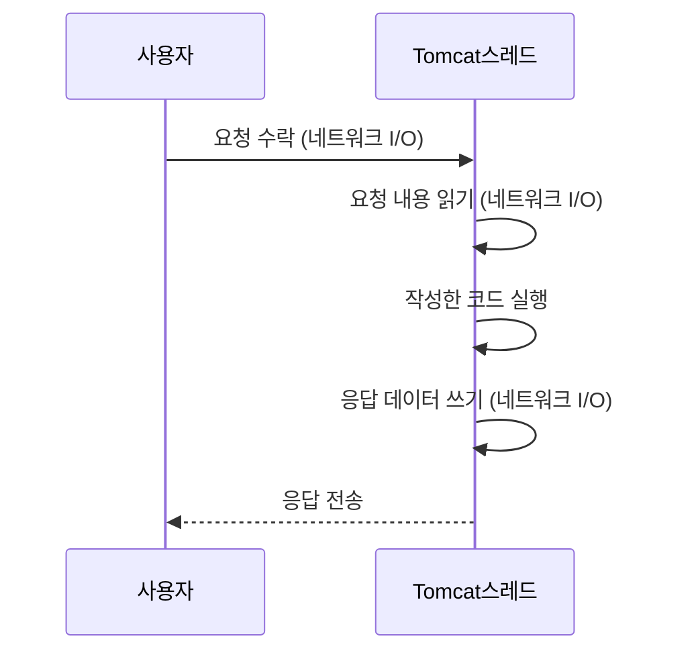
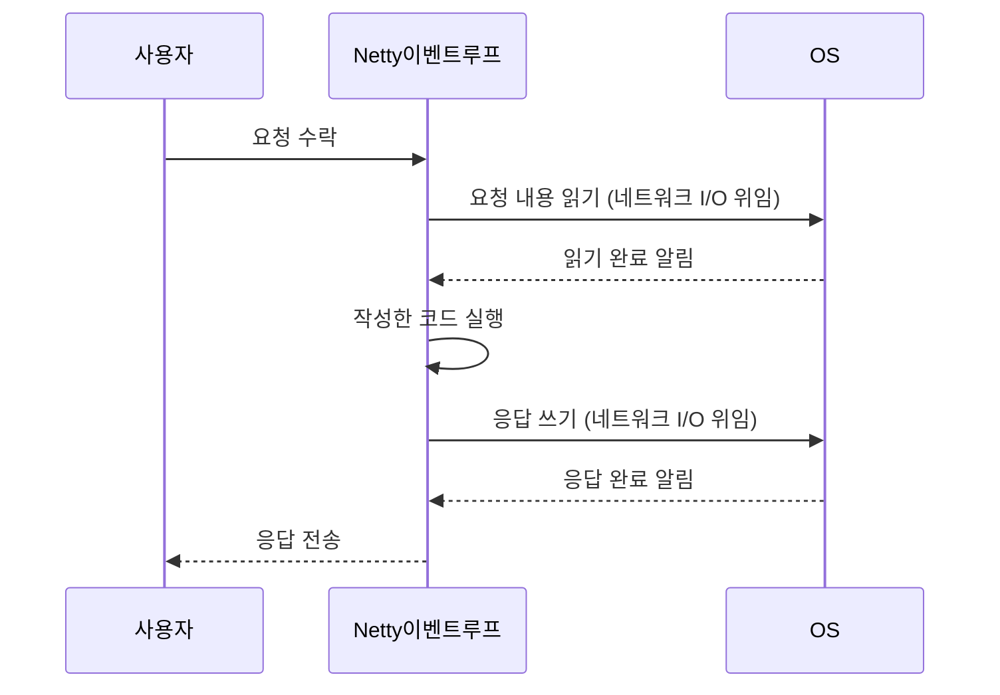
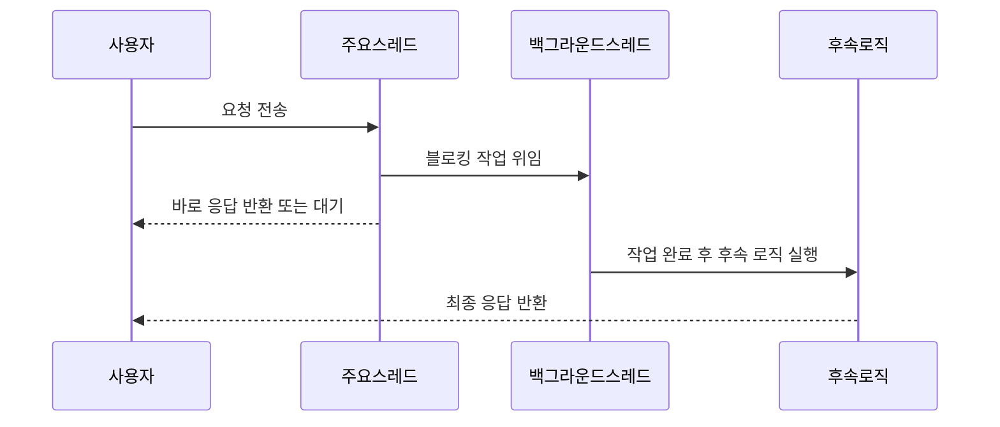
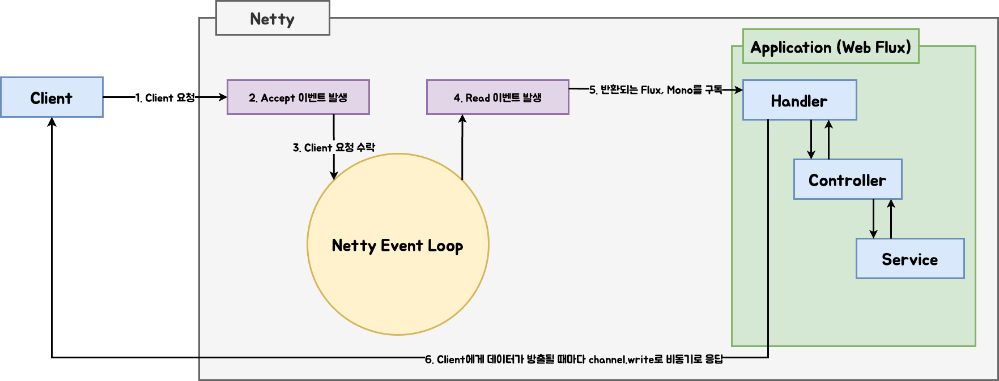
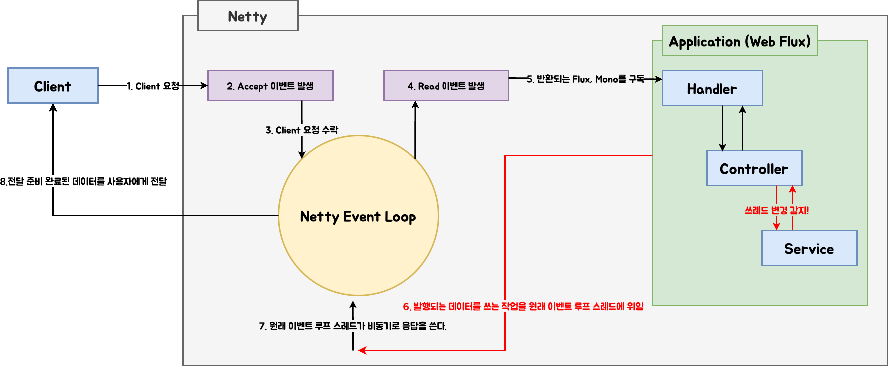
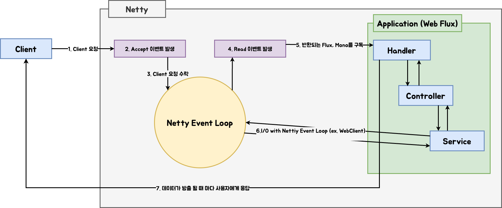

# 인프런 - Spring WebFlux + LLM 실전 구현
---

- [[#2025-07-21 - 리액티브 프로그래밍이란?|2025-07-21 - 리액티브 프로그래밍이란?]]
- [[#2025-07-21 - 스레드란?|2025-07-21 - 스레드란?]]
- [[#2025-07-21 - 블로킹과 비동기프로그래밍이란?|2025-07-21 - 블로킹과 비동기프로그래밍이란?]]
- [[#2025-07-23 - Reactive Stream - 함수형 프로그래밍이란?|2025-07-23 - Reactive Stream - 함수형 프로그래밍이란?]]
- [[#2025-07-23 - WebFlux의 Subscriber - Publisher 패턴|2025-07-23 - WebFlux의 Subscriber - Publisher 패턴]]
- [[#2025-07-23 - Netty와 이벤트 루프 패턴|2025-07-23 - Netty와 이벤트 루프 패턴]]
- [[#2025-07-23 - WebFlux는 Netty와 어떻게 통합될까?|2025-07-23 - WebFlux는 Netty와 어떻게 통합될까?]]
- [[#2025-07-24 - WebFlux에서 어떻게 블로킹을 효율적으로 처리할 수 있을까?|2025-07-24 - WebFlux에서 어떻게 블로킹을 효율적으로 처리할 수 있을까?]]
- [[#2025-07-23 - Reactive Stream - 함수형 프로그래밍이란?|2025-07-23 - Reactive Stream - 함수형 프로그래밍이란?]]
- [[#2025-07-28 - WebFlux의 기본적인 사용법, Flux와 Mono|2025-07-28 - WebFlux의 기본적인 사용법, Flux와 Mono]]

--- 

## 2025-07-21 - 리액티브 프로그래밍이란?

### 1. 학습 주제
- Spring WebFlux란 무엇인지 이해
- 리액티브 프로그래밍 개념과 필요성 학습

### 2. 주요 개념 요약

| 항목              | 설명                                                                                                                   |
| --------------- | -------------------------------------------------------------------------------------------------------------------- |
| **WebFlux**     | 비동기 논블로킹 I/O를 기반으로 하는 Spring의 웹 프레임워크. Netty, Undertow 등 Servlet이 아닌 웹서버와 통합 가능.                                     |
| **리액티브 서비스**    | 요청이 발생했을 때 자원을 효율적으로 활용해 빠르게 반응하는 비동기 서비스. 사용자 경험 개선과 시스템 자원 절약에 유리.                                                 |
| **동기/블로킹 방식**   | 예: Tomcat. 요청-응답 구조에서 I/O가 끝날 때까지 스레드가 차단됨.                                                                          |
| **비동기/논블로킹 방식** | 예: Netty. 요청 후 OS에 콜백을 등록하고 다른 작업 수행. 응답 도착 시 이벤트 루프(Selector)가 처리.                                                  |
| **WebFlux의 장점** | - Netty 기반 논블로킹 I/O 지원<br>- Flux/Mono를 통한 리액티브 스트림 기반<br>- WebClient, R2DBC와의 자연스러운 통합<br>- 이벤트 기반으로 Stream 통신 구현 가능 |

### 3. 생활 비유로 이해하는 논블로킹 모델
> 치킨 배달 상황을 통해 동기/비동기 방식을 비교해 보자.

#### 3.1. 동기 블로킹 방식 (Tomcat 등)
- 당신이 치킨을 시킨 후, 문 앞에서 치킨이 올 때까지 아무 일도 하지 않고 기다린다.
- 이 방식은 치킨(I/O)이 도착할 때까지 **스레드가 아무 작업도 하지 못한 채 대기**하는 구조다.

#### 3.2. 비동기 논블로킹 방식 (Netty 등)
- 당신은 치킨을 시킨 후, 어머니에게 "치킨이 오면 메모 좀 남겨줘"라고 말하고 다른 일을 하러 간다.
- 어머니는 거실(커널 영역)에서 치킨이 오면 메모(이벤트)를 남긴다.
- 당신은 나중에 메모를 확인하고 문을 연다.

> 📝 비유 요약  
> 방 = 프로세스  
> 사람 = 스레드  
> 치킨 시키기 = I/O 요청  
> 어머니 = OS (이벤트 감지자)  
> 거실 = 커널 영역  
> 메모 확인 = 이벤트 루프(Selector)를 통한 이벤트 조회 및 실행

> [!NOTE]
    > 💡 이처럼 WebFlux는 치킨 배달 예시의 **비동기 논블로킹 방식**과 같은 구조를 가지며, 자원을 효율적으로 사용하고 높은 확장성을 제공

### 4. 실습 코드

#### 4.1 전통적 동기 방식
```java
List<Integer> sink = new ArrayList<>();
for (int i = 1; i < 10; i++) {
    Thread.sleep(500); // 0.5초 지연
    sink.add(i);
}
```

#### 4.2. 리액티브 방식 (Flux)
> 클라이언트 요청 헤더에 `Accept: text/event-stream` 추가  
> (요구사항: 데이터가 생성될 때마다 스트리밍으로 응답)

```java
Flux.create(sink -> {
    for (int i = 1; i < 10; i++) {
        try {
            Thread.sleep(500); // ⚠️ 블로킹 코드 (실습 목적)
        } catch (InterruptedException e) {
            sink.error(e);
        }
        sink.next(i);
    }
    sink.complete();
});
```

> [!NOTE]
    >  위 코드에서 `Thread.sleep()`은 실제 리액티브 환경에서는 사용 지양  `Mono.delay()`, `Flux.interval()` 등을 사용하여 논블로킹 처리할 것

### 5. 리액티브 핵심 포인트

1. **리액티브 스트림 사용 (Flux/Mono)**  
   - 데이터를 스트림 형태로 비동기 전송  
   - 준비된 데이터부터 순차적으로 전송 가능  
   - `text/event-stream` 으로 실시간 스트리밍 처리 가능

2. **논블로킹 프로그래밍 필수**  
   - 모든 연산 흐름이 블로킹 없이 연결되어야 함  
   - Netty의 이벤트 루프 모델 기반으로 설계  
   - `Thread.sleep()`, JDBC 등의 블로킹 API 사용은 금물  
   - R2DBC, WebClient, Schedulers 등을 통한 완전한 비동기화 필요

3. **함수형 스타일**  
   - 선언형, 체이닝 기반의 연산 (`map`, `flatMap`, `filter`, `zip`)  
   - side-effect 최소화

### 6. 마무리
- Spring WebFlux는 Netty 기반으로 작동하며 논블로킹 서비스 구축에 특화됨
- Flux, Mono를 통해 데이터를 스트리밍 방식으로 전달하며, 효율적인 자원 관리 가능
- 리액티브 시스템은 비동기 흐름과 함수형 스타일이 핵심이며, 블로킹 코드를 철저히 배제해야 함

---

##  2025-07-21 - 스레드란?

### 1. 학습 주제
- 스레드의 개념과 역할 이해
- Tomcat과 Netty의 스레드 처리 방식 비교

### 2. 주요 개념 요약
| 항목                   | 설명                                          |
| -------------------- | ------------------------------------------- |
| **Thread**           | 하나의 작업 흐름을 실행하는 단위. 애플리케이션의 코드 흐름을 수행       |
| **Thread의 일반 흐름**    | 사용자 요청 → CPU 자원 할당 → 웹서버 → 코드 실행 → 사용자에게 응답 |
| **Tomcat Thread 흐름** | 모든 작업을 요청당 할당된 스레드가 순차적으로 직접 수행             |
| **Netty Thread 흐름**  | 소수의 스레드가 이벤트 루프 기반으로 동작하며, 블로킹 I/O는 OS에 위임  |
### 3. Tomcat Thread 처리 순서도


### 4. Netty Thread 처리 순서도



### 5. 톰캣 vs Netty

#### 5-1. 톰캣 스레드 모델
> Tomcat은 요청마다 스레드를 생성하여 작업을 처리하는 전통적 구조
- 요청 수락 → 요청 읽기 → 비즈니스 로직 실행 → 응답 쓰기를 모두 **동일한 스레드**에서 처리
- 블로킹 I/O 기반이며, 작업 중 대기 시간이 발생해도 스레드가 점유됨
- 다수의 요청을 처리하기 위해 **수백 개의 스레드**를 유지함

#### 5-2. Netty 스레드 모델
> Netty는 이벤트 루프 기반으로 작동하며, 비동기 논블로킹 방식에 최적화되어 있음
- 요청을 수락한 후 I/O 작업은 OS에 위임 (Selector를 통한 비동기 I/O)
- 작성한 코드만 간단히 실행한 뒤 다시 이벤트 루프로 복귀
- **작은 수의 스레드**로도 수천, 수만 개의 요청 처리 가능
- 컨텍스트 스위칭 비용 절감

| 구분 | Tomcat | Netty |
|------|--------|-------|
| 스레드 모델 | 요청당 1스레드 | 이벤트 루프 기반, 소수 스레드 |
| 블로킹 허용 | 일정 허용 | 거의 불가 |
| 스레드 수 | 수백 개 이상 | CPU 코어 수와 동일 수준 |
| 특징 | 직관적 구조, 자원 소모 많음 | 고성능 구조, 논블로킹 코드 필수 |

### 6. 의문사항 정리

#### 6-1. Q1. Netty도 스레드를 많이 만들면 안 되나요?
```
[ 하드웨어 영역(CPU) | 커널 영역(OS) | 유저 영역(프로세스) ]
```
- CPU는 **작업할 스레드의 컨텍스트**를 캐시에 올려두고 처리
- 스레드가 많아질수록 **캐시 교체와 컨텍스트 스위칭 비용**이 증가
- Netty는 CPU 코어 수만큼 스레드를 유지하여 **스위칭 비용을 최소화**

#### 6-2. Q2. CPU가 한정되어 있는데, 애플리케이션은 어떻게 수많은 스레드를 만들 수 있나요?
- CPU 코어는 일반적으로 **1개의 물리적 스레드**를 동시 처리
- 우리가 생성하는 대부분의 스레드는 **논리 스레드**이며, 실제 실행은 **OS 스케줄러**가 관리
- CPU는 여러 논리 스레드 중 하나씩 교대로 실행 → **동시성이 아닌 시분할 처리**
- 프로세스는 스레드 수에 신경 쓸 필요 없이 OS가 적절히 할당

### 7. 스레드 핵심 포인트
1. **스레드**는 프로그램의 실행 흐름 단위이며, 동시성의 기본 단위
2. **Tomcat**은 요청당 스레드를 할당하고, 블로킹을 수용할 수 있는 구조
3. **Netty**는 이벤트 루프를 통해 소수의 스레드로도 대량의 요청을 비동기 처리
4. **스레드는 논리적 개념**이며, 실제 실행은 OS가 물리 CPU 코어에 맞게 스케줄링
5. **스레드 수가 많을수록 컨텍스트 스위칭 비용**이 증가하므로, Netty는 효율성을 위해 소수 스레드 유지 전략을 사용

### 8. 마무리
- Tomcat은 직관적이고 사용하기 쉬우나, 대규모 동시 요청 처리에 비효율적
- Netty는 논블로킹 I/O 및 이벤트 기반 처리로 고성능 서버 개발에 적합하지만, **블로킹 코드를 섞으면 성능이 치명적으로 저하됨**.
- 고성능 백엔드 서버를 구축하려면 Netty와 같은 이벤트 루프 기반의 구조를 이해하고, 비동기 프로그래밍 방식에 익숙해질 필요가 있음

---

## 2025-07-21 - 블로킹과 비동기프로그래밍이란?

### 1. 학습 주제
- 블로킹과 논블로킹의 차이 이해
- 비동기 프로그래밍의 개념과 동작 방식 습득

### 2. 주요 개념 요약

| 항목                     | 설명                                                                              |
| ---------------------- | ------------------------------------------------------------------------------- |
| **비동기 프로그래밍**          | 작업 순서를 강제하지 않고, 대기해야 하는 작업은 다른 곳에 위임하여 계속 진행하는 방식. 블로킹을 회피하고 응답성을 높이는 프로그래밍 기법. |
| **블로킹(Blocking)**      | 스레드가 외부 자원(IO 등)의 결과를 기다리며 **멈춘 상태**                                            |
| **논블로킹(Non-Blocking)** | 스레드가 작업을 위임하고 **다른 작업을 이어서 처리하는 방식**                                            |

### 3. 블로킹 vs 논블로킹
#### 3-1. 어떤 작업이 블로킹인가?
| 작업 예시                | 블로킹 여부 | 설명                 |
| -------------------- | ------ | ------------------ |
| DB 조회                | ✅ 블로킹  | DB 응답까지 스레드가 대기    |
| Network I/O (HTTP 등) | ✅ 블로킹  | OS/네트워크 장비 응답까지 대기 |
| 파일 읽기/쓰기             | ✅ 블로킹  | 디스크에서 데이터 반환까지 대기  |
| 객체 생성/계산 로직          | ❌ 논블로킹 | CPU에서 즉시 처리 가능     ||
> 💡 참고: 대부분의 I/O는 블로킹이며, CPU 연산은 논블로킹이다.

### 4. 실제 비동기 동작 방식
| 예시                               | 비동기 처리 방식                        |
| -------------------------------- | -------------------------------- |
| `setTimeout()` (JS)              | 브라우저 백그라운드 스레드가 대기 후 콜백 실행       |
| `CompletableFuture` (Java)       | 별도의 스레드에서 작업 수행                  |
| Spring MVC + `CompletableFuture` | 컨트롤러 스레드가 작업 위임, 응답 스레드 변경 가능    |
| Netty                            | OS의 I/O 다중화 (Selector 기반)        |
| WebFlux (`Flux` / `Mono`)        | Reactor Scheduler의 워커 스레드가 작업 처리 |
### 5. 비동기 핵심 포인트
1. **중요한 스레드는 블로킹 없이 반환**  
2. **시간이 오래 걸리는 작업은 OS 또는 백그라운드 스레드에 위임**  
3. **작업 완료 후 후속 로직이 있다면 이어서 처리, 없으면 종료**  
4. **응답성과 시스템 자원 활용도를 높이기 위한 핵심 기법**

### 6. 비동기 처리 흐름
- **주요 스레드**는 블로킹 없이 이벤트만 등록하고 빠르게 반환
- **백그라운드 스레드**는 블로킹 작업(DB, 파일, 외부 API 등)을 **비동기 수행**
- 완료 후 **필요한 경우 후속 로직** 실행
- **최종 결과가 사용자에게 응답**



### 7. 마무리
- 비동기 프로그래밍은 **성능 향상과 응답성 개선**을 위한 핵심 기술
- 단순히 비동기 API를 호출하는 것만으로는 충분하지 않으며, **스레드 관리와 흐름 제어**에 대한 깊은 이해가 필요
- 특히 WebFlux, Netty, CompletableFuture 등은 각각 **스레드 처리 방식이 다르므로**, 상황에 맞는 구조 설계가 중요

---

## 2025-07-23 - Reactive Stream - 함수형 프로그래밍이란?

### 1. 학습 주제
- 함수형 프로그래밍에 대한 이해
- 함수형 프로그래밍을 통한 Reactive Stream 작성

### 2. 주요 개념 요약
| 항목                                 | 설명                                                                                                    |     |
| ---------------------------------- | ----------------------------------------------------------------------------------------------------- | --- |
| **함수형 프로그래밍**                      | 코드를 선언적이고 간결하게 표현하기 위한 방식으로, 함수를 객체처럼 다루는 것이 핵심입니다.                                                   |     |
| **Java에서 함수는 객체?**                 | Java 8부터 `Function`, `Consumer`, `Supplier` 등의 함수형 인터페이스를 통해 함수도 객체로 전달 가능합니다.                        |     |
| **리액티브 스트림**                       | 일반 Stream처럼 종결자 없이는 실행되지 않으며, `subscribe`, `publish` 등이 종결자 역할을 합니다.                                  |     |
| **Subscriber-Publisher 패턴**        | `subscribe()`를 통해 데이터가 흐르기 시작하며, publisher는 데이터를 방출하고 subscriber는 이를 소비합니다.                           |     |
| **Controller는 subscribe 없어도 되는가?** | Spring WebFlux에서는 내부적으로 Netty의 이벤트 루프 스레드에서 자동 구독되므로 subscribe 호출이 필요 없습니다. 테스트 코드는 명시적 subscribe 필요. |     |

### 3. 함수형 프로그래밍 vs 리액티브 스트림
#### 3-1. 기본 코드 (명령형 스타일)
```java
List<Integer> sink = new ArrayList<>();
for (int i = 1; i < 10; i++) {
    sink.add(i);
}

for (int i = 0; i < sink.size(); i++) {
    System.out.println(sink.get(i));
}
```
#### 3-2. 개선 요구사항
- 모든 변수에 *4 연산 수행
- 4의 배수만 필터링

#### 3-3. 명령형 → 함수형으로 전환
##### 3-3-1. 1, ×4 연산 - 명령형 vs 함수형
- 기존 코드
```java
List<Integer> newSink1 = new ArrayList<>();
for (int i = 0; i <= 8; i++) {
    newSink1.add(sink.get(i) * 4);
}
sink = newSink1;
```
- 함수형 변경
```java
sink = map(sink, data -> data * 4);

private List<Integer> map(List<Integer> sink, Function<Integer, Integer> mapper) {
    List<Integer> result = new ArrayList<>();
    for (Integer item : sink) {
        result.add(mapper.apply(item));
    }
    return result;
}
```

##### 3-3-2. 필터링 - 명령형 vs 함수형
- 기존코드
```java
List<Integer> newSink2 = new ArrayList<>();
for (int i = 0; i <= 8; i++) {
    if (sink.get(i) % 4 == 0) {
        newSink2.add(sink.get(i));
    }
}
sink = newSink2;
```
- 함수형 변경
```java
sink = filter(sink, data -> data % 4 == 0);

private List<Integer> filter(List<Integer> sink, Predicate<Integer> predicate) {
    List<Integer> result = new ArrayList<>();
    for (Integer item : sink) {
        if (predicate.test(item)) {
            result.add(item);
        }
    }
    return result;
}

```

##### 3-3-3. 출력 - 명령형 vs 함수형
- 기존코드
```java
for (int i = 0; i < sink.size(); i++) {
    System.out.println(sink.get(i));
}
```
- 함수형 변경
```java
print(sink, System.out::println);

private void print(List<Integer> sink, Consumer<Integer> printer) {
    for (Integer item : sink) {
        printer.accept(item);
    }
}
```

### 4. Stream API 활용 (람다 기반)
- 출력부분 변경
```java
IntStream.rangeClosed(1, 9)
         .boxed()
         .map(data -> data * 4)
         .filter(data -> data % 4 == 0)
         .forEach(System.out::println);
```

### 5. Reactive Stream 활용
- Reactive Stream으로 변경
```java
Flux.fromIterable(IntStream.rangeClosed(1, 9).boxed().toList())
    .map(data -> data * 4)
    .filter(data -> data % 4 == 0)
    .subscribe(System.out::println);
```

### 6. 비동기 핵심 포인트
1. **함수형 프로그래밍은 함수를 객체처럼 다루며, 선언적 코드 스타일을 가능하게 함**  
2. **Flux, Mono는 Stream처럼 중간 연산자(Operator)를 체이닝할 수 있음**  
3. **Flux는 subscribe()가 호출되어야 실행됨 (Lazy Evaluation)**  
4. **Spring WebFlux는 Controller 내부에서 자동으로 구독을 수행 (Netty 이벤트 루프)**

### 7. 비동기 흐름 예시
```java
public Flux<Integer> example(){
    return Flux.range(1, 9)
               .map(n -> n * 2)
               .filter(n -> n % 4 == 0);
}
```
- 위 코드는 실행되지 않음 (lazy)
- Controller가 있거나 subscribe 호출 시 실행됨
- Netty 이벤트 루프가 결과 전송
- 작업 완료후 Netty 복귀

### 8. 마무리

- 함수형 프로그래밍은 선언적이고 유연한 코드 구성을 도움
- 리액티브 스트림은 함수형 패턴을 기반으로 비동기 데이터 흐름을 구현
- WebFlux는 subscribe 없이도 동작하며, 테스트 환경에선 명시적 구독 필요.

---

## 2025-07-23 - WebFlux의 Subscriber - Publisher 패턴

### 1. 학습 주제
- Subscriber-Publisher 패턴의 동작 원리 이해
- 블로킹 회피를 위한 스레드 제어 방식 학습

### 2. 주요 개념 요약
| 항목                       | 설명                                                      |
| ------------------------ | ------------------------------------------------------- |
| **Publisher**            | 데이터를 발행하는 주체                                            |
| **Subscriber**           | 데이터를 구독하고 소비하는 주체                                       |
| **subscribe()**          | 데이터 스트림 구독을 시작하는 트리거                                    |
| **publish()**            | 데이터를 실제로 발행하는 동작 (주로 Hot Sequence에서 사용)                 |
| **Scheduler**            | 별도의 스레드를 할당하여 비동기적으로 작업을 수행하게 하는 도구                     |
| **Flux 구독 시**            | `subscribe()`가 호출되어야 데이터 흐름이 시작됨                        |
| **스레드 1개만으로 블로킹 회피 가능?** | 불가능. flatMap 사용으로도 회피할 수 없음                             |
| **블로킹 회피 방법**            | OS 위임 (ex: 커널 이벤트 큐) 또는 Reactor의 `Scheduler`로 별도 스레드 할당 |
### 3. subscribeOn vs publishOn
| 연산자             | 역할                                     |
| --------------- | -------------------------------------- |
| **subscribeOn** | Publisher 측 데이터 생성이 실행되는 스레드를 지정       |
| **publishOn**   | Subscriber 측 데이터 처리 스레드를 지정 (스트리밍에 적합) ||
### 4. 콜드 시퀀스 vs 핫 시퀀스
| 구분                | 설명                                             |
| ----------------- | ---------------------------------------------- |
| **Cold Sequence** | 구독자가 있어야 데이터 발행 시작 (Flux, Mono 기본)             |
| **Hot Sequence**  | 구독자 유무와 관계없이 발행 지속 (ex: `publish()`, 실시간 스트리밍) ||

### 5. 실습 코드

#### 5-1. 스케줄러를 활용한 블로킹 회피

```java
Flux<Integer> intFlux = Flux.<Integer>create(sink -> {
    for (int i = 1; i < 10; i++) {
        try {
            Thread.sleep(500); // blocking operation
        } catch (InterruptedException e) {
            // 생략
        }
        sink.next(i);
    }
    sink.complete();
}).subscribeOn(Schedulers.boundedElastic()); // 별도 스레드 할당

intFlux.subscribe(data -> {
    System.out.println("스레드 이름: " + Thread.currentThread().getName());
    System.out.println("WebFlux 구독 데이터: " + data);
});

// 메인 스레드 종료 방지용 sleep
try {
    Thread.sleep(5000);
} catch (InterruptedException e) {
    throw new RuntimeException(e);
}
```

> [!NOTE]
    > ✅ Schedulers.boundedElastic()은 I/O blocking이 허용되는 스레드를 별도로 제공합니다.

### 6. Subscriber-Publisher 핵심 포인트
1. **Flux, Mono는 데이터를 담고 있는 것이 아니라, 함수형 정의만 포함**  
2. **구독을 해야 함수가 실행되며, 그제야 데이터가 생성됨**  
3. **단일 스레드에서는 아무리 연산자를 조합해도 블로킹 회피 불가능**  
4. **스케쥴러를 통해 별도의 스레드를 명시적으로 배정해야 블로킹 처리 가능**

### 7. WebFlux의 동작 흐름 요약
1.	Controller에서 Flux 또는 Mono 반환
2.	WebFlux 내부에서 자동으로 subscribe() 수행
3.	Netty의 이벤트 루프가 응답 데이터를 비동기적으로 처리하여 클라이언트로 전송

### 8. 마무리
- Subscriber-Publisher 패턴은 리액티브 스트림의 핵심 동작 구조
- subscribe 없이 Flux가 동작하지 않으며, 스케줄러는 블로킹 회피를 위한 필수 구성요소
- subscribeOn은 데이터 생성 시점, publishOn은 처리 시점의 스레드를 제어

---

##  2025-07-23 - Netty와 이벤트 루프 패턴

### 1. 학습 주제
- 이벤트 루프 패턴의 구조와 동작 방식 이해
- Netty 기반 비동기 처리 흐름 분석

### 2. 주요 개념 요약

| 항목             | 설명                                             |
| -------------- | ---------------------------------------------- |
| **이벤트 루프 패턴**  | 하나의 스레드가 루프를 돌며 OS가 준비한 이벤트를 감지하고 콜백 함수를 실행    |
| **이벤트 루프 스레드** | 요청 수락, 읽기, 쓰기 이벤트를 처리한 후 다시 루프로 복귀하여 다음 이벤트 대기 |
| **이벤트(Event)** | 네트워크 연결 수락, 요청 데이터 읽기, 응답 데이터 쓰기 등의 IO 작업      |
| **Selector**   | OS가 감지한 이벤트를 감시하고 관리하는 감시자 역할                  |
| **Attachment** | 이벤트에 등록된 사용자 정의 콜백 함수 또는 핸들러 객체                |

### 3. Netty 이벤트 루프의 동작 원리

> [!NOTE]
    > 💡 Netty는 이벤트 루프 기반 구조를 통해 **완전한 논블로킹 서버**를 구현합니다.
1. OS가 네트워크 이벤트를 감지하여 큐에 쌓음  
2. Netty의 이벤트 루프 스레드는 아래 과정을 반복
    1-1. selector를 통해 OS의 이벤트 확인
    1-2. 이벤트가 존재하면, 해당 이벤트에 등록된 콜백(Attachment) 실행
    1-3. 루프 복귀 후 다음 이벤트 대기
> 스레드는 직접적으로 IO를 수행하지 않고, OS가 이벤트를 준비할 때까지 반복적으로 조회만 수행

### 4. 실습 코드
#### 4-1. 예시 코드: 이벤트 루프 구조
```java
while (true) {
    selector.select(); // OS에게 이벤트 있는지 물어봄
    Set<SelectionKey> keys = selector.selectedKeys();

    for (SelectionKey key : keys) {
        if (key.isAcceptable()) {
            // 연결 수락 후 읽기 이벤트 등록
        } else if (key.isReadable()) {
            // 요청 읽기 -> 애플리케이션 로직 처리 -> 응답 준비
        } else if (key.isWritable()) {
            // 응답 쓰기 완료 처리
        }
    }
}
```

### 5. 각 이벤트 역할 & 후속 처리

|      **이벤트**       | **처리 흐름**                              |
| :----------------: | -------------------------------------- |
| **Accept (요청 수락)** | 연결 수락 후 Read 이벤트 등록                    |
|  **Read (요청 읽기)**  | 요청 내용 읽기 → 비즈니스 로직 처리 → 응답 데이터 생성      |
| **Write (응답 쓰기)**  | 응답 데이터를 OS 버퍼에 쓰기 → 완료되면 이벤트 제거 또는 재등록 |

### 6. 이벤트 루프 스레드의 특징
- **루프 기반**으로 동작하며, 블로킹 없이 이벤트 감지 및 처리
- **대기 없이 빠르게 순환**, 이벤트 발생 시 즉시 대응
- **콜백 함수 기반 처리**, 이벤트 발생 시 지정된 핸들러 실행
- **IO 작업은 OS에 위임**, 스레드는 비즈니스 로직 중심으로 동작

### 7. 핵심 포인트
1. **이벤트 루프는 논블로킹 비동기 서버의 핵심 처리 구조**  
2. **Netty는 이러한 구조를 통해 최소한의 스레드로 많은 요청을 처리**  
3. **이벤트마다 등록된 콜백이 존재하며, 이벤트 루프는 이를 실행하고 바로 복귀**  
4. **스레드는 직접 대기하지 않고 OS가 준비한 이벤트에만 반응**

### 8. WebFlux와 Netty 이벤트 루프 통합 구조
| **단계** | **동작**                                  |
| :----: | --------------------------------------- |
|  1단계   | Controller에서 Flux 또는 Mono 반환            |
|  2단계   | Spring WebFlux 내부적으로 subscribe() 수행     |
|  3단계   | Netty 이벤트 루프가 해당 비동기 응답을 감지 후 클라이언트에 전송 |
### 9. 마무리
- Netty의 이벤트 루프 패턴은 고성능 서버의 핵심 기반 기술
- WebFlux는 이 구조를 활용하여 효율적이고 반응성 높은 비동기 처리를 지원
- 스레드는 처리 대신 이벤트 감지/콜백 실행만 담당하며, 모든 IO는 OS가 주도

---

##  2025-07-23 - WebFlux는 Netty와 어떻게 통합될까?

### 1. 학습 주제
- WebFlux와 Netty가 통합되는 구조 이해
- Scheduler 사용 시 발생하는 스레드 변경 문제와 해결 방식 습득
- 기본적인 요청 처리 및 응답 흐름 파악

### 2. 주요 개념 요약
| 항목               | 설명                                                                  |
| ---------------- | ------------------------------------------------------------------- |
| **응답은 누가 처리하나?** | Flux/Mono가 Scheduler를 통해 별도 스레드에서 처리되면, 해당 스레드가 응답까지 시도할 수 있음       |
| **문제 상황**        | Netty의 응답 버퍼인 ByteBuffer는 스레드 세이프하지 않아, 이벤트 루프 외부에서 직접 접근하면 문제가 발생  |
| **해결 방안**        | 응답 쓰기 작업이 Netty 이벤트 루프 스레드가 아닐 경우, 작업을 이벤트 루프 큐에 등록하여 안전하게 처리       |
| **핵심 API**       | `AbstractChannelHandlerContext.write()` → 이벤트 루프 스레드에 write task 등록 |
| **외부 API 처리 방식** | WebClient는 논블로킹 방식으로 외부 API 호출을 처리하며, OS 대기 기반이므로 이벤트 루프는 블로킹되지 않음  |

### 3. Scheduler 사용 시 흐름

#### 3-1. 스레드 변경이 없는 경우
- Read 이벤트를 처리한 Netty 이벤트 루프 스레드가 그대로 응답까지 처리


#### 3-2. 스레드 변경이 감지된 경우
- 로직 처리 중 스레드가 변경되면, 응답 처리는 반드시 원래 이벤트 루프 스레드에서 마무리되어야 함(동시성 문제 및 효율성) - ByteBuffer 동시 접근 방지 


> ByteBuffer는 Netty 이벤트 루프 스레드만이 안전하게 접근할 수 있음

```text
스레드1  : "안녕하세요"  → 
                     [ByteBuffer] : 안녕하세요반갑습니다
스레드2  : "반갑습니다"  →
```

#### 3-3. 외부 API 호출을 포함한 흐름 (WebClient 사용)
	•	외부 API I/O도 Netty 이벤트 루프 기반으로 처리되며, 블로킹 없이 작업이 계속된다
 

### 4. 실습 코드
#### 4-1. AbstractChannelHandlerContext.write(...)
> inEventLoop()가 false이면 executor의 작업 큐에 등록하여 Netty 이벤트 루프 스레드가 처리하게 됨.
```java
// 다음 Outbound 핸들러의 실행기를 가져옴 (보통 이벤트 루프 executor)
EventExecutor executor = next.executor();

if (executor.inEventLoop()) { 
    // 현재 코드가 실행 중인 스레드가 이벤트 루프 스레드라면 (inEventLoop == true)
    // → 즉시 invoke 메서드로 메시지 전송 처리

    if (flush) {
        // flush가 true이면, write 후 곧바로 flush까지 수행
        // 즉시 데이터를 클라이언트로 방출
        next.invokeWriteAndFlush(m, promise);
    } else {
        // flush가 false이면, write만 수행하고 flush는 이후에 따로 호출됨
        next.invokeWrite(m, promise);
    }

} else {
    // 현재 스레드가 이벤트 루프가 아닌 외부 스레드인 경우
    // → 직접 처리하면 ByteBuffer를 unsafe하게 접근할 수 있으므로 반드시 이벤트 루프에게 위임

    // Write 작업을 Runnable(Task)로 감쌈 → 이벤트 루프 큐에 등록
    WriteTask task = AbstractChannelHandlerContext.WriteTask
                            .newInstance(next, m, promise, flush);

    // safeExecute: executor의 작업 큐에 task를 등록
    if (!safeExecute(executor, task, promise, m, !flush)) {
        // 만약 작업 등록에 실패하면 task 취소 및 예외 상태 설정
        task.cancel();
    }
}
```

### 5. RestTemplate vs WebClient
|    항목     | RestTemplate         | WebClient          |
| :-------: | -------------------- | ------------------ |
|    방식     | 블로킹                  | 논블로킹               |
|  스레드 필요   | 별도 스레드 필요(Scheduler) | 없음 (OS 대기 + Netty) |
|    성능     | 스레드 자원 소비 많음         | 자원 효율적             |
| I/O 대기 처리 | 별도 스레드가 대기           | OS 레벨 비동기 I/O 처리   |
### 6. WebClinet 요청흐름
1.	Netty가 클라이언트 요청을 수락 (Accept 이벤트)
2.	Read 이벤트 발생 → ByteBuffer에서 요청을 읽음
3.	WebFlux가 이를 감지하고 Mono 또는 Flux를 구독
4.	비즈니스 로직 처리 (Handler → Controller → Service)
5.	응답 데이터를 이벤트 루프 스레드가 클라이언트에 전달

### 7. WebClient 흐름 요약
1.	WebClient가 외부 API에 논블로킹 요청 전송
2.	요청 I/O는 OS가 처리하고 Netty는 블로킹되지 않음
3.	응답 도착 시 Netty 이벤트 루프가 콜백을 실행
4.	결과 데이터는 Flux/Mono로 애플리케이션에 전달됨

### 8. 핵심 포인트
-	**응답은 반드시 Netty 이벤트 루프 스레드에서 수행**
-	**스레드가 변경된 경우에도 write 작업은 반드시 다시 이벤트 루프로 복귀해야 함**
-	**WebClient는 완전한 논블로킹 방식으로 외부 API 호출이 가능**
-	**RestTemplate + Scheduler 방식은 효율이 떨어짐**

### 9. 마무리
- Netty의 이벤트 루프는 고성능 비동기 서버의 핵심 구조
- WebFlux는 이 구조 위에서 Reactor를 활용해 논블로킹 스트림 처리 구현
- 모든 I/O는 OS가 주도하며, Netty는 이벤트 감지와 콜백 실행만을 담당

---

## 2025-07-24 - WebFlux에서 어떻게 블로킹을 효율적으로 처리할 수 있을까?

### 1. 학습 주제
- WebFlux에서 블로킹을 피하기 위한 구조와 원리 이해  
- 리액티브 시스템의 핵심 철학과 Netty의 비동기 처리 전략 학습

### 2. 주요 개념 요약
| 항목                    | 설명                                                             |
| --------------------- | -------------------------------------------------------------- |
| **리액티브 시스템의 철학**      | 컨텍스트 스위치 비용을 줄이고 스레드 수를 최소화하여 처리량과 응답성을 극대화                    |
| **Scheduler 사용의 비효율** | 요청을 Netty 이벤트 루프 스레드가 받고, 이후 Scheduler 스레드로 이동하면 블로킹 발생 가능성 증가 |
| **OS 레벨 대기로 해결**      | Netty가 OS에 블로킹 I/O를 위임하고, 완료 시 이벤트 루프 스레드에서 콜백 처리              |
| **OS 대기 기반 라이브러리**    | R2DBC, WebClient 등은 이벤트 루프를 유지하면서도 블로킹 없이 I/O를 처리함             |

### 3. Netty 기반 비동기 라이브러리 요약
| 용도        | 라이브러리          | 설명                        |
| --------- | -------------- | ------------------------- |
| 외부 API 호출 | WebClient      | Netty 기반의 논블로킹 HTTP 클라이언트 |
| RDB 접근    | R2DBC          | 비동기 방식의 관계형 데이터베이스 연동     |
| 캐싱 처리     | Reactive Redis | 리액티브 방식의 Redis 연동 클라이언트   |
> Netty는 OS 이벤트 큐를 활용해 I/O 대기 상태를 관리하므로 블로킹 없이 처리 가능

### 4. 실습 코드
#### 4-1. WebClient의 논블로킹 처리 방식
- `Flux.just()` 등 단순 Flux가 아닌 `FluxReceive` 같은 Netty 기반 Flux 구현체 사용
- `.retrieve()`는 내부적으로 Netty 이벤트를 등록하고, 완료 시 `subscribe()`의 콜백이 이벤트 루프에서 실행됨
- 별도 Scheduler 없이도 완전한 비동기 처리가 가능함
```java
Flux<Integer> intFlux = webClient.get()
                .uri("http://localhost:8080/reactive/onenine/flux")
                .retrieve()
                .bodyToFlux(Integer.class);

intFlux.subscribe(data -> {
            System.out.println("처리되고 있는 스레드 이름 : "+ Thread.currentThread().getName());
            System.out.println("WebFlux가 구독중 : " + data);
        });
```
### 5. Tomcat vs WebFlux 구조 비교
| **비교항목** | **Tomcat** | **WebFlux (with Scheduler)** |
| :------: | ---------- | ---------------------------- |
|  스레드 모델  | 요청당 1스레드   | 요청 중간에 스레드 분리 발생             |
| 컨텍스트 스위칭 | 거의없음       | 빈번한 전환 발생                    |
|  블로킹 처리  | 자연스럽게 처리됨  | Scheduler를 써도 성능 저하 가능       |

### 6. Scheduler는 언제 사용?
다음과 같은 상황에서는 불가피하게 **Scheduler를 사용하여 스레드를 분리**해야 함
- `Thread.sleep()`, JPA 등 **블로킹 함수나 블로킹 DB 클라이언트**를 사용해야 하는 경우  
- R2DBC, WebClient 같은 **논블로킹 대체 라이브러리가 존재하지 않는 I/O 작업**  
- 이벤트 루프 스레드의 부하가 높고, **병렬 처리를 통해 성능 향상이 가능한 경우**
> Scheduler는 논블로킹 구조 내에서 **제한적으로 사용하는 우회 전략**일 뿐, 기본 구조는 Netty 이벤트 루프 중심으로 유지하는 것이 원칙입니다.

|       **작업유형**        | **처리방식**                |
| :-------------------: | ----------------------- |
| 트랜잭션/로그인/회원가입 등 핵심 로직 | JPA + Scheduler(스레드 분리) |
| 비중요 비동기 저장 (채팅, 로그 등) | MQ를 통한 비동기 저장           |
|       가벼운 조회 등        | R2DBC 사용                |

### 7. WebFlux 블로킹 처리 원칙
1.	가급적 R2DBC, WebClient, Reactive Redis 등 Netty 기반 논블로킹 라이브러리 사용
2.	불가피한 블로킹은 Scheduler로 스레드를 분리
3.	의미 없는 스레드 전환은 제거하고 흐름을 단순화
4.	subscribe는 항상 Netty 이벤트 루프 스레드에서 이루어지도록 구조 설계

### 8. 핵심 포인트
- **WebFlux의 강점은 Netty 기반의 이벤트 루프를 적극 활용한 논블로킹 처리에 있음**
- **리액티브의 핵심은 ‘스레드를 늘리는 것이 아니라 스레드를 효율적으로 사용하는 것’**
- **불필요한 Scheduler 사용은 오히려 성능을 악화시킬 수 있음**
- **가능하다면 완전한 논블로킹으로 설계하고, 불가피한 경우에만 블로킹 작업을 분리할 것**

### 9. 마무리
- WebFlux는 Netty의 이벤트 루프 구조를 기반으로 고성능 처리를 실현
- 리액티브 시스템은 **OS 이벤트 + 최소 스레드 + 콜백 중심 구조**를 기반으로 설계
- “논블로킹은 코드 스타일이 아니라 시스템의 설계 철학”이라는 점을 명심할 것

---

## 2025-07-23 - Reactive Stream - 함수형 프로그래밍이란?

### 1. 학습 주제
- 함수형 프로그래밍에 대한 이해
- 함수형 프로그래밍을 통한 Reactive Stream 작성

### 2. 주요 개념 요약
| 항목                                 | 설명                                                                                                    |
| ---------------------------------- | ----------------------------------------------------------------------------------------------------- |
| **함수형 프로그래밍**                      | 코드를 선언적이고 간결하게 표현하기 위한 방식으로, 함수를 객체처럼 다루는 것이 핵심입니다.                                                   |
| **Java에서 함수는 객체?**                 | Java 8부터 `Function`, `Consumer`, `Supplier` 등의 함수형 인터페이스를 통해 함수도 객체로 전달 가능합니다.                        |
| **리액티브 스트림**                       | 일반 Stream처럼 종결자 없이는 실행되지 않으며, `subscribe`, `publish` 등이 종결자 역할을 합니다.                                  |
| **Subscriber-Publisher 패턴**        | `subscribe()`를 통해 데이터가 흐르기 시작하며, publisher는 데이터를 방출하고 subscriber는 이를 소비합니다.                           |
| **Controller는 subscribe 없어도 되는가?** | Spring WebFlux에서는 내부적으로 Netty의 이벤트 루프 스레드에서 자동 구독되므로 subscribe 호출이 필요 없습니다. 테스트 코드는 명시적 subscribe 필요. |

### 3. 함수형 프로그래밍 vs 리액티브 스트림
#### 3-1. 기본 코드 (명령형 스타일)
```java
List<Integer> sink = new ArrayList<>();
for (int i = 1; i < 10; i++) {
    sink.add(i);
}

for (int i = 0; i < sink.size(); i++) {
    System.out.println(sink.get(i));
}
```
#### 3-2. 개선 요구사항
- 모든 변수에 *4 연산 수행
- 4의 배수만 필터링

#### 3-3. 명령형 → 함수형으로 전환
##### 3-3-1. 1, ×4 연산 - 명령형 vs 함수형
- 기존 코드
```java
List<Integer> newSink1 = new ArrayList<>();
for (int i = 0; i <= 8; i++) {
    newSink1.add(sink.get(i) * 4);
}
sink = newSink1;
```
- 함수형 변경
```java
sink = map(sink, data -> data * 4);

private List<Integer> map(List<Integer> sink, Function<Integer, Integer> mapper) {
    List<Integer> result = new ArrayList<>();
    for (Integer item : sink) {
        result.add(mapper.apply(item));
    }
    return result;
}
```

##### 3-3-2. 필터링 - 명령형 vs 함수형
- 기존코드
```java
List<Integer> newSink2 = new ArrayList<>();
for (int i = 0; i <= 8; i++) {
    if (sink.get(i) % 4 == 0) {
        newSink2.add(sink.get(i));
    }
}
sink = newSink2;
```
- 함수형 변경
```java
sink = filter(sink, data -> data % 4 == 0);

private List<Integer> filter(List<Integer> sink, Predicate<Integer> predicate) {
    List<Integer> result = new ArrayList<>();
    for (Integer item : sink) {
        if (predicate.test(item)) {
            result.add(item);
        }
    }
    return result;
}

```

##### 3-3-3. 출력 - 명령형 vs 함수형
- 기존코드
```java
for (int i = 0; i < sink.size(); i++) {
    System.out.println(sink.get(i));
}
```
- 함수형 변경
```java
print(sink, System.out::println);

private void print(List<Integer> sink, Consumer<Integer> printer) {
    for (Integer item : sink) {
        printer.accept(item);
    }
}
```

### 4. Stream API 활용 (람다 기반)
- 출력부분 변경
```java
IntStream.rangeClosed(1, 9)
         .boxed()
         .map(data -> data * 4)
         .filter(data -> data % 4 == 0)
         .forEach(System.out::println);
```

### 5. Reactive Stream 활용
- Reactive Stream으로 변경
```java
Flux.fromIterable(IntStream.rangeClosed(1, 9).boxed().toList())
    .map(data -> data * 4)
    .filter(data -> data % 4 == 0)
    .subscribe(System.out::println);
```

### 6. 비동기 핵심 포인트
1. **함수형 프로그래밍은 함수를 객체처럼 다루며, 선언적 코드 스타일을 가능하게 함**  
2. **Flux, Mono는 Stream처럼 중간 연산자(Operator)를 체이닝할 수 있음**  
3. **Flux는 subscribe()가 호출되어야 실행됨 (Lazy Evaluation)**  
4. **Spring WebFlux는 Controller 내부에서 자동으로 구독을 수행 (Netty 이벤트 루프)**

### 7. 비동기 흐름 예시
```java
public Flux<Integer> example(){
    return Flux.range(1, 9)
               .map(n -> n * 2)
               .filter(n -> n % 4 == 0);
}
```
- 위 코드는 실행되지 않음 (lazy)
- Controller가 있거나 subscribe 호출 시 실행됨
- Netty 이벤트 루프가 결과 전송
- 작업 완료후 Netty 복귀

### 8. 마무리

- 함수형 프로그래밍은 선언적이고 유연한 코드 구성을 도움
- 리액티브 스트림은 함수형 패턴을 기반으로 비동기 데이터 흐름을 구현
- WebFlux는 subscribe 없이도 동작하며, 테스트 환경에선 명시적 구독 필요.

--- 

## 2025-07-28 - WebFlux의 기본적인 사용법, Flux와 Mono

### 1. 학습 주제
- `Mono`와 `Flux`의 개념 및 차이점
- 사용 시점과 적절한 선택 기준
- 리액티브 흐름의 기본적인 동작 방식 이해

### 2. 주요 개념 요약
| 항목                         | 설명                                                  |
| -------------------------- | --------------------------------------------------- |
| **Flux**                   | 0개 이상의 데이터를 비동기 스트림으로 발행 (예: `List<Stream>`)        |
| **Mono**                   | 최대 1개의 데이터를 비동기적으로 발행 (예: `Optional`)               |
| **Flux가 아닌 Mono 왜 사용하는가?** | 하나의 값만 다룰 경우 Flux보다 Mono가 더 직관적이며, 의도를 명확히 전달할 수 있음 |
| **데이터가 없을 경우**             | `Mono<Void>`를 사용하여 "값 없음"을 표현함                      |
### 3. Flux와 Mono의 기본 흐름
Flux와 Mono는 아래 순서로 동작:
1. **데이터 흐름 시작**: `just()`, `fromIterable()`, `fromCallable()` 등을 사용  
2. **데이터 가공**: `map()`, `filter()`, `flatMap()` 등의 연산자 적용  
3. **구독(subscribe)**: 실제로 데이터 흐름이 실행됨 (구독하지 않으면 동작하지 않음)

###  4. Flux vs Mono 예제
#### 4-1. Flux 예제 – 여러 데이터 처리
- 여러 값을 발행하고, 중간에 가공한 뒤, 구독을 통해 최종 소비
1. just 데이터로부터 흐름을 시작
2. map과 filter 같은 연산자로 데이터를 가공
3. subscribe하면서 데이터를 방출
```java
Flux.<Integer>just(1, 2, 3, 4, 5)
    .map(data -> data * 2)
    .filter(data -> data % 4 == 0)
    .subscribe(data -> System.out.println("Flux가 구독한 data! = " + data));
```
#### 4-2. Mono 예제 – 단일 데이터 처리
- 하나의 값만 처리할 때는 Mono가 더 적합하고 간결예제코드
```java
Mono.<Integer>just(2)
    .map(data -> data * 2)
    .filter(data -> data % 4 == 0)
    .subscribe(data -> System.out.println("Mono가 구독한 data! = " + data));
```

### 5.  Mono에서 block() 사용 (Blocking 예제)
- Mono.just("String")은 **비동기 데이터 컨테이너**
    실제 데이터 흐름은 subscribe() 또는 block() 같은 트리거가 있어야 작동
- block()을 호출하면:
    - Mono 내부의 데이터가 **완성될 때까지 현재 스레드가 멈춤**
    - 즉, **비동기 객체를 동기적으로 다루는 방식**
```java
Mono<String> justString = Mono.just("String");  
// Mono는 비동기적으로 값을 전달하는 객체입니다.
// 구독이 일어나야만 내부 데이터 흐름이 실행됩니다.

// block() 메서드는 Mono의 결과값이 나올 때까지 현재 스레드를 블로킹(대기)합니다.
String block = justString.block();  
System.out.println("block = " + block);
```
> [!WARNING]
    > .block()은 **이벤트 루프를 막기 때문에 WebFlux에서는 사용을 지양**

### 6. List 반환시 동작하는 이유?
```java
@GetMapping("/list")
public List<String> getList() {
    return List.of("a", "b", "c");
}
```
- WebFlux는 동기 값을 반환해도 내부적으로 Mono.just(...)로 자동 포장
- 위 코드는 다음과 같이 처리
```java
return Mono.just(List.of("a", "b", "c"));
```
- 이 기능은 단순 타입(String, int, Map, List 등)에 모두 적용

### 7. Flux & Mono 핵심 포인트

1. **Flux**: 0개 이상의 비동기 데이터 흐름 (여러 개의 데이터 스트림)
2. **Mono**: 0~1개의 데이터 처리 (단일 데이터, Optional 느낌)
3. **단일 값 처리 시**에는 Mono가 명확하고 가독성이 좋음
4. **WebFlux는 일반 객체를 자동으로 Mono로 감싸서 반환** (Spring 내부 처리)
5. **명시적으로 Mono/Flux를 사용하는 것이 리액티브 흐름을 명확하게 표현함**
6. **블로킹 연산은 리액티브 흐름을 깨트리므로 피해야 함**

### 8. 마무리

- Flux와 Mono는 WebFlux의 핵심 데이터 흐름 도구
- 어떤 연산을 수행하든 **subscribe()가 호출되기 전까지는 실제로 아무 일도 일어나지 않음**
- Flux: 여러 개의 비동기 데이터 처리
- Mono: 단일 데이터 비동기 처리
- 리액티브 프로그래밍의 기본은 **데이터 흐름 + 지연 실행 + 비동기 처리**

--- 

## 2025-07-29 - Operator에 대하여 - Mono

### 1. 학습 주제
- `Mono`의 Operator 개념 이해
- 다양한 Operator의 실사용 예시 및 흐름 파악

### 2. 주요 개념 요약
| 항목             | 설명                                                                                |
| -------------- | --------------------------------------------------------------------------------- |
| **Operator**   | Mono/Flux에서 데이터를 **가공, 변환, 제어**하는 연산자                                             |
| **Mono 기본 흐름** | 생성 Operator → 가공 Operator → `subscribe()`                                         |
| **시작 방식 구분**   | **데이터로부터 시작**: `just()`, `empty()` <br> **함수로부터 시작**: `fromCallable()`, `defer()` |

### 3. Mono 생성 - 데이터로부터 시작
#### 3-1. `just`
- 하나의 값을 가진 Mono 생성
```java
Mono.just(1).subscribe(data -> System.out.println("data = " + data));
```
#### 3-2. `empty()`
- 데이터 없이 비어 있는 Mono 생성  
- 실행은 되지만 `onNext` 이벤트는 발생하지 않음
```java
Mono.empty().subscribe(data -> System.out.println("data = " + data));
```
> **사용 예시**: 시스템 오류 발생 시 로그는 남기되, 더 이상 흐름을 진행하지 않음

### 4. Mono 생성 - 함수로부터 시작
#### 4-1. `fromCallable()`
- 동기적으로 값을 반환하는 메서드를 Mono로 감싸서 스레드를 분리하고자 할 때 사용  
- **RestTemplate, JPA 등 블로킹 라이브러리 처리 시 사용**
```java
Mono<String> monoFromCallable = Mono.fromCallable(() -> {
    return callRestTemplate("안녕");
}).subscribeOn(Schedulers.boundedElastic());

public String callRestTemplate(String request) {
    return request + " callRestTemplate 응답";
}
```
#### 4-2. `defer()`
- Mono를 반환하는 함수를 실행 시점에 호출  
- **지연 실행**, **Mono 흐름 안에서 블로킹 코드 포함한 로직 처리** 시 유용
```java
Mono<String> monoFromDefer = Mono.defer(() -> {
    return callWebClient("안녕");
});
monoFromDefer.subscribe();

public Mono<String> callWebClient(String request) {
    return Mono.just(request + " callWebClient 응답");
}
```

##### 블로킹 포함 로직을 defer로 감싸는 예시
```java
Mono<String> stringMono = Mono.defer(() -> {
    String a = "안녕";
    String b = "하세"; // 블로킹 발생 가능
    String c = "요";
    return callWebClient(a + b + c);
}).subscribeOn(Schedulers.boundedElastic());
```
> [!NOTE]
    > `subscribeOn(Schedulers.boundedElastic())` 을 통해 블로킹 코드가 메인 이벤트 루프를 막지 않도록 분리

### 5. Mono → Flux 변환: `flatMapMany()`
- Mono가 하나의 값만 방출하더라도, 해당 값을 기반으로 여러 데이터를 방출하는 Flux로 변환 가능
```java
Mono<Integer> one = Mono.just(1);
Flux<Integer> integerFlux = one.flatMapMany(data -> {
    return Flux.just(data, data + 1, data + 2);
});
integerFlux.subscribe(data -> System.out.println("data = " + data));
```

### 6. 핵심 요약
| 분류               | 설명                               |
| ---------------- | -------------------------------- |
| `just()`         | 즉시 값을 포함한 Mono 생성                |
| `empty()`        | 아무 이벤트도 발생하지 않는 Mono             |
| `fromCallable()` | 블로킹 코드 결과를 Mono로 감싸 별도 스레드에서 실행  |
| `defer()`        | Mono 흐름 내에서 실행 시점까지 로직을 지연 처리    |
| `flatMapMany()`  | Mono → Flux 변환 시 사용, 다수의 값 방출 가능 |
### 7. 마무리

- `Mono`는 단일 값 처리를 위한 리액티브 타입으로, 다양한 시작 방식과 조작 연산자를 제공함  
- 특히 **블로킹 코드가 포함된 작업은 반드시 스레드 분리 (`subscribeOn`) 처리**가 필요  
- `defer()`는 지연 실행 + 흐름 제어에 매우 유용하므로, 동적 Mono 생성 시 필수로 활용됨  
- `Mono → Flux` 전환은 `flatMapMany()`로 자연스럽게 가능하며, 실전에서 자주 사용됨

--- 

## 2025-07-30 - Operator에 대하여 - Flux

### 1. 학습 주제
- `Flux`의 Operator 개념 이해
- 다양한 Operator의 실사용 예시 및 흐름 파악

### 2. 주요 개념 요약
| 항목               | 설명                                                                                             |
| ---------------- | ---------------------------------------------------------------------------------------------- |
| **Operator**     | `Mono`/`Flux`에서 데이터를 **가공, 변환, 제어**하는 연산자                                                      |
| **Flux 기본 흐름**   | 생성 Operator → 가공 Operator → `subscribe()`                                                      |
| **시작 방식 구분**     | **데이터로부터 시작**: `just()`, `empty()`, `from-시리즈`<br>**함수로부터 시작**: `defer()`, `create()`          |
| Sink             |                                                                                                |
| Context          | Webflux에서 ThreadLocal 대신 스레드 변경에도 안전한 데이터 전달을 위해 Context사용                                     |

###  3. Flux 생성 - 데이터로부터 시작
#### 3-1. `just`
-  여러개의 값을 가진 Flux 생성
```java
Flux.just(1, 2, 3, 4)  
        .subscribe(data -> System.out.println("data = " + data));
```
#### 3-2. `fromIterable()`
- 리스트나 컬렉션을 Flux로 반환
```java
List<Integer> basicList = List.of(1, 2, 3, 4);  
Flux.fromIterable(basicList)  
        .subscribe(data -> System.out.println("data fromIterable = " + data));
```

### 4. Flux 생성 - 함수로부터 시작
#### 4-1. `create()`
- 내부에서 동기적인 객체를 반환
```java
Flux.create(sink -> {  
    sink.next(1);  
    sink.next(2);  
    sink.next(3);  
    sink.complete(); // sink가 언제 끝나는지 알 수 없기 때문에 마지막에 호출  
}).subscribe(data -> System.out.println("data from sink = " + data));
```
#### 4-2. `defer()`
- Flux 객체 생성을 지연 처리
```java
Flux.defer(() -> {  
    return Flux.just(1, 2, 3, 4);  
}).subscribe(data -> System.out.println("data from defer = " + data));
```

### 5. Sink
- 동기적인 데이터 마이그레이션
- Flux의 방출 타이밍 지정 가능 → 로직이 복잡한 상황에서 특정 데이터만 추출 가능
- 블로킹 코드의 ThreadLocal 대신 context를 사용하여 공통 접근 변수 추출
```java
Flux.<String>create(sink -> {  
            AtomicInteger counter = new AtomicInteger(0);  
            recursiveFunction(sink, counter);  
        })  
        .subscribe(data -> System.out.println("data from recursive = " + data));

Flux.<String>create(sink -> {  
            recursiveFunction1(sink);  
            recursiveFunction1(sink);  
            recursiveFunction1(sink);  
        })  
        .contextWrite(Context.of("counter", new AtomicInteger(0)))  
        .subscribe(data -> System.out.println("data from recursive1 = " + data));

public void recursiveFunction(FluxSink<String> sink, AtomicInteger counter) {  
    if (counter.incrementAndGet() < 10) { // = ++int  
        sink.next("sink count " + counter);  
        recursiveFunction(sink, counter);  
    } else {  
        sink.complete();  
    }  
}

public void recursiveFunction1(FluxSink<String> sink) {  
    AtomicInteger counter = sink.contextView().get("counter");  
    if (counter.incrementAndGet() < 10) { // = ++int  
        sink.next("1 sink count " + counter);  
        recursiveFunction1(sink);  
    } else {  
        sink.complete();  
    }  
}
```
> [!warning]
	> Sink와 Request 개수
	> 리액트 스트림의 Request 기본값은 무한대이지만 next() 호출로 방출하기 때문에 요청개수를 n으로 설정하면 n개 이상의 데이터가 next로 방출될 시 예외가 발생하므로 request 개수조작은 권장하지 않음

### 6. Context
- Webflux는 스레드 변경이 매우 자주 일어나기 때문에 ThreadLocal 사용이 제한적
- 리액터 내부에서 제공하는 Key-Value 형태의 저장소 Context 사용
- 스레드 변경에도 안전하게 데이터 전달
```java
Mono.deferContextual(ctx -> {
String userId = ctx.get("userId");
return Mono.just("사용자: " + userId);
})
.contextWrite(Context.of("userId", "abc123"));

Mono.fromCallable(() -> {
// JPA 트랜잭션 처리
})
.subscribeOn(Schedulers.boundedElastic());
```
> [!important]
    > JPA 트랜잭션은 사용 불가능한가?
    > boundedElastic() 스레드 안에서는 ThreadLocal이 유지되지만 이스레드 밖으로 트랜잭션 객체가 나가면 깨짐

### 7. 핵심 요약
| 분류               | 설명                                   |
| ---------------- | ------------------------------------ |
| `just()`         | 즉시 값을 포함한 Flux 생성                   |
| `empty()`        | 아무 이벤트도 발생하지 않는 Flux                 |
| `fromIterable()` | 리스트나 컬렉션을 Flux로 반환                   |
| `defer()`        | Flux 생성 시점을 구독 시점으로 지연 처리            |
| `collectList()`  | Flux → Mono 변환, 결과를 List로 모아 한 번에 방출 |
### 8. 마무리

- Operator는 **중간 연산자**(map, filter, flatMap 등)와 **종단 연산자**(subscribe, collectList 등)로 나뉨
- 데이터 생성 시점 제어가 필요할 때는 defer()나 create() 사용
- Sink 사용 시 **complete() 호출 필수**
- Context API는 리액티브 체인 전체에서 공유 데이터 관리 가능

---

## 2025-08-01 - Operator에 FlatMap에 대하여

### 1. 학습 주제
- `flatMap`의 개념 이해
- flatMap의 실사용 예시 및 동작 흐름 파악

### 2. 주요 개념 요약
| 항목                    | 설명                                                                                                                                                               |
| --------------------- | ---------------------------------------------------------------------------------------------------------------------------------------------------------------- |
| **map**               | 단일 객체를 변환                                                                                                                                                        |
| **flatMap**           | 각 데이터를 비동기 함수로 변환하고, 내부의 `Mono`/`Flux`를 평탄화. Mono(Flux) 안에 다른 Mono/Flux가 중첩된 경우 사용.<br>내부 순서를 보장하지 않으며 병렬 실행 가능                                                  |
| **flatMapSequential** | 순서 보장이 필요한 경우 사용                                                                                                                                                 |
| **비동기 + 비동기**         | 비동기 작업 안에 다른 비동기 작업이 포함되면, 결국 하나의 비동기 체인으로 합쳐지므로 flatMap이 자연스럽게 중첩 구조를 평탄화                                                                                       |
### 3. 데이터 변환 구조
| 반환 값                | 변환 후             | 설명                                                                                                              |
| ------------------- | ---------------- | --------------------------------------------------------------------------------------------------------------- |
| `Mono<Mono<T>>`     | `Mono<T>`        | 중첩 Mono를 평탄화                                                                                                    |
| `Mono<Flux<T>>`     | `Flux<T>`        | 내부 Flux를 평탄화. 순서 보장이 필요하면 `flatMapSequential` 사용                                                                |
| `Flux<Mono<T>>`     | `Flux<T>`        | `flatMapMany`를 사용. Flux의 순서가 보장됨                                                                                |
| `Flux<Flux<T>>`     | `Flux<List<T>>`  | `collectList()`로 List로 묶어 반환. 예: `Flux<Mono<List<T>>>` → `Flux<List<T>>`                                        |
### 4. flatMap 관련 특징 및 예제
- **flatMap 특징**
  - 중첩된 비동기 작업을 처리할 때 유용
  - 입력 순서를 보장하지 않음 → 내부 요소들이 처리 완료되는 순서대로 방출
  - 내부 호출을 동시에 실행
  - 블로킹 회피와 직접적인 관련은 없음

#### 4-1. `just` (순서 보장)
-  just는 순서를 보장
```java
Flux<Integer> integerFlux = one.flatMapMany(data -> Flux.just(data, data + 1, data + 2));
integerFlux.subscribe(data -> System.out.println("data = " + data));
```
#### 4-2. `flatMap()`(순서 보장 안함)
```java
Flux<String> flatMap = Flux.just(
        callWebClient("1단계 - 문제 이해하기", 1500),
        callWebClient("2단계 - 문제 단계별로 풀어가기", 1500),
        callWebClient("3단계 - 최종 응답", 1500)
    )
    .flatMap(monoData -> monoData.map(data -> data + " 추가 가공!"));

flatMap.subscribe(data -> System.out.println("FlatMapped data = " + data));

public Mono<String> callWebClient(String request, long delay) {
    return Mono.defer(() -> {
                try {
                    Thread.sleep(delay);
                    return Mono.just(request + " -> 딜레이 : " + delay);
                } catch (InterruptedException e) {
                    return Mono.empty();
                }
            })
            .subscribeOn(Schedulers.boundedElastic());
}
```
#### 4-3. `flatMapSequential()` (순서 보장)
```java
Flux<String> flatMapSequential = Flux.just(
        callWebClient("1단계 - 문제 이해하기", 1500),
        callWebClient("2단계 - 문제 단계별로 풀어가기", 1500),
        callWebClient("3단계 - 최종 응답", 1500)
    )
    .flatMapSequential(monoData -> monoData);

flatMapSequential.subscribe(data -> System.out.println("FlatMap Sequential data = " + data));
```
#### 4-4. `merge()` (순서 보장 안 함)
```java
Flux<String> merge = Flux.merge(
        callWebClient("1단계 - 문제 이해하기", 1500),
        callWebClient("2단계 - 문제 단계별로 풀어가기", 1500),
        callWebClient("3단계 - 최종 응답", 1500)
);
// .map(...) 추가 시 flatMap과 유사한 구조
merge.subscribe(data -> System.out.println("merge = " + data));
```
#### 4-4. `mergeSequential()`(순서 보장)
- 병렬 실행 후 최종적으로 순서 정렬
```java
Flux<String> mergeSequential = Flux.mergeSequential(
        callWebClient("1단계 - 문제 이해하기", 1500),
        callWebClient("2단계 - 문제 단계별로 풀어가기", 1500),
        callWebClient("3단계 - 최종 응답", 1500)
);
// .map(...) 추가 시 flatMap과 유사한 구조
mergeSequential.subscribe(data -> System.out.println("mergeSequential = " + data));
```
> [!Warning]
    > concat은 순서에 의존하여 실행하므로 병렬성이 떨어질 수 있음

### 5. 핵심요약
| **연산자**           | **순서 보장** | **병렬 실행** | **특징**                      |
| ----------------- | --------- | --------- | --------------------------- |
| flatMap           | X         | O         | 중첩 비동기 평탄화, 병렬성 최대화         |
| flatMapSequential | O         | O         | 순서 보장, 하지만 내부적으로는 병렬 실행     |
| merge             | X         | O         | 여러 Publisher 병합, 순서 무시      |
| mergeSequential   | O         | O         | 병렬 실행 후 최종적으로 순서 정렬         |
| concat            | O         | X         | 순서 의존, 병렬성 없음 → 대기 시간 발생 가능 |
| map               | O         | N/A       | 동기적 변환                      |
### 6. 마무리

- flatMap은 리액티브 스트림에서 **중첩 비동기 평탄화**의 핵심 연산자
- 순서 보장이 필요하면 flatMapSequential 또는 mergeSequential 사용
- 단순 변환은 map, 병렬 변환·병합은 flatMap/merge 계열 선택

---

## 