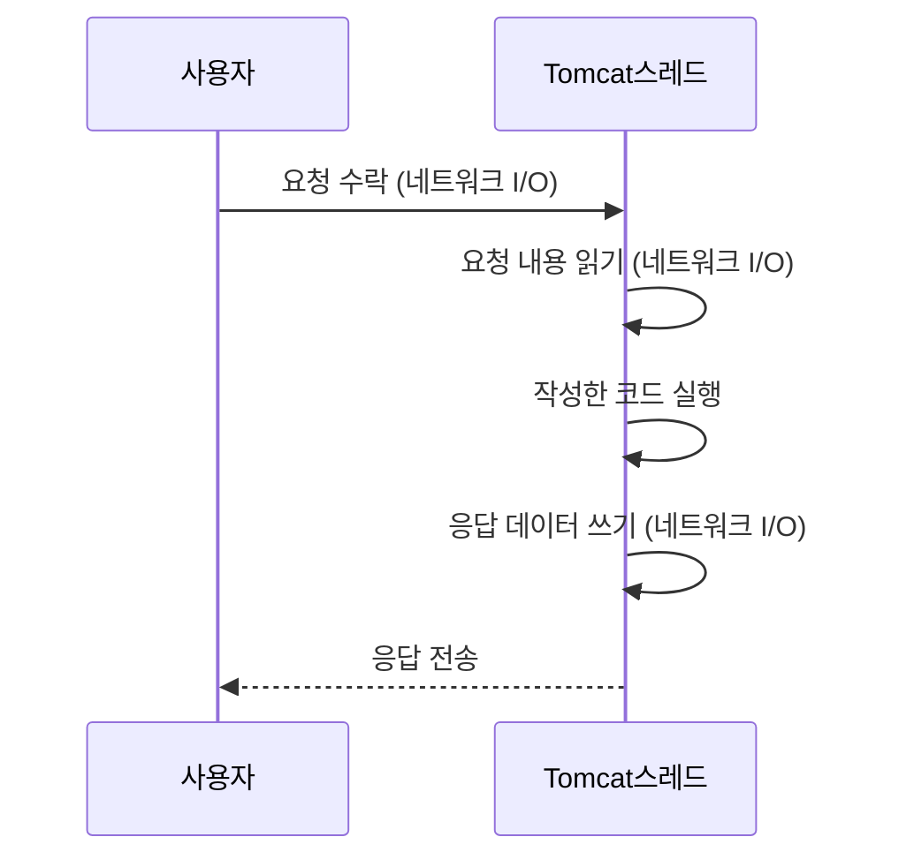
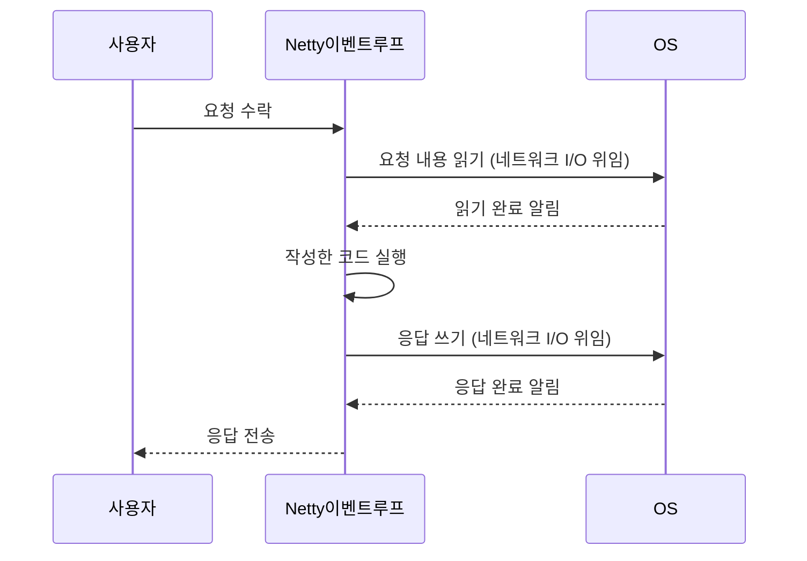
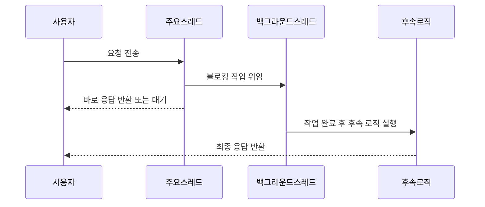

# 📘 인프런 - Spring WebFlux + LLM 실전 구현


## 📅 2025-07-21 - 리액티브 프로그래밍이란?

### 💡 학습 주제

- Spring WebFlux란 무엇인지 이해
- 리액티브 프로그래밍 개념과 필요성 학습


### 🧠 주요 개념 요약


| 항목 | 설명 |
|------|------|
| **WebFlux** | 비동기 논블로킹 I/O를 기반으로 하는 Spring의 웹 프레임워크. Netty, Undertow 등 Servlet이 아닌 웹서버와 통합 가능. |
| **리액티브 서비스** | 요청이 발생했을 때 자원을 효율적으로 활용해 빠르게 반응하는 비동기 서비스. 사용자 경험 개선과 시스템 자원 절약에 유리. |
| **동기/블로킹 방식** | 예: Tomcat. 요청-응답 구조에서 I/O가 끝날 때까지 스레드가 차단됨. |
| **비동기/논블로킹 방식** | 예: Netty. 요청 후 OS에 콜백을 등록하고 다른 작업 수행. 응답 도착 시 이벤트 루프(Selector)가 처리. |
| **WebFlux의 장점** | - Netty 기반 논블로킹 I/O 지원<br> - Flux/Mono를 통한 리액티브 스트림 기반<br> - WebClient, R2DBC와의 자연스러운 통합<br> - 이벤트 기반으로 Stream 통신 구현 가능 |


### 🆚 생활 비유로 이해하는 비동기/논블로킹 모델

> 치킨 배달 상황을 통해 동기/비동기 방식을 비교해 보자.

#### 🧍 동기 블로킹 방식 (Tomcat 등)

- 당신이 치킨을 시킨 후, 문 앞에서 치킨이 올 때까지 아무 일도 하지 않고 기다린다.
- 이 방식은 치킨(I/O)이 도착할 때까지 **스레드가 아무 작업도 하지 못한 채 대기**하는 구조다.

#### 🏃 비동기 논블로킹 방식 (Netty 등)

- 당신은 치킨을 시킨 후, 어머니에게 "치킨이 오면 메모 좀 남겨줘"라고 말하고 다른 일을 하러 간다.
- 어머니는 거실(커널 영역)에서 치킨이 오면 메모(이벤트)를 남긴다.
- 당신은 나중에 메모를 확인하고 문을 연다.

> 📝 비유 요약  
> 방 = 프로세스  
> 사람 = 스레드  
> 치킨 시키기 = I/O 요청  
> 어머니 = OS (이벤트 감지자)  
> 거실 = 커널 영역  
> 메모 확인 = 이벤트 루프(Selector)를 통한 이벤트 조회 및 실행
>> ### 💡 이처럼 WebFlux는 치킨 배달 예시의 **비동기 논블로킹 방식**과 같은 구조를 가지며, 자원을 효율적으로 사용하고 높은 확장성을 제공


### 🧪 실습 코드


#### 📌 1. 전통적 동기 방식

```java
List<Integer> sink = new ArrayList<>();
for (int i = 1; i < 10; i++) {
    Thread.sleep(500); // 0.5초 지연
    sink.add(i);
}
```

#### 📌 2. 리액티브 방식 (Flux 사용)

> 클라이언트 요청 헤더에 `Accept: text/event-stream` 추가  
> (요구사항: 데이터가 생성될 때마다 스트리밍으로 응답)

```java
Flux.create(sink -> {
    for (int i = 1; i < 10; i++) {
        try {
            Thread.sleep(500); // ⚠️ 블로킹 코드 (실습 목적)
        } catch (InterruptedException e) {
            sink.error(e);
        }
        sink.next(i);
    }
    sink.complete();
});
```


> 위 코드에서 `Thread.sleep()`은 실제 리액티브 환경에서는 사용 지양  
> `Mono.delay()`, `Flux.interval()` 등을 사용하여 논블로킹 처리할 것


### 🔎 리액티브 프로그래밍 핵심 포인트

1. **리액티브 스트림 사용 (Flux/Mono)**  
   - 데이터를 스트림 형태로 비동기 전송  
   - 준비된 데이터부터 순차적으로 전송 가능  
   - `text/event-stream` 으로 실시간 스트리밍 처리 가능

2. **논블로킹 프로그래밍 필수**  
   - 모든 연산 흐름이 블로킹 없이 연결되어야 함  
   - Netty의 이벤트 루프 모델 기반으로 설계  
   - `Thread.sleep()`, JDBC 등의 블로킹 API 사용은 금물  
   - R2DBC, WebClient, Schedulers 등을 통한 완전한 비동기화 필요

3. **함수형 스타일**  
   - 선언형, 체이닝 기반의 연산 (`map`, `flatMap`, `filter`, `zip`)  
   - side-effect 최소화


### 🧾 마무리

- Spring WebFlux는 Netty 기반으로 작동하며 논블로킹 서비스 구축에 특화됨
- Flux, Mono를 통해 데이터를 스트리밍 방식으로 전달하며, 효율적인 자원 관리 가능
- 리액티브 시스템은 비동기 흐름과 함수형 스타일이 핵심이며, 블로킹 코드를 철저히 배제해야 함
---


## 📅 2025-07-21 - 스레드란?

### 💡 학습 주제

- 스레드의 개념과 역할 이해
- Tomcat과 Netty의 스레드 처리 방식 비교


### 🧠 주요 개념 요약


| 항목 | 설명 |
|------|------|
| **Thread** | 하나의 작업 흐름을 실행하는 단위. 애플리케이션의 코드 흐름을 수행 |
| **Thread의 일반 흐름** | 사용자 요청 → CPU 자원 할당 → 웹서버 → 코드 실행 → 사용자에게 응답 |
| **Tomcat Thread 흐름** | 모든 작업을 요청당 할당된 스레드가 순차적으로 직접 수행 |
| **Netty Thread 흐름** | 소수의 스레드가 이벤트 루프 기반으로 동작하며, 블로킹 I/O는 OS에 위임 |


### 📌 Tomcat Thread 처리 순서도




### 📌 Netty Thread 처리 순서도




### 🆚 톰캣 vs Netty

#### 🧍 톰캣 스레드 모델

> Tomcat은 요청마다 스레드를 생성하여 작업을 처리하는 전통적 구조

- 요청 수락 → 요청 읽기 → 비즈니스 로직 실행 → 응답 쓰기를 모두 **동일한 스레드**에서 처리
- 블로킹 I/O 기반이며, 작업 중 대기 시간이 발생해도 스레드가 점유됨
- 다수의 요청을 처리하기 위해 **수백 개의 스레드**를 유지함

#### 🏃 Netty 스레드 모델

> Netty는 이벤트 루프 기반으로 작동하며, 비동기 논블로킹 방식에 최적화되어 있음

- 요청을 수락한 후 I/O 작업은 OS에 위임 (Selector를 통한 비동기 I/O)
- 작성한 코드만 간단히 실행한 뒤 다시 이벤트 루프로 복귀
- **작은 수의 스레드**로도 수천, 수만 개의 요청 처리 가능
- 컨텍스트 스위칭 비용 절감

| 구분 | Tomcat | Netty |
|------|--------|-------|
| 스레드 모델 | 요청당 1스레드 | 이벤트 루프 기반, 소수 스레드 |
| 블로킹 허용 | 일정 허용 | 거의 불가 |
| 스레드 수 | 수백 개 이상 | CPU 코어 수와 동일 수준 |
| 특징 | 직관적 구조, 자원 소모 많음 | 고성능 구조, 논블로킹 코드 필수 |


### ❓ 의문사항 정리

#### 📌 Q1. Netty도 스레드를 많이 만들면 안 되나요?

```
[ 하드웨어 영역(CPU) | 커널 영역(OS) | 유저 영역(프로세스) ]
```

- CPU는 **작업할 스레드의 컨텍스트**를 캐시에 올려두고 처리
- 스레드가 많아질수록 **캐시 교체와 컨텍스트 스위칭 비용**이 증가
- Netty는 CPU 코어 수만큼 스레드를 유지하여 **스위칭 비용을 최소화**

#### 📌 Q2. CPU가 한정되어 있는데, 애플리케이션은 어떻게 수많은 스레드를 만들 수 있나요?

- CPU 코어는 일반적으로 **1개의 물리적 스레드**를 동시 처리
- 우리가 생성하는 대부분의 스레드는 **논리 스레드**이며, 실제 실행은 **OS 스케줄러**가 관리
- CPU는 여러 논리 스레드 중 하나씩 교대로 실행 → **동시성이 아닌 시분할 처리**
- 프로세스는 스레드 수에 신경 쓸 필요 없이 OS가 적절히 할당


---

### 🔎 스레드 핵심 포인트

1. **스레드**는 프로그램의 실행 흐름 단위이며, 동시성의 기본 단위
2. **Tomcat**은 요청당 스레드를 할당하고, 블로킹을 수용할 수 있는 구조
3. **Netty**는 이벤트 루프를 통해 소수의 스레드로도 대량의 요청을 비동기 처리한
4. **스레드는 논리적 개념**이며, 실제 실행은 OS가 물리 CPU 코어에 맞게 스케줄링
5. **스레드 수가 많을수록 컨텍스트 스위칭 비용**이 증가하므로, Netty는 효율성을 위해 소수 스레드 유지 전략을 사용


---
### 🧾 마무리

- Tomcat은 직관적이고 사용하기 쉬우나, 대규모 동시 요청 처리에 비효율적
- Netty는 논블로킹 I/O 및 이벤트 기반 처리로 고성능 서버 개발에 적합하지만, **블로킹 코드를 섞으면 성능이 치명적으로 저하됨**.
- 고성능 백엔드 서버를 구축하려면 Netty와 같은 이벤트 루프 기반의 구조를 이해하고, 비동기 프로그래밍 방식에 익숙해질 필요가 있음

---


## 📅 2025-07-21 - 블로킹과 비동기프로그래밍이란?

### 💡 학습 주제

- 블로킹과 논블로킹의 차이 이해
- 비동기 프로그래밍의 개념과 동작 방식 습득


### 🧠 주요 개념 요약


| 항목 | 설명 |
|------|------|
| **비동기 프로그래밍** | 작업 순서를 강제하지 않고, 대기해야 하는 작업은 다른 곳에 위임하여 계속 진행하는 방식. 블로킹을 회피하고 응답성을 높이는 프로그래밍 기법. |
| **블로킹(Blocking)** | 스레드가 외부 자원(IO 등)의 결과를 기다리며 **멈춘 상태** |
| **논블로킹(Non-Blocking)** | 스레드가 작업을 위임하고 **다른 작업을 이어서 처리하는 방식** |


## 🆚 블로킹 vs 논블로킹

### 📌 어떤 작업이 블로킹인가?

| 작업 예시 | 블로킹 여부 | 설명 |
|-----------|-------------|------|
| DB 조회 | ✅ 블로킹 | DB 응답까지 스레드가 대기 |
| Network I/O (HTTP 등) | ✅ 블로킹 | OS/네트워크 장비 응답까지 대기 |
| 파일 읽기/쓰기 | ✅ 블로킹 | 디스크에서 데이터 반환까지 대기 |
| 객체 생성/계산 로직 | ❌ 논블로킹 | CPU에서 즉시 처리 가능 |

> 💡 참고: 대부분의 I/O는 블로킹이며, CPU 연산은 논블로킹이다.


## ⚙️ 실제 비동기 동작 방식

| 예시 | 비동기 처리 방식 |
|------|------------------|
| `setTimeout()` (JS) | 브라우저 백그라운드 스레드가 대기 후 콜백 실행 |
| `CompletableFuture` (Java) | 별도의 스레드에서 작업 수행 |
| Spring MVC + `CompletableFuture` | 컨트롤러 스레드가 작업 위임, 응답 스레드 변경 가능 |
| Netty | OS의 I/O 다중화 (Selector 기반) |
| WebFlux (`Flux` / `Mono`) | Reactor Scheduler의 워커 스레드가 작업 처리 |

---

### 🔎 비동기 핵심 포인트

1. **중요한 스레드는 블로킹 없이 반환**  
2. **시간이 오래 걸리는 작업은 OS 또는 백그라운드 스레드에 위임**  
3. **작업 완료 후 후속 로직이 있다면 이어서 처리, 없으면 종료**  
4. **응답성과 시스템 자원 활용도를 높이기 위한 핵심 기법**


### ❓ 비동기 처리 흐름

- **주요 스레드**는 블로킹 없이 이벤트만 등록하고 빠르게 반환
- **백그라운드 스레드**는 블로킹 작업(DB, 파일, 외부 API 등)을 **비동기 수행**
- 완료 후 **필요한 경우 후속 로직** 실행
- **최종 결과가 사용자에게 응답**




---
### 🧾 마무리


- 비동기 프로그래밍은 **성능 향상과 응답성 개선**을 위한 핵심 기술
- 단순히 비동기 API를 호출하는 것만으로는 충분하지 않으며, **스레드 관리와 흐름 제어**에 대한 깊은 이해가 필요
- 특히 WebFlux, Netty, CompletableFuture 등은 각각 **스레드 처리 방식이 다르므로**, 상황에 맞는 구조 설계가 중요

---


## 📅 2025-07-23 - Reactive Stream - 함수형 프로그래밍이란?

### 💡 학습 주제

- 함수형 프로그래밍에 대한 이해
- 함수형 프로그래밍을 통한 Reactive Stream 작성


### 🧠 주요 개념 요약


| 항목 | 설명 |
|------|------|
| **함수형 프로그래밍** | 코드를 선언적이고 간결하게 표현하기 위한 방식으로, 함수를 객체처럼 다루는 것이 핵심입니다. |
| **Java에서 함수는 객체?** | Java 8부터 `Function`, `Consumer`, `Supplier` 등의 함수형 인터페이스를 통해 함수도 객체로 전달 가능합니다. |
| **리액티브 스트림** | 일반 Stream처럼 종결자 없이는 실행되지 않으며, `subscribe`, `publish` 등이 종결자 역할을 합니다. |
| **Subscriber-Publisher 패턴** | `subscribe()`를 통해 데이터가 흐르기 시작하며, publisher는 데이터를 방출하고 subscriber는 이를 소비합니다. |
| **Controller는 subscribe 없어도 되는가?** | Spring WebFlux에서는 내부적으로 Netty의 이벤트 루프 스레드에서 자동 구독되므로 subscribe 호출이 필요 없습니다. 테스트 코드는 명시적 subscribe 필요. |


### 🆚 함수형 프로그래밍 vs 리액티브 스트림

#### 📌 기본 코드 (명령형 스타일)
```java
List<Integer> sink = new ArrayList<>();
for (int i = 1; i < 10; i++) {
    sink.add(i);
}

for (int i = 0; i < sink.size(); i++) {
    System.out.println(sink.get(i));
}
```

#### 📌 개선 요구사항

- 모든 변수에 *4 연산 수행
- 4의 배수만 필터링


#### ✅ 명령형 → 함수형으로 전환

##### 🎯 1. *4 연산 - 명령형 vs 함수형

- 기존 코드
```java
List<Integer> newSink1 = new ArrayList<>();
for (int i = 0; i <= 8; i++) {
    newSink1.add(sink.get(i) * 4);
}
sink = newSink1;
```
- 함수형 변경
```java
sink = map(sink, data -> data * 4);

private List<Integer> map(List<Integer> sink, Function<Integer, Integer> mapper) {
    List<Integer> result = new ArrayList<>();
    for (Integer item : sink) {
        result.add(mapper.apply(item));
    }
    return result;
}
```

##### 🎯 2. 필터링 - 명령형 vs 함수형

- 기존코드

```java
List<Integer> newSink2 = new ArrayList<>();
for (int i = 0; i <= 8; i++) {
    if (sink.get(i) % 4 == 0) {
        newSink2.add(sink.get(i));
    }
}
sink = newSink2;
```
- 함수형 변경

```java
sink = filter(sink, data -> data % 4 == 0);

private List<Integer> filter(List<Integer> sink, Predicate<Integer> predicate) {
    List<Integer> result = new ArrayList<>();
    for (Integer item : sink) {
        if (predicate.test(item)) {
            result.add(item);
        }
    }
    return result;
}

```

##### 🎯 3. 출력 - 명령형 vs 함수형

- 기존코드
```java
for (int i = 0; i < sink.size(); i++) {
    System.out.println(sink.get(i));
}
```
- 함수형 변경

```java
print(sink, System.out::println);

private void print(List<Integer> sink, Consumer<Integer> printer) {
    for (Integer item : sink) {
        printer.accept(item);
    }
}
```

#### 🔄 Stream API 활용 (람다 기반)

- 출력부분 변경
```java
IntStream.rangeClosed(1, 9)
         .boxed()
         .map(data -> data * 4)
         .filter(data -> data % 4 == 0)
         .forEach(System.out::println);
```

#### ⚡ Reactive Stream 활용

```java
Flux.fromIterable(IntStream.rangeClosed(1, 9).boxed().toList())
    .map(data -> data * 4)
    .filter(data -> data % 4 == 0)
    .subscribe(System.out::println);
```


1. Reactive Stream으로 변경

```java
Flux.fromIterable(IntStream.rangeClosed(1,9).boxed().toList())
     .map(data -> data*4)
     .filter(data -> data % 4 ==0)
     .subscribe(data -> System.out.println(data));
```

---

### 🔎 비동기 핵심 포인트

1. **함수형 프로그래밍은 함수를 객체처럼 다루며, 선언적 코드 스타일을 가능하게 함**  
2. **Flux, Mono는 Stream처럼 중간 연산자(Operator)를 체이닝할 수 있음**  
3. **Flux는 subscribe()가 호출되어야 실행됨 (Lazy Evaluation)**  
4. **Spring WebFlux는 Controller 내부에서 자동으로 구독을 수행 (Netty 이벤트 루프)**

---


### 🔁 비동기 흐름 예시
```java
public Flux<Integer> example(){
    return Flux.range(1, 9)
               .map(n -> n * 2)
               .filter(n -> n % 4 == 0);
}
```

- 위 코드는 실행되지 않음 (lazy)
- Controller가 있거나 subscribe 호출 시 실행됨
- Netty 이벤트 루프가 결과 전송
- 작업 완료후 Netty 복귀


---
### 🧾 마무리


- 함수형 프로그래밍은 선언적이고 유연한 코드 구성을 도움
- 리액티브 스트림은 함수형 패턴을 기반으로 비동기 데이터 흐름을 구현
- WebFlux는 subscribe 없이도 동작하며, 테스트 환경에선 명시적 구독 필요.

---


## 📅 2025-07-23 - WebFlux의 Subscriber - Publisher 패턴

### 💡 학습 주제

- Subscriber-Publisher 패턴의 동작 원리 이해
- 블로킹 회피를 위한 스레드 제어 방식 학습


### 🧠 주요 개념 요약


| 항목 | 설명 |
|------|------|
| **Publisher** | 데이터를 발행하는 주체 |
| **Subscriber** | 데이터를 구독하고 소비하는 주체 |
| **subscribe()** | 데이터 스트림 구독을 시작하는 트리거 |
| **publish()** | 데이터를 실제로 발행하는 동작 (주로 Hot Sequence에서 사용) |
| **Scheduler** | 별도의 스레드를 할당하여 비동기적으로 작업을 수행하게 하는 도구 |
| **Flux 구독 시** | `subscribe()`가 호출되어야 데이터 흐름이 시작됨 |
| **스레드 1개만으로 블로킹 회피 가능?** | 불가능. flatMap 사용으로도 회피할 수 없음 |
| **블로킹 회피 방법** | OS 위임 (ex: 커널 이벤트 큐) 또는 Reactor의 `Scheduler`로 별도 스레드 할당 |


### 🧩 subscribeOn vs publishOn

| 연산자 | 역할 |
|--------|------|
| **subscribeOn** | Publisher 측 데이터 생성이 실행되는 스레드를 지정 |
| **publishOn** | Subscriber 측 데이터 처리 스레드를 지정 (스트리밍에 적합) |


### 🔥 콜드 시퀀스 vs 핫 시퀀스

| 구분 | 설명 |
|------|------|
| **Cold Sequence** | 구독자가 있어야 데이터 발행 시작 (Flux, Mono 기본) |
| **Hot Sequence** | 구독자 유무와 관계없이 발행 지속 (ex: `publish()`, 실시간 스트리밍) |


### 🧪 실습 코드

#### 📌 1. 스케줄러를 활용한 블로킹 회피

```java
Flux<Integer> intFlux = Flux.<Integer>create(sink -> {
    for (int i = 1; i < 10; i++) {
        try {
            Thread.sleep(500); // blocking operation
        } catch (InterruptedException e) {
            // 생략
        }
        sink.next(i);
    }
    sink.complete();
}).subscribeOn(Schedulers.boundedElastic()); // 별도 스레드 할당

intFlux.subscribe(data -> {
    System.out.println("스레드 이름: " + Thread.currentThread().getName());
    System.out.println("WebFlux 구독 데이터: " + data);
});

// 메인 스레드 종료 방지용 sleep
try {
    Thread.sleep(5000);
} catch (InterruptedException e) {
    throw new RuntimeException(e);
}
```
>✅ Schedulers.boundedElastic()은 I/O blocking이 허용되는 스레드를 별도로 제공합니다.


---

### 🔎 Subscriber-Publisher 핵심 포인트

1. **Flux, Mono는 데이터를 담고 있는 것이 아니라, 함수형 정의만 포함**  
2. **구독을 해야 함수가 실행되며, 그제야 데이터가 생성됨**  
3. **단일 스레드에서는 아무리 연산자를 조합해도 블로킹 회피 불가능**  
4. **스케쥴러를 통해 별도의 스레드를 명시적으로 배정해야 블로킹 처리 가능**


---


### 📡 WebFlux의 동작 흐름 요약

1.	Controller에서 Flux 또는 Mono 반환
2.	WebFlux 내부에서 자동으로 subscribe() 수행
3.	Netty의 이벤트 루프가 응답 데이터를 비동기적으로 처리하여 클라이언트로 전송

---
### 🧾 마무리


- Subscriber-Publisher 패턴은 리액티브 스트림의 핵심 동작 구조
- subscribe 없이 Flux가 동작하지 않으며, 스케줄러는 블로킹 회피를 위한 필수 구성요소
- subscribeOn은 데이터 생성 시점, publishOn은 처리 시점의 스레드를 제어

---


## 📅 2025-07-23 - Netty와 이벤트 루프 패턴

### 💡 학습 주제

- 이벤트 루프 패턴의 구조와 동작 방식 이해
- Netty 기반 비동기 처리 흐름 분석


### 🧠 주요 개념 요약


| 항목 | 설명 |
|------|------|
| **이벤트 루프 패턴** | 하나의 스레드가 루프를 돌며 OS가 준비한 이벤트를 감지하고 콜백 함수를 실행 |
| **이벤트 루프 스레드** | 요청 수락, 읽기, 쓰기 이벤트를 처리한 후 다시 루프로 복귀하여 다음 이벤트 대기 |
| **이벤트(Event)** | 네트워크 연결 수락, 요청 데이터 읽기, 응답 데이터 쓰기 등의 IO 작업 |
| **Selector** | OS가 감지한 이벤트를 감시하고 관리하는 감시자 역할 |
| **Attachment** | 이벤트에 등록된 사용자 정의 콜백 함수 또는 핸들러 객체 |


## 📡 Netty 이벤트 루프의 동작 원리

> 💡 Netty는 이벤트 루프 기반 구조를 통해 **완전한 논블로킹 서버**를 구현합니다.

1. OS가 네트워크 이벤트를 감지하여 큐에 쌓음  
2. Netty의 이벤트 루프 스레드는 아래 과정을 반복
    1-1. selector를 통해 OS의 이벤트 확인
    1-2. 이벤트가 존재하면, 해당 이벤트에 등록된 콜백(Attachment) 실행
    1-3. 루프 복귀 후 다음 이벤트 대기

- 스레드는 직접적으로 IO를 수행하지 않고, OS가 이벤트를 준비할 때까지 반복적으로 조회만 수행

### 🧪 실습 코드

#### 📌 1. 예시 코드: 이벤트 루프 구조

```java
while (true) {
    selector.select(); // OS에게 이벤트 있는지 물어봄
    Set<SelectionKey> keys = selector.selectedKeys();

    for (SelectionKey key : keys) {
        if (key.isAcceptable()) {
            // 연결 수락 후 읽기 이벤트 등록
        } else if (key.isReadable()) {
            // 요청 읽기 -> 애플리케이션 로직 처리 -> 응답 준비
        } else if (key.isWritable()) {
            // 응답 쓰기 완료 처리
        }
    }
}
```
### 🧩 각 이벤트 역할 & 후속 처리

| **이벤트** | **처리 흐름** |
|:-:|-|
| **Accept (요청 수락)** | 연결 수락 후 Read 이벤트 등록 |
| **Read (요청 읽기)** | 요청 내용 읽기 → 비즈니스 로직 처리 → 응답 데이터 생성 |
| **Write (응답 쓰기)** | 응답 데이터를 OS 버퍼에 쓰기 → 완료되면 이벤트 제거 또는 재등록 |


### 🔥 이벤트 루프 스레드의 특징

- **루프 기반**으로 동작하며, 블로킹 없이 이벤트 감지 및 처리
- **대기 없이 빠르게 순환**, 이벤트 발생 시 즉시 대응
- **콜백 함수 기반 처리**, 이벤트 발생 시 지정된 핸들러 실행
- **IO 작업은 OS에 위임**, 스레드는 비즈니스 로직 중심으로 동작


---

### 🔎 핵심 포인트

1. **이벤트 루프는 논블로킹 비동기 서버의 핵심 처리 구조**  
2. **Netty는 이러한 구조를 통해 최소한의 스레드로 많은 요청을 처리**  
3. **이벤트마다 등록된 콜백이 존재하며, 이벤트 루프는 이를 실행하고 바로 복귀**  
4. **스레드는 직접 대기하지 않고 OS가 준비한 이벤트에만 반응**


---


### 🌐 WebFlux와 Netty 이벤트 루프 통합 구조

| **단계** | **동작** |
|:-:|-|
| 1단계 | Controller에서 Flux 또는 Mono 반환 |
| 2단계 | Spring WebFlux 내부적으로 subscribe() 수행 |
| 3단계 | Netty 이벤트 루프가 해당 비동기 응답을 감지 후 클라이언트에 전송 |


---
### 🧾 마무리


- Netty의 이벤트 루프 패턴은 고성능 서버의 핵심 기반 기술
- WebFlux는 이 구조를 활용하여 효율적이고 반응성 높은 비동기 처리를 지원
- 스레드는 처리 대신 이벤트 감지/콜백 실행만 담당하며, 모든 IO는 OS가 주도

---
