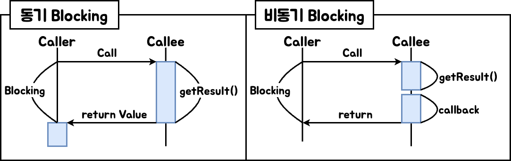
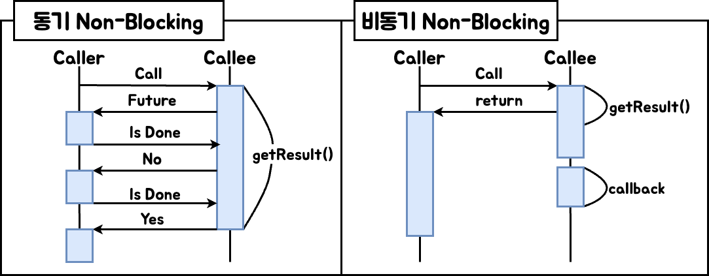

---
aliases:
  - "\bsync-vs-async"
---
#  🧠 Sync VS Async

### ✅ 핵심 개념 요약
- **동기(Synchronous)**: 호출한 쪽(caller)이 결과가 나올 때까지 흐름을 함께 맞춰 기다림  
- **비동기(Asynchronous)**: 호출한 쪽(caller)은 즉시 반환받고, 결과 처리는 호출받은 쪽(callee)에서 완료 후 알림  
- **Blocking**: 결과가 준비될 때까지 호출자가 **대기하며 다른 일을 못 함**  
- **Non-Blocking**: 호출자가 결과를 기다리지 않고 **다른 작업을 계속 수행 가능**

### 🔎 상세 개념 정리
| 구분               | 설명                                                                                   |
| ---------------- | ------------------------------------------------------------------------------------ |
| **동기(Sync)**     | 호출자가 직접 결과를 기다리고 처리함.  예: JDBC 호출 후 결과 ResultSet을 즉시 받아 처리                        |
| **비동기(Async)**   | 호출자는 즉시 반환받고, 실제 결과 처리는 콜백/이벤트/훗날 응답으로 callee가 처리.  예: R2DBC, `CompletableFuture` |
| **Blocking**     | 호출자가 결과 준비될 때까지 멈춤 (스레드 점유)                                                          |
| **Non-Blocking** | 호출자가 멈추지 않고 계속 다른 작업을 수행                                                             |
### ✅ 동기 + Blocking vs 비동기 + Blocking
- **동기 Blocking**: 가장 일반적인 방식. 요청 → 결과 반환까지 대기.  
	- 예: 전통적인 JDBC 호출, 파일 읽기 API  
- **비동기 Blocking**: 요청은 비동기로 보냈지만, 호출자가 결과를 강제로 기다림 (`future.get()` 같은 경우).

### ✅  동기 Non-Block  vs 비동기 Non-Block
- **동기 Non-Blocking**: 호출자는 즉시 응답받지만, 결과 확인을 **직접 반복 체크(polling)** 해야 함.  
	- 예: NIO 소켓 채널에서 `ready` 여부를 직접 확인  
- **비동기 Non-Blocking**: 가장 효율적인 모델. 호출자는 즉시 반환받고, 결과가 준비되면 **이벤트/콜백/Promise**로 callee가 알려줌.  
	-  예: Netty, Spring WebFlux, Java `CompletableFuture.thenApply()`

### 🚀 CompletableFuture
- **Java 8 도입**: 기존 `Future`의 한계를 극복한 비동기 API. (`java.util.concurrent`)
- Completion Stage : 비동기 체이닝 메서드 제공
- Future : 완료시 결과값 반환
- allOf : 모든 요청 완료 대기
- join : 개별결과 수집
- **특징**  
  - 비동기 작업 실행: `supplyAsync()`, `runAsync()`  
  - 콜백 체이닝: `thenApply()`, `thenAccept()`, `thenRun()`  
  - 연산 조합: `thenCompose()`, `thenCombine()`  
  - 예외 처리: `exceptionally()`, `handle()`  
- **Blocking vs Non-Blocking 사용 예시**  
  - Blocking: `future.get()` → 결과 올 때까지 현재 스레드 대기  
  - Non-Blocking: `thenApply()`, `thenAccept()` → 결과가 준비되면 콜백 실행