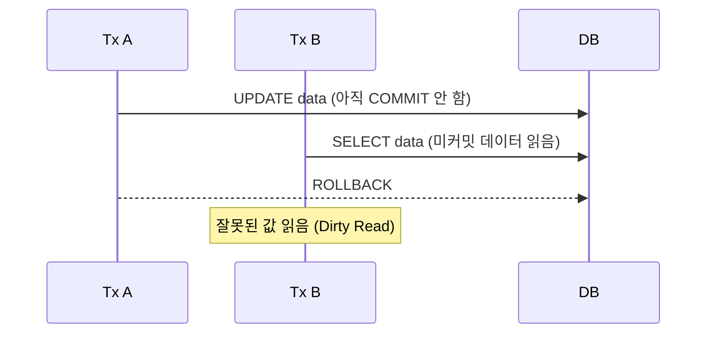
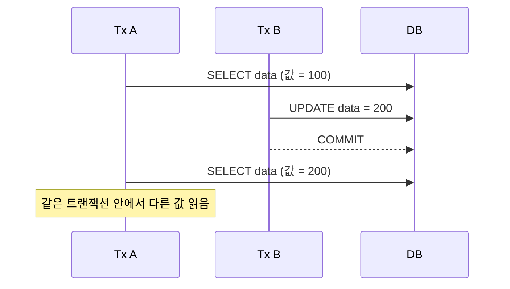
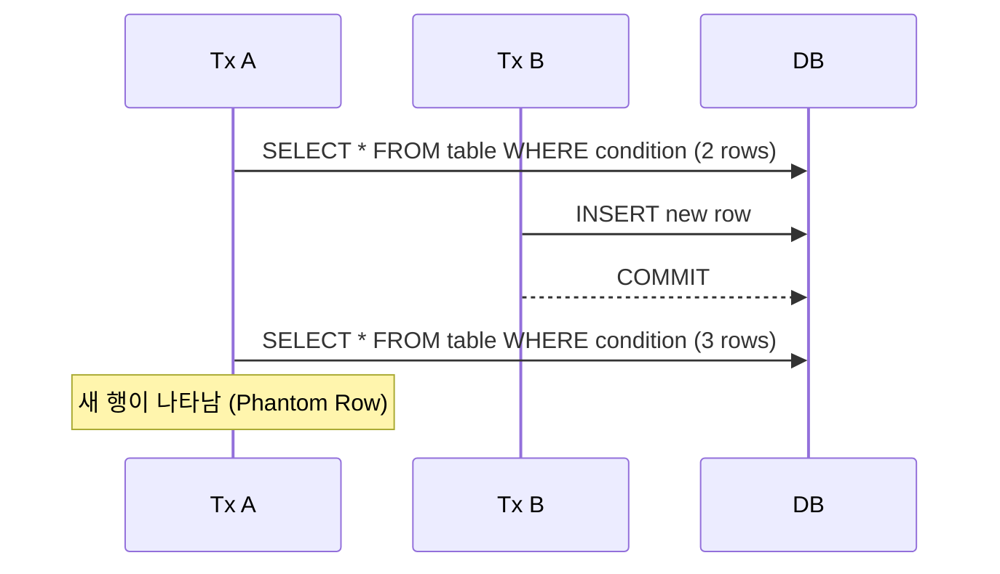

---
aliases:
  - "\bIsolation Level"
---
- [[#1. Isolation Level(트랜잭션 격리 수준)|1. Isolation Level(트랜잭션 격리 수준)]]
- [[#2. 트랜잭션 격리 수준에서 발생하는 문제들|2. 트랜잭션 격리 수준에서 발생하는 문제들]]

---

## 1. Isolation Level(트랜잭션 격리 수준)
### 1-1. Read Uncommitted
- **DirtyRead** : 다른 트랜잭션에서 아직 커밋되지 않은 데이터를 읽을수 있음
- Non-Repeatable Read 발생 가능
- Phantom Read 발생 가능

### 1-2. Read Committed
- Dirty Read 방지
- **Non-Repeatable Read 발생**: 같은 데이터를 두 번 읽을 때 값이 다를 수 있음
- Phantom Read 발생 가능

### 1-3. Repeatable Read
- Dirty Read 방지
- Non-Repeatable Read 방지
- **Phantom Read 발생 가능**
- InnoDB에서는 MVCC로 대부분 해결 가능

### 1-4. Serializable
- Dirty Read 방지
- Non-Repeatable Read 방지
- Phantom Read 방지
- 가장 강력하지만 동시성 낮음 (Read/Write Lock 필요)

| Isolation Level  | Dirty Read | Non-Repeatable Read | Phantom Read |
| ---------------- | ---------- | ------------------- | ------------ |
| Read Uncommitted | O          | O                   | O            |
| Read Committed   | X          | O                   | O            |
| Repeatable Read  | X          | X                   | O            |
| Serializable     | X          | X                   | X            |

---

## 2. 트랜잭션 격리 수준에서 발생하는 문제들
### 2-1. DirtyRead
- 다른 트랜잭션에서 아직 커밋되지 않은 데이터를 읽을수 있음

### 2-2. Non-Repeatable Read
- 같은 데이터를 두 번 읽을 때 값이 다를 수 있음

### 2-3. Phantom Read
- 새로운 행이 추가될 경우 로우 갯수가 다를 수 있음

---
