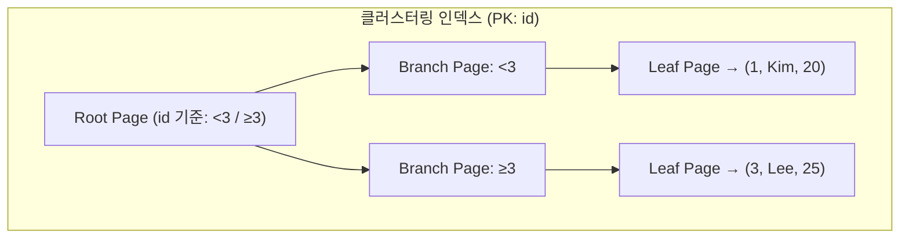
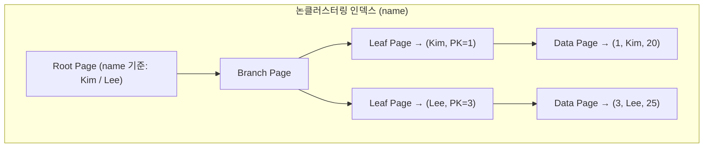
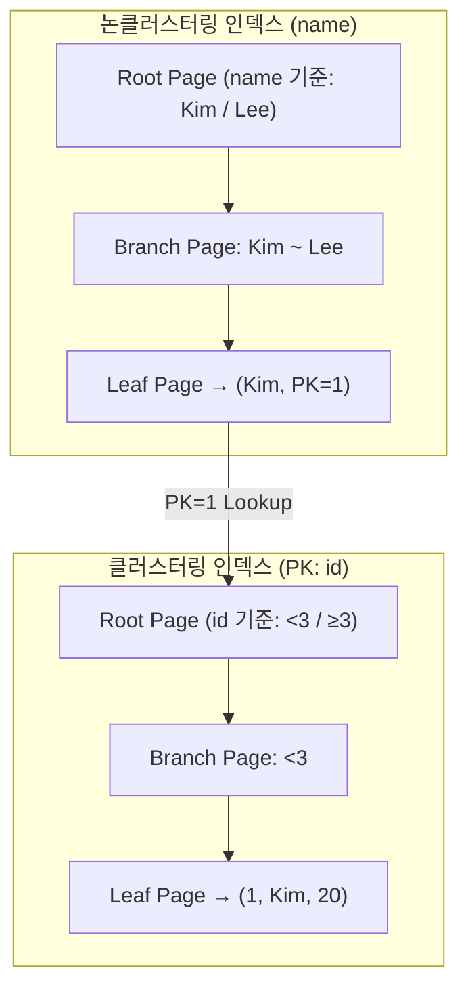

- [[#1. 인덱스 사용이유|1. 인덱스 사용이유]]
- [[#2. 클러스터링 인덱스|2. 클러스터링 인덱스]]
- [[#3. 논 클러스터링 인덱스|3. 논 클러스터링 인덱스]]
- [[#4. 클러스터링 인덱스 vs 논클러스터링 인덱스|4. 클러스터링 인덱스 vs 논클러스터링 인덱스]]
- [[#5. 인덱스 스캔 종류|5. 인덱스 스캔 종류]]

---

## 1. 인덱스 사용이유
- 정렬, 그루핑, 검색등을 빠르게 하기 위해

---

## 2. 클러스터링 인덱스

- 조건 : `PK`, `NOT NULL`, `Unique Index`
- 리프 페이지 = 데이터 페이지 (실제 데이터 저장)
- **장점** : 검색 성능 우수
- **단점** : 데이터 변경이 빈번할 경우 성능 저하 발생 (페이지 재정렬 필요)

---

## 3. 논 클러스터링 인덱스

- 일반적인 Index 생성
- 리프 페이지가 별도 존재 (데이터 페이지 주소를 가짐)
- Root Page → 분기 페이지 → 리프 페이지 → 데이터 페이지 순으로 탐색
- **단점** : 클러스터링 인덱스보다 추가 I/O 발생

---

## 4. 클러스터링 인덱스 vs 논클러스터링 인덱스

### 4-1. 예시 데이터 (`User` 테이블)
| PK(id) | name   | age |
| ------ | ------ | --- |
| 1      | Kim    | 20  |
| 3      | Lee    | 25  ||
- **PK(id)** : 클러스터링 인덱스 기준

---

  

### 4-2. 클러스터링 인덱스 (PK = id)

- Leaf Page 자체에 **실제 데이터(Row 전체)** 저장
- PK(id) 기준으로 항상 **정렬 상태 유지**
- 범위 검색, PK 기반 검색에서 성능 최적화

  

---

  

### 4-3. 논클러스터링 인덱스 (name)

- Leaf Page에는 **인덱스 컬럼(name) + PK 값**만 저장
- 실제 데이터 조회 시 → **PK Lookup** → 클러스터링 인덱스로 이동
- 비PK 검색에 유리하지만, 추가 I/O 발생

---

### 4-4. 논클러스터링 인덱스 + 클러스터링 인덱스 탐색 흐름
- 페이지 변경시 변경 범위가 큼(주소값 모두 변경)

---

## 5. 인덱스 스캔 종류

- 복합 인덱스 : 두개 이상의 컬럼으로 생성
- 커버링 인덱스 : 쿼리에 필요한 모든 컬럼을 포함하는 인덱스
- 인덱스 레인지 스캔 : 조건 범위 내의 값 조회
- 루스 인덱스 스캔 : 그루핑/ 집계시 인덱스를 듬성 듬성 조회
- 풀 인덱스 스캔 : 인덱스를 모두 조회

---