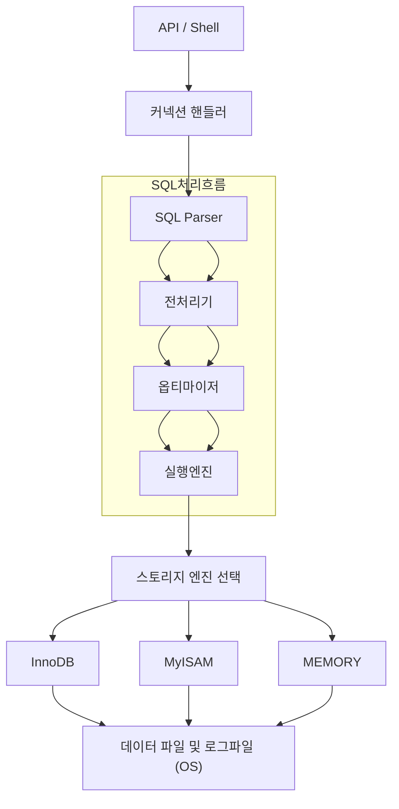
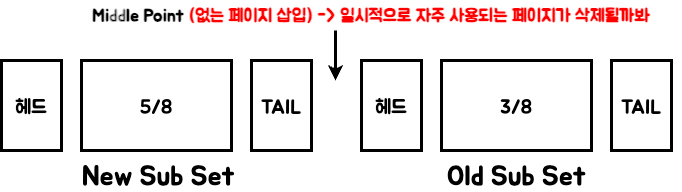
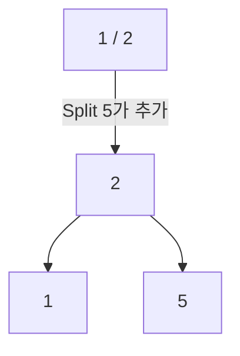
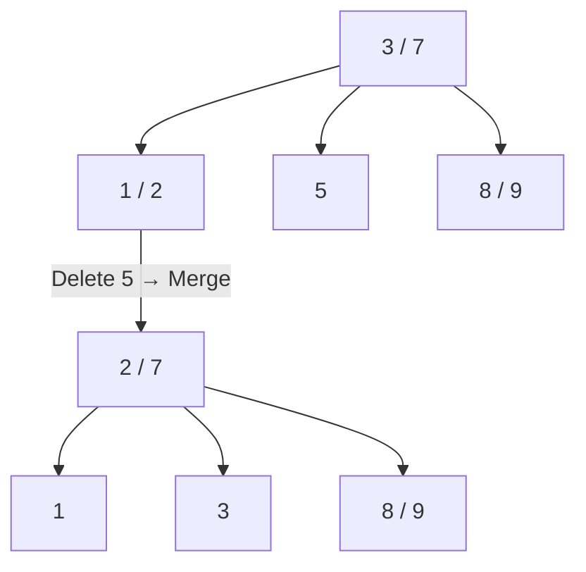
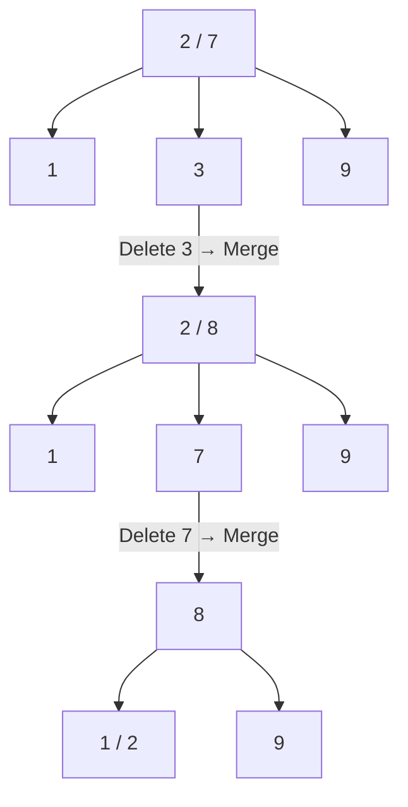

- [[#1. MySQL 전체 구조|1. MySQL 전체 구조]]
- [[#2. InnoDB vs MyISAM 정리|2. InnoDB vs MyISAM 정리]]
- [[#3. 구조 비교|3. 구조 비교]]
- [[#4. 추가 개념 정리|4. 추가 개념 정리]]
- [[#5. 버퍼풀|5. 버퍼풀]]
- [[#6. MVCC|6. MVCC]]

--- 

## 1. MySQL 전체 구조 

- SQL Parser
	- 요청 쿼리를 단어 단위의 토큰으로 분리
	- 문법 오류 검사
	- 오류가 없으면 트리 형태로 쿼리를 구성
- 전처리기 
	- 쿼리의 논리적 오류를 파악
	- ex) 접근권한, 테이블 유무...등
- 옵티마이저 : 실행 계획 생성
- 실행 엔진 : 실제 작업을 수행

---
## 2. InnoDB vs MyISAM 정리

### 2-1. InnoDB 특징
- **Row 수준의 잠금 (인덱스를 걸어야 함)**
- 외래키 지원
- 트랜잭션 지원
	- **Undo / Redo 로그**를 통해 데이터 무결성 보장
		- Undo : 변경 이전의 값 저장 (Rollback, MVCC 용도)
		- Redo : 커밋된 값의 복구용 (비정상 종료 시 재적용)
- **MVCC (Multi-Version Concurrency Control)** 지원
	- 동일 데이터에 대해 여러 버전 관리
	- 일관된 읽기(Consistent Read) 제공
- 버퍼 풀(Buffer Pool) 사용
	- 데이터/인덱스를 메모리에 캐싱
	- Page 단위 데이터 관리 (Linked List 구조)

### 2-2. MyISAM 특징
- **Table 수준의 잠금 (병목 현상 발생)**
- 외래키 미지원
- 트랜잭션 미지원
- Undo / Redo 로그 없음
- MVCC 미지원
- 비교적 단순 구조로 읽기 성능은 빠름

---

## 3. 구조 비교
| 구분               | InnoDB                           | MyISAM                   |
| ---------------- | -------------------------------- | ------------------------ |
| 잠금 단위            | Row (세밀함, 동시성 ↑)                 | Table (전체 잠금, 동시성 ↓)     |
| 트랜잭션 지원          | O                                | X                        |
| Undo / Redo 로그   | 지원 (Rollback & Recovery 가능)      | 지원 안 함                   |
| MVCC             | 지원                               | 지원 안 함                   |
| 안정성              | 높음                               | 낮음 (Crash 시 위험)          |
| 속도 특성            | 읽기/쓰기 모두 균형                      | 읽기 위주에 강점                |
| 외래키              | O                                | X                        |

---
## 4. 추가 개념 정리

### Undo Log
- 트랜잭션 롤백 시 사용
- 이전 값(변경 전 데이터) 저장
- MVCC(일관된 읽기)에도 활용됨
### Redo Log
- 커밋된 데이터의 복구용
- 비정상 종료 시, 마지막 커밋 시점까지 복원
### MVCC (Multi-Version Concurrency Control)
- 여러 트랜잭션이 동시에 같은 데이터를 다루어도 일관성 유지
- Undo 로그를 기반으로 과거 버전을 관리

--- 

## 5. 버퍼풀

--- 

## 6. MVCC
| 구분         | Read Lock | Write Lock |
| ---------- | --------- | ---------- |
| Read Lock  | O         | O          |
| Write Lock | O         | X          ||

---

## 7. 글로벌 인덱스 vs 로컬 인덱스

| 구분          | 글로벌 인덱스 (Global)                  | 로컬 인덱스 (Local)              |
| ----------- | --------------------------------- | --------------------------- |
| 관리 단위       | 테이블 전체                            | 파티션 단위                      |
| 유일성(Unique) | 테이블 전체에서 보장                       | 파티션 내부에서만 보장                |
| 검색 범위       | 모든 파티션을 아우르는 인덱스                  | 특정 파티션 내에서만 탐색              |
| 유지 보수 비용    | 높음 (파티션 변경 시 전체 인덱스 영향)           | 낮음 (파티션 내부에서만 관리)           |

---

## 8. Balanced Tree

### 8-1. 특징
- 높이가 동일
- 시간 복잡도: `O(log N)`
- Internal node는 항상 **2개 이상의 자식 노드**를 가짐
- Internal node의 키가 `X`면 자식 노드의 수는 `X + 1`

### 8-2. 연산
#### 8-2-1. 추가

#### 8-2-2. 삭제
##### 삭제 예시 1

##### 삭제 예시 2

