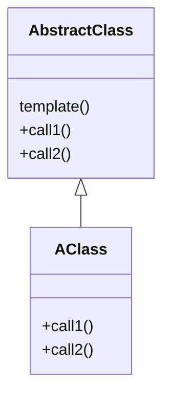
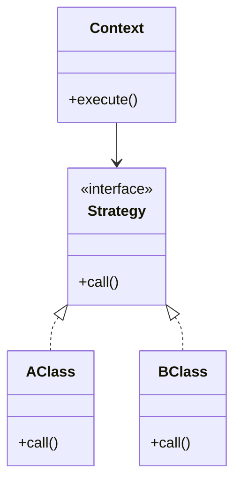
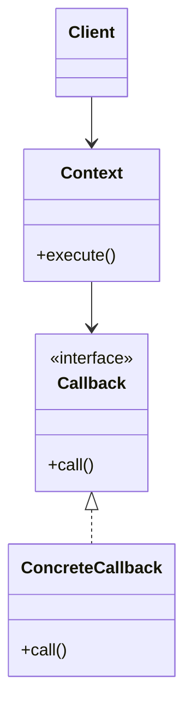
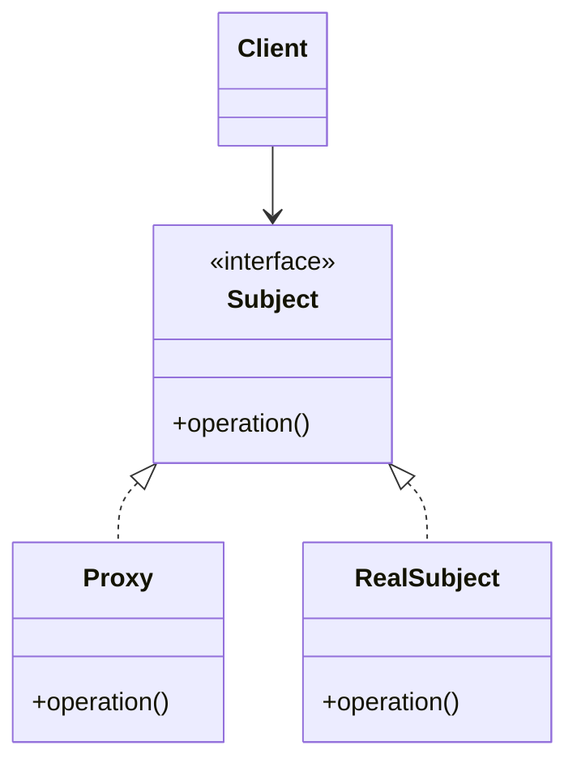
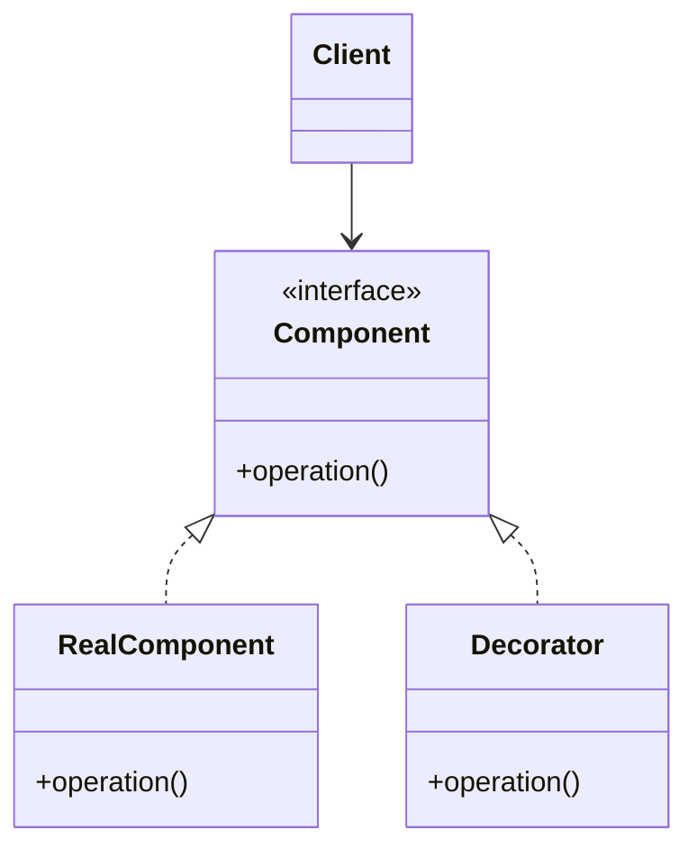

- [[#1. 템플릿 메소드 패턴|1. 템플릿 메소드 패턴]]
- [[#2. 전략 패턴|2. 전략 패턴]]
- [[#3. 템플릿 콜백 패턴|3. 템플릿 콜백 패턴]]
- [[#4. 프록시 패턴 (Proxy Pattern)|4. 프록시 패턴 (Proxy Pattern)]]
- [[#5. 데코레이터 패턴 (Decorator Pattern)|5. 데코레이터 패턴 (Decorator Pattern)]]

---

## 1. 템플릿 메소드 패턴
- 변하지 않는 부분을 템플릿화하고, 변하는 부분은 상속을 통해 구현

---

## 2. 전략 패턴 
- 변하지 않는 부분을 Context에 두고 변하는 부분을 interface에 구현

---

## 3. 템플릿 콜백 패턴
- 전략 패턴에서 콜백 인터페이스를 실행시 주입하는 방식

---

## 4. 프록시 패턴 (Proxy Pattern)
- 객체의 접근 제어를 위한 패턴

---

## 5. 데코레이터 패턴 (Decorator Pattern)
- 기존 기능에 새로운 기능을 추가하는 패턴

---
