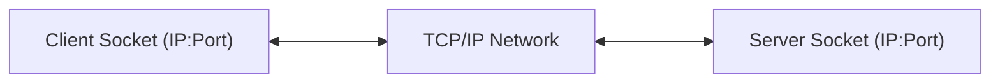
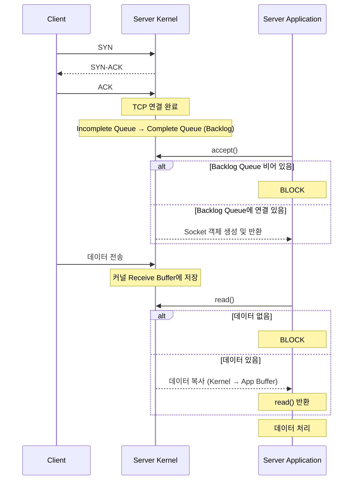
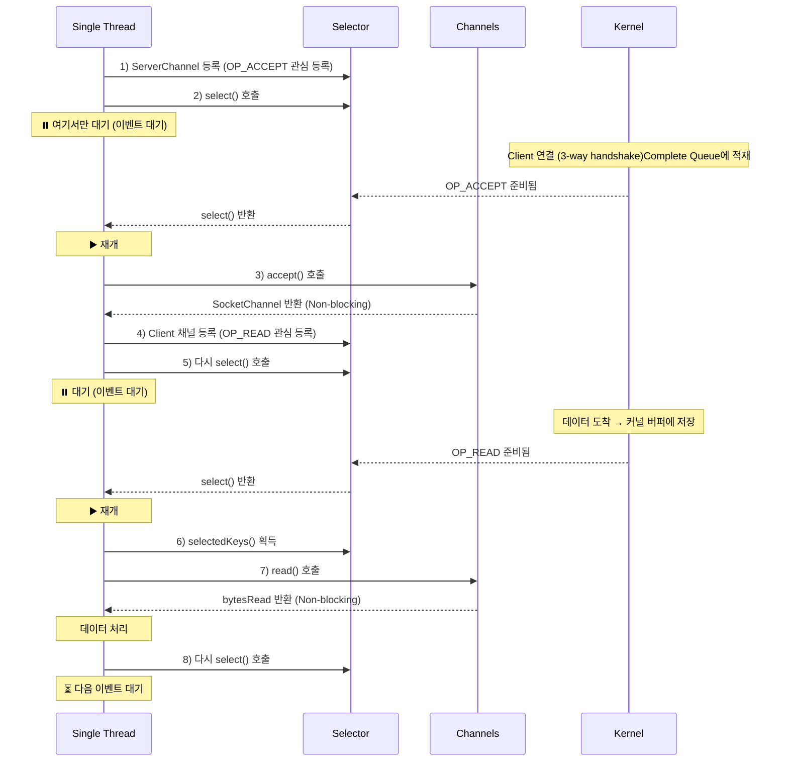

## 1. 소켓통신이란?
- 소켓은 네트워크를 통해 데이터를 주고 받기 위한 양방향 통신의 EndPoint
- IP주소와 PORT번호를 통해 프로세스간 통신


## 2.  Blocking I/O 방식의 읽기 흐름
### 2-1. 동작방식
#### 1. 서버 소켓 생성
- socket() : 소켓 생성
- bind(8080) : 포트바인딩
- listen(50) : backlog 큐 크기를 50으로 설정
```java
ServerSocket serverSocket = new ServerSocket(8080, 50); //port, backlog
```
#### 2. 클라이언트 연결 수락
- backlog가 비어 있으면 대기
- 큐에 연결이 있으면 즉시 반환
- 새로운 소켓 객체 생성하여 반환
```java
Socket clientSocket = serverSocket.accept(); //Blocking
```
#### 3. 데이터 송수신
- Thread를 사용
```java
InputStream in = clientSocket.getInputStream(); 
OutputStream out = clientSocket.getOutputStream();

ByteBuffer buffer = ByteBuffer.allocate(1024);

// read()도 블로킹됨
// 커널 버퍼에 데이터가 없으면 여기서 대기
int bytesRead = in.read(buffer);  //Blocking
```

### 2-2. 동작 흐름


## 3. Blocking 방식의 장단점 

#### 3-1. 장점

**1. 구현이 직관적이고 단순함**

```java
// 코드 흐름이 순차적이고 이해하기 쉬움
int data = in.read();      // 1단계: 읽기
process(data);             // 2단계: 처리
out.write(response);       // 3단계: 응답

```

**2. 디버깅이 용이**

- 동기적 처리로 스택 트레이스 추적 쉬움
- 각 스레드의 상태가 명확함

**3. 간단한 서비스에 적합**

- 소수의 클라이언트 처리
- 즉각적인 응답이 필요한 경우

#### 3-2. 단점

**1. 확장성 문제 (가장 큰 단점)**

```
100개 Client 접속 → 100개 스레드 필요
1000개 Client 접속 → 1000개 스레드 필요
10000개 Client 접속 → 메모리 부족
```

**2. 리소스 낭비**

```java
// 대기 중인 스레드는 CPU를 사용하지 않지만
// 메모리는 계속 점유 (스레드 스택 공간)
ByteBuffer buffer = ByteBuffer.allocate(1024);
int bytesRead = in.read(buffer);  // 이 순간 다른 작업 불가
```

**3. Context Switching 비용**

- 많은 스레드 → 잦은 컨텍스트 스위칭

## 4. Non-Blocking / NIO 개념
### 4-1. 간략 설명
- 하나의 스레드가 여러 채널을 관리하며, **준비된 채널만 선택적으로 처리**
```
기존 Blocking:  Thread-1 → Client-1 (accept 대기 또는 read 대기)
               Thread-2 → Client-2 (accept 대기 또는 read 대기)
               Thread-3 → Client-3 (accept 대기 또는 read 대기)
               → 각 스레드가 블로킹됨

NIO:           Thread-1 → [Selector] → ServerChannel 새 연결 준비됨
                                     → Client-1  데이터 없음
                                     → Client-2  읽기 가능
                                     → Client-3  데이터 없음

               → ServerChannel과 Client-2만 처리 (논블로킹)
               → 다시 select()로 돌아가서 다음 이벤트 대기
```
### 4-2. NIO 주요 구성요소(channel, buffer,selector)
#### 1.  Channel (채널)
```java
// 양방향 데이터 통로
ServerSocketChannel serverChannel = ServerSocketChannel.open();
SocketChannel clientChannel = serverChannel.accept();

// 읽기와 쓰기 모두 가능
clientChannel.read(buffer);   // 읽기
clientChannel.write(buffer);  // 쓰기
```
- **종류:**
	- `ServerSocketChannel`: 서버 소켓
	- `SocketChannel`: 클라이언트 연결
	- `FileChannel`: 파일 I/O
	- `DatagramChannel`: UDP 통신
#### 2. Buffer (버퍼)
- 데이터를 읽고 쓰는 임시 저장소
- Buffer의 3가지 핵심 속성
	- `position` : 현재 읽기/쓰기 위치
	- `limit` : 읽기/쓰기 가능한 끝 위치
	- `capacity` : 버퍼의 전체 크기
```java
// 데이터를 읽고 쓰는 임시 저장소
// 1. 쓰기 모드 (데이터를 버퍼에 넣기)
buffer.put((byte)1);
channel.read(buffer);  // 채널에서 버퍼로 읽기

// 2. 읽기 모드로 전환
buffer.flip();  // limit = position, position = 0

// 3. 읽기 모드 (버퍼에서 데이터 꺼내기)
byte data = buffer.get();
channel.write(buffer);  // 버퍼에서 채널로 쓰기

// 4. 다시 쓰기 모드로
buffer.clear();
```

#### 3. Selector (셀렉터)
- Selector는 **여러 채널의 I/O 이벤트를 하나의 스레드에**서 관리
- Selector 이벤트 종류
	- `SelectionKey.OP_ACCEPT` :  연결 수락 가능
	- `SelectionKey.OP_CONNECT` : 연결 가능
	- `SelectionKey.OP_READ` : 읽기 가능
	- `SelectionKey.OP_WRITE` : 쓰기 가능

```java
// 여러 채널을 하나의 스레드로 관리
Selector selector = Selector.open();

// 채널을 셀렉터에 등록 + 관심 이벤트 지정
channel.register(selector, SelectionKey.OP_READ);

// 준비된 채널이 있을 때까지 대기
int readyChannels = selector.select();  // 블로킹

// 준비된 채널들 처리
Set<SelectionKey> selectedKeys = selector.selectedKeys();
```


### 4-3. NIO에서 읽기(read) 처리 흐름 (핵심)
#### 4-3-1. 동작 흐름
##### 1. ServerSocketChannel 생성 및 등록

```java
// ServerSocketChannel 생성
ServerSocketChannel serverChannel = ServerSocketChannel.open();
serverChannel.bind(new InetSocketAddress(8080), 50);  // backlog = 50
serverChannel.configureBlocking(false);  // Non-blocking 모드

// Selector에 등록
Selector selector = Selector.open();
serverChannel.register(selector, SelectionKey.OP_ACCEPT);
// OP_ACCEPT: 새로운 연결이 backlog Queue에 준비되면 알림받기

```

##### 2. Selector로 이벤트 대기 (여기서만 블로킹)
- select()는 블로킹이지만, 여러 채널의 여러 이벤트를 동시에 모니터링
```java
int readyCount = selector.select();  // 최소 1개 준비될 때까지 대기

// 이 한 번의 select()로:
// - ServerChannel의 새 연결 (OP_ACCEPT)
// - Client1의 읽기 가능 (OP_READ)
// - Client2의 쓰기 가능 (OP_WRITE)
// 등을 동시에 감지

// 또는 타임아웃 설정
selector.select(1000);  // 1초 대기

// 또는 논블로킹 방식
selector.selectNow();   // 즉시 반환 (폴링 방식)
```

##### 3. 새 연결 수락 (accept) - Non-blocking 
```java
Set<SelectionKey> selectedKeys = selector.selectedKeys();
Iterator<SelectionKey> keyIterator = selectedKeys.iterator();

while (keyIterator.hasNext()) {
    SelectionKey key = keyIterator.next();

    if (key.isAcceptable()) {
        ServerSocketChannel serverChannel = (ServerSocketChannel) key.channel();

        // accept()는 Non-blocking
        // Complete Queue에서 연결을 즉시 꺼내거나 null 반환
        SocketChannel clientChannel = serverChannel.accept();

        if (clientChannel != null) {
            System.out.println("새 클라이언트 연결 (TCP 이미 완료됨)");

            // 클라이언트 채널도 Non-blocking 설정
            clientChannel.configureBlocking(false);

            // Selector에 등록 (읽기 이벤트 관심)
            clientChannel.register(selector, SelectionKey.OP_READ);
        }
    }

    keyIterator.remove();
}

```

##### 4. 클라이언트로부터 데이터 읽기 (read) - Non-blocking

```java
while (keyIterator.hasNext()) {
    SelectionKey key = keyIterator.next();

    if (key.isReadable()) {
        SocketChannel channel = (SocketChannel) key.channel();
        ByteBuffer buffer = ByteBuffer.allocate(1024);

        // read()는 Non-blocking, 즉시 반환
        int bytesRead = channel.read(buffer);

        if (bytesRead == -1) {
            // 클라이언트 연결 종료
            channel.close();
            key.cancel();
        } else if (bytesRead > 0) {
            // 데이터 처리
            buffer.flip();
            // ... 처리 로직
        } else {
            // bytesRead == 0: 데이터 없음, 다음으로
        }
    }

    keyIterator.remove();  // ⚠️ 중요: 처리한 키는 제거
}
```
##### 5. 다시 2번으로 돌아가서 반복

####  4-2-2. 전체 흐름



## 5. Blocking  I/O vs NIO 비교정리
### 5-1. 읽기방식, 확장성
#### 5-1-1. 읽기방식
##### 1. Blocking I/O Server 
- Blocking: accept() / read()에서 대기(블로킹)
```java
while (true) {
    Socket s = serverSocket.accept();     // 연결 대기
    new Thread(() -> {
        byte[] buf = new byte[1024];
        int n = s.getInputStream().read(buf);  // 데이터 대기
        process(buf, n);
        s.getOutputStream().write(response());
    }).start();
}
```
##### 2. NIO Server (select()에서만 블로킹)
- NIO: select()에서만 대기, accept/read는 즉시 반환(null/0 가능)
```java
while (true) {
    selector.select();                    // 이벤트 대기
    Iterator<SelectionKey> it = selector.selectedKeys().iterator();
    while (it.hasNext()) {
        SelectionKey key = it.next();
        it.remove(); // ✅ 지금 처리할 key만 제거 (가장 중요)
        if (key.isAcceptable()) {
            ServerSocketChannel server = (ServerSocketChannel) key.channel();
            SocketChannel c = server.accept(); // 즉시 (없으면 null)
            if (c != null) {
                c.configureBlocking(false);
                c.register(selector, SelectionKey.OP_READ);
            }
        }

        if (key.isReadable()) {
            SocketChannel channel = (SocketChannel) key.channel();
            ByteBuffer buffer = ByteBuffer.allocate(1024); 
            int n = channel.read(buffer); // 즉시 (0 가능)
            if (n > 0) {
                buffer.flip();
                process(buffer);
            } else if (n == -1) {
                channel.close();
                key.cancel();
            }
        }
    }
}
```

#### 5-1-2. 확장성
- **Blocking I/O**
    - 동접 증가 → 스레드 수 증가
    - 스레드 증가 → 스택 메모리 사용 증가, 컨텍스트 스위칭 증가
    - 일정 시점 이후 성능 급격히 저하 → **확장성 낮음**
- **NIO**
    - 소수의 이벤트 루프 스레드가 다수의 채널을 처리
    - 동접이 늘어도 스레드 수는 거의 고정
    - 자원 사용 증가율이 완만 → **확장성 높음**
