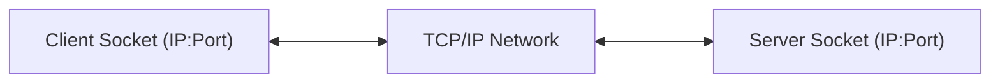
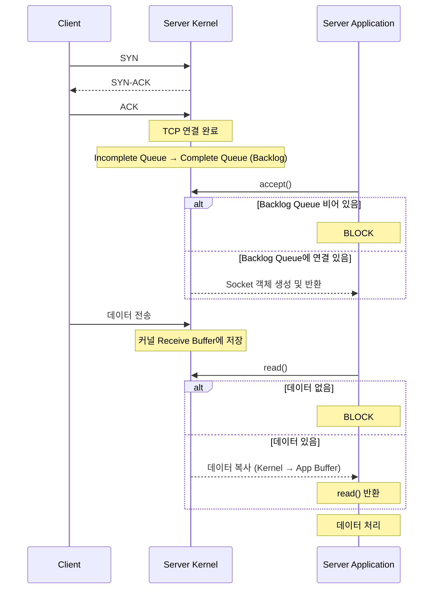
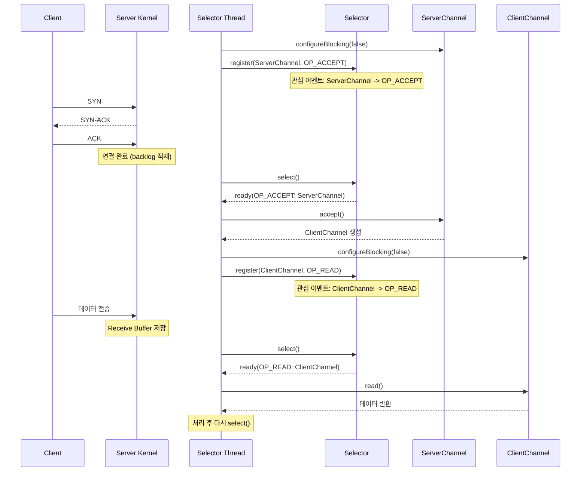
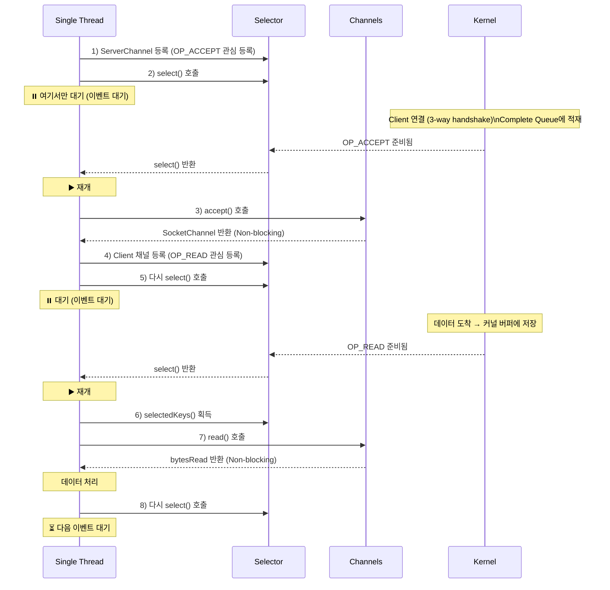
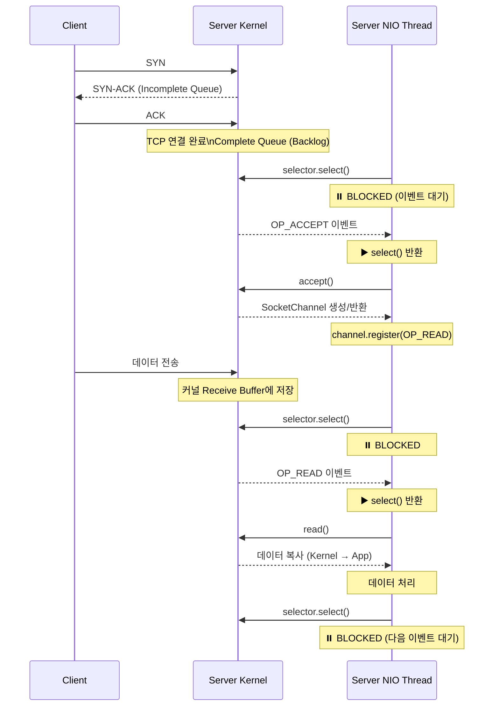

## 1. 소켓통신이란?
- 소켓은 네트워크를 통해 데이터를 주고 받기 위한 양방향 통신의 EndPoint
- IP주소와 PORT번호를 통해 프로세스간 통신


## 2.  Blocking I/O 방식의 읽기 흐름
### 2-1. 동작방식
#### 1. 서버 소켓 생성
- socket() : 소켓 생성
- bind(8080) : 포트바인딩
- listen(50) : backlog 큐 크기를 50으로 설정
```java
ServerSocket serverSocket = new ServerSocket(8080, 50); //port, backlog
```
#### 2. 클라이언트 연결 수락
- backlog가 비어 있으면 대기
- 큐에 연결이 있으면 즉시 반환
- 새로운 소켓 객체 생성하여 반환
```java
Socket clientSocket = serverSocket.accept(); //Blocking
```
#### 3. 데이터 송수신
- Thread를 사용
```java
InputStream in = clientSocket.getInputStream(); 
OutputStream out = clientSocket.getOutputStream();

ByteBuffer buffer = ByteBuffer.allocate(1024);

// read()도 블로킹됨
// 커널 버퍼에 데이터가 없으면 여기서 대기
int bytesRead = in.read(buffer);  //Blocking
```

### 2-2. 동작 흐름


## 3. Blocking 방식의 장단점 

#### 3-1. 장점

**1. 구현이 직관적이고 단순함**

```java
// 코드 흐름이 순차적이고 이해하기 쉬움
int data = in.read();      // 1단계: 읽기
process(data);             // 2단계: 처리
out.write(response);       // 3단계: 응답

```

**2. 디버깅이 용이**

- 동기적 처리로 스택 트레이스 추적 쉬움
- 각 스레드의 상태가 명확함

**3. 간단한 서비스에 적합**

- 소수의 클라이언트 처리
- 즉각적인 응답이 필요한 경우

#### 3-2. 단점

**1. 확장성 문제 (가장 큰 단점)**

```
100개 Client 접속 → 100개 스레드 필요
1000개 Client 접속 → 1000개 스레드 필요
10000개 Client 접속 → 메모리 부족
```

**2. 리소스 낭비**

```java
// 대기 중인 스레드는 CPU를 사용하지 않지만
// 메모리는 계속 점유 (스레드 스택 공간)
ByteBuffer buffer = ByteBuffer.allocate(1024);
int bytesRead = in.read(buffer);  // 이 순간 다른 작업 불가
```

**3. Context Switching 비용**

- 많은 스레드 → 잦은 컨텍스트 스위칭

## 4. Non-Blocking / NIO 개념
### 4-1. 간략 설명
- 하나의 스레드가 여러 채널을 관리하며, **준비된 채널만 선택적으로 처리**
```
기존 Blocking:  Thread-1 → Client-1 (accept 대기 또는 read 대기)
               Thread-2 → Client-2 (accept 대기 또는 read 대기)
               Thread-3 → Client-3 (accept 대기 또는 read 대기)
               → 각 스레드가 블로킹됨

NIO:           Thread-1 → [Selector] → ServerChannel 새 연결 준비됨
                                     → Client-1  데이터 없음
                                     → Client-2  읽기 가능
                                     → Client-3  데이터 없음

               → ServerChannel과 Client-2만 처리 (논블로킹)
               → 다시 select()로 돌아가서 다음 이벤트 대기
```


### 4-2. NIO 주요 구성요소(channel, buffer,selector)
#### 1.  Channel (채널)
```java
// 양방향 데이터 통로
ServerSocketChannel serverChannel = ServerSocketChannel.open();
SocketChannel clientChannel = serverChannel.accept();

// 읽기와 쓰기 모두 가능
clientChannel.read(buffer);   // 읽기
clientChannel.write(buffer);  // 쓰기

```

**종류:**
- `ServerSocketChannel`: 서버 소켓
- `SocketChannel`: 클라이언트 연결
- `FileChannel`: 파일 I/O
- `DatagramChannel`: UDP 통신
#### 2. Buffer (버퍼)
- 데이터를 읽고 쓰는 임시 저장소
- Buffer의 3가지 핵심 속성
	- `position` : 현재 읽기/쓰기 위치
	- `limit` : 읽기/쓰기 가능한 끝 위치
	- `capacity` : 버퍼의 전체 크기
```java
// 데이터를 읽고 쓰는 임시 저장소
// 1. 쓰기 모드 (데이터를 버퍼에 넣기)
buffer.put((byte)1);
channel.read(buffer);  // 채널에서 버퍼로 읽기

// 2. 읽기 모드로 전환
buffer.flip();  // limit = position, position = 0

// 3. 읽기 모드 (버퍼에서 데이터 꺼내기)
byte data = buffer.get();
channel.write(buffer);  // 버퍼에서 채널로 쓰기

// 4. 다시 쓰기 모드로
buffer.clear();
```

#### 3. Selector (셀렉터)
- Selector는 **여러 채널의 I/O 이벤트를 하나의 스레드에**서 관리
- Selector 이벤트 종류
	- `SelectionKey.OP_ACCEPT` :  연결 수락 가능
	- `SelectionKey.OP_CONNECT` : 연결 가능
	- `SelectionKey.OP_READ` : 읽기 가능
	- `SelectionKey.OP_WRITE` : 쓰기 가능

```java
// 여러 채널을 하나의 스레드로 관리
Selector selector = Selector.open();

// 채널을 셀렉터에 등록 + 관심 이벤트 지정
channel.register(selector, SelectionKey.OP_READ);

// 준비된 채널이 있을 때까지 대기
int readyChannels = selector.select();  // 블로킹

// 준비된 채널들 처리
Set<SelectionKey> selectedKeys = selector.selectedKeys();
```


### 4-3. NIO에서 읽기(read) 처리 흐름 (핵심)



## 5. Blocking  I/O vs NIO 비교정리



### 5-1. 읽기방식, 확장성


# 소켓통신 Blocking vs NIO 비교

## 1. 소켓통신이란?

### 개념

- 네트워크를 통해 두 프로그램이 데이터를 주고받기 위한 **양방향 통신 연결의 끝점(endpoint)**
- IP주소 + 포트번호를 통해 프로세스 간 통신

### 주요 구성요소

```
클라이언트 소켓 <--TCP/IP 네트워크--> 서버 소켓
   (IP:Port)                           (IP:Port)

```

### TCP 연결 수립과 accept() 메커니즘

### 전체 흐름도

```
[Client]           [Server - Kernel Space]              [Server - Application]
   |                      |                                    |
   |                      | bind(8080)                         |
   |                      | listen(backlog)                    |
   |                      |<-----------------------------------|
   |                      |                                    |
   | 1. SYN               |                                    |
   |--------------------->|                                    |
   |                      | Incomplete Queue (SYN Queue)       |
   |                      | └─ Half-open 연결 저장             |
   |                      |                                    |
   | 2. SYN-ACK           |                                    |
   |<---------------------|                                    |
   |                      |                                    |
   | 3. ACK (3-way 완료)  |                                    |
   |--------------------->|                                    |
   |                      |                                    |
   |              ✅ TCP 연결 완료 (커널 레벨)                 |
   |                      |                                    |
   |                      | Complete Queue (Backlog Queue)     |
   |                      | ┌──────────────────────┐           |
   |                      | │ [Client1 Socket]     │           |
   |                      | │ [Client2 Socket]     │           |
   |                      | │ [Client3 Socket]     │           |
   |                      | └──────────────────────┘           |
   |                      |                                    |
   |                      |        accept() 호출               |
   |                      |<-----------------------------------|
   |                      |                                    |
   |                      | Queue에서 가장 오래된 연결 꺼냄    |
   |                      | 새로운 Socket/Channel 객체 생성    |
   |                      |----------------------------------->|
   |                      |                                    | Socket 반환
   |                      |                                    |

```

### 두 개의 큐 시스템

서버는 실제로 **2개의 큐**를 관리합니다:

```
┌─────────────────────────────────────┐
│  1. Incomplete Connection Queue     │
│     (SYN Queue)                     │
├─────────────────────────────────────┤
│  • SYN 패킷 받음                    │
│  • SYN-ACK 응답 보냄                │
│  • 최종 ACK 대기 중                 │
│  • Half-open 연결 상태              │
└─────────────────────────────────────┘
              ↓
        ACK 수신 (3-way handshake 완료)
              ↓
┌─────────────────────────────────────┐
│  2. Complete Connection Queue       │
│     (Accept Queue = Backlog Queue)  │
├─────────────────────────────────────┤
│  • ✅ TCP 연결 완료됨               │
│  • accept() 호출 대기 중            │
│  • 실제 통신 가능한 상태            │
└─────────────────────────────────────┘
              ↓
        accept() 호출
              ↓
      Application에 Socket 전달

```

**핵심 포인트:**

- TCP 연결은 `accept()` 호출 **이전**에 커널 레벨에서 완료됩니다
- Backlog Queue에는 **이미 연결이 완료된** 소켓들이 대기 중입니다
- `accept()`는 큐에서 소켓을 꺼내 Application 레벨의 객체를 생성합니다

### 소켓 생성 타이밍

```
타임라인:

T1: Client가 SYN 전송
    → Kernel이 소켓 자료구조 생성 (커널 공간)
    → Incomplete Queue에 추가

T2: 3-way handshake 완료 (ACK 수신)
    → TCP 연결 완료
    → Complete Queue (Backlog)로 이동
    → 이미 통신 가능한 상태!

T3: accept() 호출
    → Application 레벨의 Socket/SocketChannel 객체 생성
    → 커널 소켓과 연결 (File Descriptor 할당)
    → Application에 반환

```

**중요**:

- **커널 소켓**: TCP 연결 시 생성 (T1~T2)
- **Application Socket 객체**: accept() 시 생성 (T3)
- **TCP 연결 완료 시점**: T2 (accept 전!)

### 동작 방식

### Blocking 방식

```java
// 1. 서버 소켓 생성
ServerSocket serverSocket = new ServerSocket(8080, 50);
//                                               port  backlog
// 내부적으로:
// - socket() : 소켓 생성
// - bind(8080) : 포트 바인딩
// - listen(50) : Backlog Queue 크기를 50으로 설정

// 2. 클라이언트 연결 수락
Socket clientSocket = serverSocket.accept();  // ⏸️ Blocking
// - Backlog Queue가 비어있으면 대기
// - Queue에 연결이 있으면 즉시 반환
// - 새로운 Socket 객체 생성하여 반환

// 3. 데이터 송수신
InputStream in = clientSocket.getInputStream();
OutputStream out = clientSocket.getOutputStream();

```

### NIO 방식

```java
// 1. 서버 소켓 채널 생성
ServerSocketChannel serverChannel = ServerSocketChannel.open();
serverChannel.bind(new InetSocketAddress(8080), 50);
//                                              port  backlog
serverChannel.configureBlocking(false);  // Non-blocking 모드

// 2. Selector에 등록
Selector selector = Selector.open();
serverChannel.register(selector, SelectionKey.OP_ACCEPT);

// 3. 클라이언트 연결 수락
selector.select();  // 연결 준비될 때까지 대기
SocketChannel clientChannel = serverChannel.accept();  // 즉시 반환
// - Non-blocking이므로 null일 수 있음
// - null이 아니면 새로운 SocketChannel 반환

// 4. 데이터 송수신용 등록
if (clientChannel != null) {
    clientChannel.configureBlocking(false);
    clientChannel.register(selector, SelectionKey.OP_READ);
}

```

---

## 2. Blocking I/O 방식의 읽기 흐름

### 전체 처리 흐름 (TCP 연결부터 데이터 수신까지)

```
[Client]          [Server-Kernel]            [Server-Application Thread]
   |                     |                            |
   | SYN                 |                            |
   |-------------------->|                            |
   |                     | Incomplete Queue           |
   | SYN-ACK             |                            |
   |<--------------------|                            |
   | ACK                 |                            |
   |-------------------->|                            |
   |              ✅ TCP 연결 완료                    |
   |                     | Complete Queue (Backlog)   |
   |                     | [Socket 대기]              |
   |                     |                            |
   |                     |        accept() 호출       |
   |                     |<---------------------------|
   |                     | ⏸️ Queue 비어있으면 BLOCK |
   |                     |                            |
   |                     | Socket 객체 생성           |
   |                     |--------------------------->|
   |                     |                            | ▶️ accept() 반환
   |                     |                            |
   | 데이터 전송         |                            |
   |-------------------->|                            |
   |                     | 커널 버퍼에 저장           |
   |                     |                            |
   |                     |        read() 호출         |
   |                     |<---------------------------|
   |                     |                            | ⏸️ BLOCKED
   |                     |                            | (데이터 대기 중...)
   |                     | 데이터 도착 확인           |
   |                     | 커널 → App 버퍼 복사       |
   |                     |--------------------------->|
   |                     |                            | ▶️ read() 반환
   |                     |                            | 데이터 처리

```

### Blocking I/O의 두 가지 블로킹 지점

### 1. accept() 블로킹

```java
ServerSocket serverSocket = new ServerSocket(8080);

// Backlog Queue가 비어있으면 여기서 블로킹
Socket clientSocket = serverSocket.accept();  // ⏸️ BLOCKED
// 새 연결이 Complete Queue에 들어올 때까지 대기

```

**블로킹 상황:**

- Backlog Queue가 비어있을 때
- 새로운 클라이언트 연결이 완료될 때까지 스레드 정지

### 2. read() 블로킹

```java
InputStream in = clientSocket.getInputStream();

// 데이터가 도착하지 않았으면 여기서 블로킹
int bytesRead = in.read(buffer);  // ⏸️ BLOCKED
// 데이터가 커널 버퍼에 도착할 때까지 대기

```

**블로킹 상황:**

- 커널 버퍼에 읽을 데이터가 없을 때
- 네트워크로부터 데이터가 도착할 때까지 스레드 정지

### 특징

- **동기적(Synchronous)**: accept(), read() 호출 시 작업 완료까지 스레드 정지
- **블로킹(Blocking)**: 해당 스레드는 다른 작업 불가
- **1:1 매핑**: 클라이언트당 1개 스레드 필요
- **순차적 처리**: 코드 흐름이 직관적

### 샘플 코드

```java
// Blocking I/O 서버 예제
public class BlockingServer {
    public static void main(String[] args) throws IOException {
        // Backlog Queue 크기를 50으로 설정
        // 최대 50개의 완료된 TCP 연결을 큐에 대기시킬 수 있음
        ServerSocket serverSocket = new ServerSocket(8080, 50);
        //                                               port  backlog
        System.out.println("서버 시작 (포트 8080, Backlog 50)");

        // 내부적으로 수행되는 작업:
        // 1. socket() - 소켓 생성
        // 2. bind(8080) - 포트 바인딩
        // 3. listen(50) - Backlog Queue 크기 설정

        while (true) {
            System.out.println("클라이언트 연결 대기 중...");

            // accept()는 두 가지 일을 함:
            // 1. Backlog Queue에서 완료된 연결을 꺼냄
            // 2. 새로운 Socket 객체를 생성하여 반환
            //
            // ⚠️ Queue가 비어있으면 여기서 블로킹!
            Socket clientSocket = serverSocket.accept();  // ⏸️ BLOCKED

            System.out.println("클라이언트 연결: " + clientSocket.getRemoteSocketAddress());
            System.out.println("→ TCP 연결은 이미 완료된 상태!");

            // 각 클라이언트마다 새 스레드 생성
            // 이것이 Blocking I/O의 확장성 문제 원인
            new Thread(() -> handleClient(clientSocket)).start();
        }
    }

    private static void handleClient(Socket socket) {
        try (InputStream in = socket.getInputStream();
             OutputStream out = socket.getOutputStream()) {

            byte[] buffer = new byte[1024];

            System.out.println("데이터 수신 대기 중...");

            // read()도 블로킹됨
            // 커널 버퍼에 데이터가 없으면 여기서 대기
            int bytesRead = in.read(buffer);  // ⏸️ BLOCKED

            if (bytesRead > 0) {
                String message = new String(buffer, 0, bytesRead);
                System.out.println("받은 메시지: " + message);

                // 응답 전송
                String response = "Echo: " + message;
                out.write(response.getBytes());
                System.out.println("응답 전송 완료");
            }

        } catch (IOException e) {
            e.printStackTrace();
        }
    }
}

```

**Backlog Queue 오버플로우 시나리오:**

```java
ServerSocket server = new ServerSocket(8080, 2);  // Backlog = 2

// 동시에 5개 클라이언트 연결 시도하면?
//
// 시나리오 1: accept()를 빨리 호출하는 경우
// Client1 → Complete Queue [Client1]
// Client2 → Complete Queue [Client1, Client2]  ← 큐 가득 참
// Client3 → SYN Queue에서 대기 (잠시 기다림)
// Client4 → SYN Queue에서 대기
// Client5 → 연결 거부 또는 재시도
//
// accept() 호출하면 Queue에서 하나씩 꺼내져서 공간 확보
//
// 시나리오 2: accept()를 안 호출하는 경우
// Client1, Client2 → Complete Queue에 대기
// Client3, Client4, Client5 → 연결 실패 또는 타임아웃

```

```java
// Blocking I/O 클라이언트 예제
public class BlockingClient {
    public static void main(String[] args) throws IOException {
        System.out.println("서버 연결 시도...");

        // connect() 시 3-way handshake 수행
        // 1. SYN 전송
        // 2. SYN-ACK 수신
        // 3. ACK 전송
        // → 서버의 Complete Queue에 추가됨
        Socket socket = new Socket("localhost", 8080);

        System.out.println("서버 연결 성공!");
        System.out.println("→ TCP 연결 완료, 서버가 accept() 호출 전이어도 OK");

        OutputStream out = socket.getOutputStream();
        InputStream in = socket.getInputStream();

        // 데이터 전송
        String message = "Hello Server";
        out.write(message.getBytes());
        System.out.println("메시지 전송: " + message);

        // 응답 대기 (블로킹)
        byte[] buffer = new byte[1024];
        int bytesRead = in.read(buffer);  // ⏸️ BLOCKED

        String response = new String(buffer, 0, bytesRead);
        System.out.println("서버 응답: " + response);

        socket.close();
    }
}

```

**실행 순서 이해하기:**

```
시간순서:

T1: Client - new Socket("localhost", 8080) 호출
    → TCP 3-way handshake 시작

T2: Server Kernel - TCP 연결 완료
    → Complete Queue에 연결 추가
    → Client의 connect() 반환 ✅

T3: Server Application - serverSocket.accept() 호출
    → Complete Queue에서 연결 꺼냄
    → Socket 객체 반환 ✅

T4: Client - out.write() 호출
    → 데이터 전송

T5: Server - in.read() 호출
    → 데이터 수신 및 처리

```

---

## 3. Blocking 방식의 장단점

### ✅ 장점

**1. 구현이 직관적이고 단순함**

```java
// 코드 흐름이 순차적이고 이해하기 쉬움
int data = in.read();      // 1단계: 읽기
process(data);             // 2단계: 처리
out.write(response);       // 3단계: 응답

```

**2. 디버깅이 용이**

- 동기적 처리로 스택 트레이스 추적 쉬움
- 각 스레드의 상태가 명확함

**3. 간단한 서비스에 적합**

- 소수의 클라이언트 처리
- 즉각적인 응답이 필요한 경우

### ❌ 단점

**1. 확장성 문제 (가장 큰 단점)**

```
100명 접속 → 100개 스레드 필요
1000명 접속 → 1000개 스레드 필요
10000명 접속 → 💥 메모리 부족

```

**2. 리소스 낭비**

```java
// 대기 중인 스레드는 CPU를 사용하지 않지만
// 메모리는 계속 점유 (스레드 스택 공간)
int bytesRead = in.read();  // 이 순간 다른 작업 불가

```

**3. Context Switching 비용**

- 많은 스레드 → 잦은 컨텍스트 스위칭
- CPU 시간 낭비

**4. 스레드 풀 사용 시에도 제한**

```java
ExecutorService executor = Executors.newFixedThreadPool(100);
// 풀 크기 100 → 동시 처리 가능한 클라이언트 100개로 제한

```

---

## 4. Non-Blocking I/O / NIO 개념

### 4-1. 간략 설명

**핵심 아이디어:** 하나의 스레드가 여러 채널을 관리하며, **준비된 채널만 선택적으로 처리**

```
기존 Blocking:  Thread-1 → Client-1 (accept 대기 또는 read 대기)
               Thread-2 → Client-2 (accept 대기 또는 read 대기)
               Thread-3 → Client-3 (accept 대기 또는 read 대기)
               → 각 스레드가 블로킹됨

NIO:           Thread-1 → [Selector] → ServerChannel ✅ 새 연결 준비됨
                                    → Client-1 ⏳ 데이터 없음
                                    → Client-2 ✅ 읽기 가능
                                    → Client-3 ⏳ 데이터 없음

               → ServerChannel과 Client-2만 처리 (논블로킹)
               → 다시 select()로 돌아가서 다음 이벤트 대기

```

**Non-Blocking 특징:**

- I/O 작업이 즉시 반환 (블로킹되지 않음)
- 준비되지 않은 작업은 null 또는 0 반환
- Selector를 통해 준비된 채널만 효율적으로 처리
- **단, Selector.select()는 블로킹** (하지만 여러 채널을 동시에 모니터링)

### NIO에서의 TCP 연결과 accept 흐름

```
[Client]          [Server-Kernel]              [Server-NIO Thread]
   |                     |                            |
   | SYN                 |                            |
   |-------------------->|                            |
   | SYN-ACK             | Incomplete Queue           |
   |<--------------------|                            |
   | ACK                 |                            |
   |-------------------->|                            |
   |              ✅ TCP 연결 완료                    |
   |                     | Complete Queue (Backlog)   |
   |                     | [Channel 대기]             |
   |                     |                            |
   |                     |    selector.select() 호출  |
   |                     |<---------------------------|
   |                     |                            | ⏸️ BLOCKED
   |                     |                            | (준비된 이벤트 대기)
   |                     | OP_ACCEPT 이벤트 발생      |
   |                     |--------------------------->|
   |                     |                            | ▶️ select() 반환
   |                     |                            |
   |                     |    accept() 호출           |
   |                     |<---------------------------|
   |                     | 즉시 반환 (Non-blocking)   |
   |                     | SocketChannel 생성         |
   |                     |--------------------------->|
   |                     |                            | channel.register()
   |                     |                            | (OP_READ 등록)
   |                     |                            |
   | 데이터 전송         |                            |
   |-------------------->|                            |
   |                     | 커널 버퍼에 저장           |
   |                     |                            |
   |                     |    selector.select() 호출  |
   |                     |<---------------------------|
   |                     |                            | ⏸️ BLOCKED
   |                     | OP_READ 이벤트 발생        |
   |                     |--------------------------->|
   |                     |                            | ▶️ select() 반환
   |                     |                            |
   |                     |    read() 호출             |
   |                     |<---------------------------|
   |                     | 즉시 반환 (Non-blocking)   |
   |                     | 데이터 복사                |
   |                     |--------------------------->|
   |                     |                            | 데이터 처리
   |                     |                            |
   |                     |    다시 select() 호출      |
   |                     |<---------------------------|
   |                     |                            | ⏸️ BLOCKED
   |                     |                            | (다음 이벤트 대기)

```

**NIO의 블로킹 지점:**

- ✅ **Selector.select()**: 여기서만 블로킹 (여러 채널 동시 모니터링)
- ❌ **accept()**: Non-blocking (즉시 반환, null 가능)
- ❌ **read()**: Non-blocking (즉시 반환, 0 또는 -1 가능)

**Blocking I/O와의 차이:**

- Blocking: 각 accept(), read()마다 블로킹
- NIO: select()에서만 블로킹, 나머지는 즉시 반환

### 4-2. NIO의 주요 구성요소

### 📺 Channel (채널)

```java
// 양방향 데이터 통로
ServerSocketChannel serverChannel = ServerSocketChannel.open();
SocketChannel clientChannel = serverChannel.accept();

// 읽기와 쓰기 모두 가능
clientChannel.read(buffer);   // 읽기
clientChannel.write(buffer);  // 쓰기

```

**종류:**

- `ServerSocketChannel`: 서버 소켓
- `SocketChannel`: 클라이언트 연결
- `FileChannel`: 파일 I/O
- `DatagramChannel`: UDP 통신

### 📦 Buffer (버퍼)

```java
// 데이터를 읽고 쓰는 임시 저장소
ByteBuffer buffer = ByteBuffer.allocate(1024);

// Buffer의 3가지 핵심 속성
// position: 현재 읽기/쓰기 위치
// limit: 읽기/쓰기 가능한 끝 위치
// capacity: 버퍼의 전체 크기

// 쓰기 모드 → 읽기 모드 전환
buffer.flip();

// 버퍼 초기화
buffer.clear();

```

**Buffer 사용 패턴:**

```java
// 1. 쓰기 모드 (데이터를 버퍼에 넣기)
buffer.put((byte)1);
channel.read(buffer);  // 채널에서 버퍼로 읽기

// 2. 읽기 모드로 전환
buffer.flip();  // limit = position, position = 0

// 3. 읽기 모드 (버퍼에서 데이터 꺼내기)
byte data = buffer.get();
channel.write(buffer);  // 버퍼에서 채널로 쓰기

// 4. 다시 쓰기 모드로
buffer.clear();

```

### 🎯 Selector (셀렉터)

```java
// 여러 채널을 하나의 스레드로 관리하는 핵심 컴포넌트
Selector selector = Selector.open();

// 채널을 셀렉터에 등록 + 관심 이벤트 지정
channel.register(selector, SelectionKey.OP_READ);

// 준비된 채널이 있을 때까지 대기
int readyChannels = selector.select();  // 블로킹

// 준비된 채널들 처리
Set<SelectionKey> selectedKeys = selector.selectedKeys();

```

**Selector 이벤트 종류:**

```java
SelectionKey.OP_ACCEPT    // 연결 수락 가능
SelectionKey.OP_CONNECT   // 연결 완료
SelectionKey.OP_READ      // 읽기 가능
SelectionKey.OP_WRITE     // 쓰기 가능

// 여러 이벤트 동시 등록
channel.register(selector, OP_READ | OP_WRITE);

```

### 4-3. NIO에서 읽기(read) 처리 흐름 (핵심)

### 전체 흐름도 (accept부터 read까지)

```
[Single Thread]          [Selector]                [Channels]              [Kernel]

    |                       |                          |                       |
    | 1. ServerChannel 등록|                          |                       |
    |--------------------->| OP_ACCEPT 관심 등록      |                       |
    |                       |                          |                       |
    | 2. select() 호출      |                          |                       |
    |--------------------->| ⏳ 준비된 이벤트 대기    |                       |
    | ⏸️ (여기서만 대기)   |                          |                       |
    |                       |                          |                       |Client 연결
    |                       |                          |                       | 3-way handshake
    |                       |                          |                       | Complete Queue
    |                       |<--------------------------------------------------|
    |                       | OP_ACCEPT 이벤트 ✅     |                       |
    |<---------------------|                          |                       |
    | ▶️ 재개              |                          |                       |
    |                       |                          |                       |
    | 3. accept() 호출      |                          |                       |
    |------------------------------------------------->| 즉시 반환 (Non-block) |
    | SocketChannel 반환   |                          |                       |
    |                       |                          |                       |
    | 4. Client 채널 등록   |                          |                       |
    |--------------------->| OP_READ 관심 등록        |                       |
    |                       |                          |                       |
    | 5. 다시 select()      |                          |                       |
    |--------------------->| ⏳ 준비된 이벤트 대기    |                       |
    | ⏸️ (대기)           |                          |                       |
    |                       |                          |                       |데이터 도착
    |                       |<--------------------------------------------------|
    |                       | OP_READ 이벤트 ✅       |                       |
    |<---------------------|                          |                       |
    | ▶️ 재개              |                          |                       |
    |                       |                          |                       |
    | 6. 준비된 키 획득     |                          |                       |
    | selectedKeys()        |                          |                       |
    |--------------------->|                          |                       |
    |                       |                          |                       |
    | 7. read() 호출        |                          |                       |
    |------------------------------------------------->| 즉시 반환             |
    | bytesRead 반환       |                          |                       |
    |                       |                          |                       |
    | 데이터 처리           |                          |                       |
    |                       |                          |                       |
    | 8. 다시 select()      |                          |                       |
    |--------------------->| ⏳ 다음 이벤트 대기      |                       |

```

### 상세 단계별 설명

**1단계: ServerSocketChannel 생성 및 등록**

```java
// ServerSocketChannel 생성
ServerSocketChannel serverChannel = ServerSocketChannel.open();
serverChannel.bind(new InetSocketAddress(8080), 50);  // backlog = 50
serverChannel.configureBlocking(false);  // Non-blocking 모드

// Selector에 등록
Selector selector = Selector.open();
serverChannel.register(selector, SelectionKey.OP_ACCEPT);
// OP_ACCEPT: 새로운 연결이 Complete Queue에 준비되면 알림받기

```

**2단계: Selector로 이벤트 대기 (여기서만 블로킹)**

```java
// select()는 블로킹이지만, 여러 채널의 여러 이벤트를 동시에 모니터링
int readyCount = selector.select();  // 최소 1개 준비될 때까지 대기

// 이 한 번의 select()로:
// - ServerChannel의 새 연결 (OP_ACCEPT)
// - Client1의 읽기 가능 (OP_READ)
// - Client2의 쓰기 가능 (OP_WRITE)
// 등을 동시에 감지

// 또는 타임아웃 설정
selector.select(1000);  // 1초 대기

// 또는 논블로킹 방식
selector.selectNow();   // 즉시 반환 (폴링 방식)

```

**3단계: 새 연결 수락 (accept) - Non-blocking**

```java
Set<SelectionKey> selectedKeys = selector.selectedKeys();
Iterator<SelectionKey> keyIterator = selectedKeys.iterator();

while (keyIterator.hasNext()) {
    SelectionKey key = keyIterator.next();

    if (key.isAcceptable()) {
        ServerSocketChannel serverChannel = (ServerSocketChannel) key.channel();

        // accept()는 Non-blocking
        // Complete Queue에서 연결을 즉시 꺼내거나 null 반환
        SocketChannel clientChannel = serverChannel.accept();

        if (clientChannel != null) {
            System.out.println("새 클라이언트 연결 (TCP 이미 완료됨)");

            // 클라이언트 채널도 Non-blocking 설정
            clientChannel.configureBlocking(false);

            // Selector에 등록 (읽기 이벤트 관심)
            clientChannel.register(selector, SelectionKey.OP_READ);
        }
    }

    keyIterator.remove();
}

```

**4단계: 클라이언트로부터 데이터 읽기 (read) - Non-blocking**

```java
while (keyIterator.hasNext()) {
    SelectionKey key = keyIterator.next();

    if (key.isReadable()) {
        SocketChannel channel = (SocketChannel) key.channel();
        ByteBuffer buffer = ByteBuffer.allocate(1024);

        // read()는 Non-blocking, 즉시 반환
        int bytesRead = channel.read(buffer);

        if (bytesRead == -1) {
            // 클라이언트 연결 종료
            channel.close();
            key.cancel();
        } else if (bytesRead > 0) {
            // 데이터 처리
            buffer.flip();
            // ... 처리 로직
        } else {
            // bytesRead == 0: 데이터 없음, 다음으로
        }
    }

    keyIterator.remove();  // ⚠️ 중요: 처리한 키는 제거
}

```

**5단계: 다시 2단계로 돌아가서 반복**

### 핵심 차이점 정리

|구분|Blocking I/O|Non-Blocking I/O|
|---|---|---|
|**블로킹 지점**|• accept() 호출마다<br>• read() 호출마다|• selector.select()에서만<br>(여러 채널 동시 모니터링)|
|**accept() 동작**|Backlog Queue가 비면 대기|즉시 반환 (null 가능)|
|**read() 동작**|데이터 없으면 대기|즉시 반환 (0 또는 -1)|
|**스레드 수**|클라이언트 수만큼|1개 (또는 소수)|
|**준비 안된 채널**|계속 대기 (블로킹)|건너뛰고 다음 채널 처리|
|**TCP 연결 완료 시점**|accept() 호출 전|accept() 호출 전|
|**Backlog Queue**|accept()가 꺼냄|accept()가 꺼냄 (동일)|

### 완전한 NIO 서버 예제

```java
import java.io.IOException;
import java.net.InetSocketAddress;
import java.nio.ByteBuffer;
import java.nio.channels.*;
import java.util.Iterator;
import java.util.Set;

public class NioServer {
    public static void main(String[] args) throws IOException {
        // 1. Selector 생성 (이벤트 멀티플렉서)
        Selector selector = Selector.open();

        // 2. ServerSocketChannel 생성 및 설정
        ServerSocketChannel serverChannel = ServerSocketChannel.open();
        serverChannel.bind(new InetSocketAddress(8080), 50);  // backlog = 50
        //                                              port  backlog
        serverChannel.configureBlocking(false);  // Non-blocking 모드

        System.out.println("내부적으로 수행:");
        System.out.println("- socket() 생성");
        System.out.println("- bind(8080)");
        System.out.println("- listen(50) - Backlog Queue 크기 50");

        // 3. ServerChannel을 Selector에 등록 (Accept 이벤트 관심)
        serverChannel.register(selector, SelectionKey.OP_ACCEPT);
        System.out.println("\\n✅ NIO 서버 시작 (포트 8080)");
        System.out.println("하나의 스레드로 모든 클라이언트 처리\\n");

        // 4. 이벤트 루프 (무한 루프)
        while (true) {
            System.out.println(">>> selector.select() 호출 - 이벤트 대기 중...");

            // 준비된 채널이 있을 때까지 대기 (여기서만 블로킹!)
            // 여러 채널의 여러 이벤트를 동시에 모니터링
            int readyChannels = selector.select();

            if (readyChannels == 0) {
                continue;
            }

            System.out.println("<<< " + readyChannels + "개 채널 준비됨!\\n");

            // 5. 준비된 채널들의 키 획득
            Set<SelectionKey> selectedKeys = selector.selectedKeys();
            Iterator<SelectionKey> keyIterator = selectedKeys.iterator();

            // 6. 각 키를 순회하며 처리
            while (keyIterator.hasNext()) {
                SelectionKey key = keyIterator.next();

                try {
                    // 7-1. 새로운 연결 수락 가능 (OP_ACCEPT)
                    if (key.isAcceptable()) {
                        System.out.println("[OP_ACCEPT 이벤트]");
                        handleAccept(key, selector);
                    }

                    // 7-2. 데이터 읽기 가능 (OP_READ)
                    if (key.isReadable()) {
                        System.out.println("[OP_READ 이벤트]");
                        handleRead(key);
                    }

                } catch (IOException e) {
                    System.err.println("Error: " + e.getMessage());
                    key.cancel();
                    key.channel().close();
                }

                // ⚠️ 중요: 처리한 키는 반드시 제거
                // 제거하지 않으면 다음 select()에서 다시 나타남
                keyIterator.remove();
            }

            System.out.println();
        }
    }

    // 새 클라이언트 연결 처리
    private static void handleAccept(SelectionKey key, Selector selector)
            throws IOException {

        ServerSocketChannel serverChannel = (ServerSocketChannel) key.channel();

        System.out.println("  → serverChannel.accept() 호출 (Non-blocking)");

        // accept()는 Non-blocking이므로 즉시 반환
        // Complete Queue에서 연결을 꺼냄
        // Queue가 비어있으면 null 반환 (블로킹 안됨!)
        SocketChannel clientChannel = serverChannel.accept();

        if (clientChannel != null) {
            System.out.println("  → 새 클라이언트 연결: " +
                clientChannel.getRemoteAddress());
            System.out.println("  → TCP 3-way handshake는 이미 완료된 상태!");

            // Non-blocking 모드 설정
            clientChannel.configureBlocking(false);

            // Selector에 등록 (읽기 이벤트 관심)
            clientChannel.register(selector, SelectionKey.OP_READ);
            System.out.println("  → 클라이언트 채널을 Selector에 등록 (OP_READ)");
        } else {
            System.out.println("  → accept()가 null 반환 (연결 없음)");
        }
    }

    // 클라이언트로부터 데이터 읽기
    private static void handleRead(SelectionKey key) throws IOException {
        SocketChannel channel = (SocketChannel) key.channel();
        ByteBuffer buffer = ByteBuffer.allocate(1024);

        System.out.println("  → channel.read() 호출 (Non-blocking)");

        // read()는 Non-blocking이므로 즉시 반환
        // 반환값:
        //  > 0 : 읽은 바이트 수
        //  = 0 : 읽을 데이터 없음 (아직)
        //  -1  : 연결 종료 (EOF)
        int bytesRead = channel.read(buffer);

        if (bytesRead == -1) {
            // 클라이언트가 연결 종료
            System.out.println("  → 클라이언트 연결 종료: " +
                channel.getRemoteAddress());
            channel.close();
            key.cancel();  // Selector에서 제거
            return;
        }

        if (bytesRead > 0) {
            // 데이터 처리
            buffer.flip();  // 쓰기 모드 → 읽기 모드
            byte[] data = new byte[buffer.remaining()];
            buffer.get(data);
            String message = new String(data);

            System.out.println("  → 받은 메시지 (" + bytesRead + " bytes): " + message);

            // Echo 응답 전송
            String response = "Echo: " + message;
            ByteBuffer responseBuffer = ByteBuffer.wrap(response.getBytes());

            int bytesWritten = channel.write(responseBuffer);
            System.out.println("  → 응답 전송 완료 (" + bytesWritten + " bytes)");
        } else {
            // bytesRead == 0
            System.out.println("  → 읽을 데이터 없음 (0 bytes)");
        }
    }
}

```

**실행 흐름 예시:**

```
터미널 출력:

내부적으로 수행:
- socket() 생성
- bind(8080)
- listen(50) - Backlog Queue 크기 50

✅ NIO 서버 시작 (포트 8080)
하나의 스레드로 모든 클라이언트 처리

>>> selector.select() 호출 - 이벤트 대기 중...
    ⏸️ 블로킹 상태... (새 연결 또는 데이터 대기)

[Client1이 연결]
<<< 1개 채널 준비됨!

[OP_ACCEPT 이벤트]
  → serverChannel.accept() 호출 (Non-blocking)
  → 새 클라이언트 연결: /127.0.0.1:54321
  → TCP 3-way handshake는 이미 완료된 상태!
  → 클라이언트 채널을 Selector에 등록 (OP_READ)

>>> selector.select() 호출 - 이벤트 대기 중...
    ⏸️ 블로킹 상태...

[Client2가 연결, Client1이 데이터 전송]
<<< 2개 채널 준비됨!

[OP_ACCEPT 이벤트]
  → serverChannel.accept() 호출 (Non-blocking)
  → 새 클라이언트 연결: /127.0.0.1:54322
  → TCP 3-way handshake는 이미 완료된 상태!
  → 클라이언트 채널을 Selector에 등록 (OP_READ)

[OP_READ 이벤트]
  → channel.read() 호출 (Non-blocking)
  → 받은 메시지 (13 bytes): Hello Server
  → 응답 전송 완료 (19 bytes)

>>> selector.select() 호출 - 이벤트 대기 중...
    ⏸️ 블로킹 상태...

```

**Blocking vs NIO 실행 흐름 비교:**

```
┌────────────────────────────────┐
│     Blocking I/O Server        │
├────────────────────────────────┤
│ Main Thread:                   │
│   while(true) {                │
│     Socket s = accept();  ⏸️  │
│     new Thread(() -> {         │
│       read(s);  ⏸️            │
│       process();               │
│       write(s);                │
│     }).start();                │
│   }                            │
│                                │
│ Thread Pool:                   │
│   [Thread-1] ⏸️ Client1       │
│   [Thread-2] ⏸️ Client2       │
│   [Thread-3] ⏸️ Client3       │
│   ...                          │
└────────────────────────────────┘

┌────────────────────────────────┐
│        NIO Server              │
├────────────────────────────────┤
│ Single Thread:                 │
│   while(true) {                │
│     select();  ⏸️ 여기서만!   │
│     for(key : selectedKeys) {  │
│       if(accept) {             │
│         accept();  ✅ 즉시     │
│         register(READ);        │
│       }                        │
│       if(read) {               │
│         read();  ✅ 즉시       │
│         process();             │
│         write();               │
│       }                        │
│     }                          │
│   }                            │
│                                │
│ 하나의 스레드로:               │
│   Client1, Client2, Client3... │
│   모두 처리                    │
└────────────────────────────────┘

```

---

## 5. Blocking vs NIO 비교 정리

### 5-1. 핵심 비교표

|비교 항목|Blocking I/O|Non-Blocking I/O (NIO)|
|---|---|---|
|**TCP 연결 완료 시점**|accept() 호출 전<br>(커널에서 완료)|accept() 호출 전<br>(커널에서 완료, 동일)|
|**Backlog Queue**|Complete Queue에서 대기<br>accept()가 꺼냄|Complete Queue에서 대기<br>accept()가 꺼냄 (동일)|
|**accept() 동작**|블로킹<br>Queue 비면 대기|Non-blocking<br>즉시 반환 (null 가능)|
|**read() 동작**|블로킹<br>데이터 올 때까지 대기|Non-blocking<br>즉시 반환 (0 또는 -1)|
|**블로킹 지점**|• accept() 호출마다<br>• read() 호출마다<br>• write() 호출마다|• selector.select()에서만<br>(여러 채널 동시 모니터링)|
|**스레드 모델**|1 Thread : 1 Client|1 Thread : N Clients|
|**동시 접속 100명**|100개 스레드 필요|1개 스레드로 처리 가능|
|**동시 접속 10,000명**|💥 불가능 (메모리 부족)|✅ 가능|
|**확장성**|낮음 (O(N) 스레드)|높음 (O(1) 스레드)|
|**리소스 효율**|낮음<br>- 대기 스레드도 메모리 점유<br>- Context Switching 많음|높음<br>- 최소한의 스레드<br>- 메모리 효율적|
|**구현 난이도**|쉬움<br>직관적인 코드 흐름|어려움<br>Selector, Buffer 관리 필요|
|**코드 복잡도**|낮음|높음|
|**디버깅**|쉬움|어려움 (비동기 처리)|
|**적합한 상황**|• 소수 클라이언트 (< 100)<br>• 즉각 응답 필요<br>• 간단한 로직|• 대규모 클라이언트 (1000+)<br>• 높은 동시성<br>• 채팅, 게임 서버|
|**처리량**|낮음|높음|
|**레이턴시**|낮음 (간단한 경우)|약간 높음 (복잡한 처리)|

### 5-2. TCP 연결과 accept() 비교

### 공통점

```
둘 다 동일한 메커니즘:

1. Client가 connect() 호출
   ↓
2. 3-way handshake (SYN → SYN-ACK → ACK)
   ↓
3. TCP 연결 완료 (커널 레벨)
   ↓
4. Complete Queue (Backlog)에 추가
   ↓
5. accept() 호출하면 Queue에서 꺼냄

```

### 차이점

```
Blocking I/O:
  ServerSocket ss = new ServerSocket(8080);
  Socket s = ss.accept();  // ⏸️ Queue가 비면 여기서 대기
  // 대기 중 이 스레드는 다른 작업 불가

NIO:
  ServerSocketChannel sc = ServerSocketChannel.open();
  sc.configureBlocking(false);
  selector.register(sc, OP_ACCEPT);

  selector.select();  // ⏸️ 여기서만 대기 (여러 채널 모니터링)

  SocketChannel c = sc.accept();  // ✅ 즉시 반환 (null 가능)
  if (c != null) { ... }  // null 체크 필요
  // 대기 없이 바로 다음 작업 가능

```

### 5-3. 실제 시나리오 비교

### 시나리오 1: 1000명 동시 접속 채팅 서버

**Blocking I/O:**

```
상황: 1000명이 동시 접속, 각자 가끔씩 메시지 전송

리소스 사용:
- 스레드: 1000개 (각 클라이언트마다)
- 메모리: 1000 × 1MB(스택) = 1GB
- Context Switch: 매우 빈번
- CPU: 대부분의 스레드가 read()에서 대기 중
  → CPU는 놀고 있는데 메모리만 낭비

실제 동작:
Thread-1  ⏸️ read() 대기 (Client1이 메시지 안보냄)
Thread-2  ⏸️ read() 대기 (Client2가 메시지 안보냄)
Thread-3  ▶️ read() 처리 (Client3 메시지 도착)
Thread-4  ⏸️ read() 대기
...
Thread-1000 ⏸️ read() 대기

결과: 서버 성능 저하, 확장 불가능

```

**NIO:**

```
상황: 동일 (1000명 동시 접속)

리소스 사용:
- 스레드: 1-4개
- 메모리: 수십 MB
- Context Switch: 거의 없음
- CPU: 효율적으로 활용

실제 동작:
Single Thread:
  selector.select() ⏸️ 메시지 대기

  [Client3이 메시지 전송]

  select() 반환 ▶️
  → Client3의 read() 처리 (즉시)
  → 다시 select()로 ⏸️

  [Client7, Client15가 메시지 전송]

  select() 반환 ▶️
  → Client7 read() 처리 (즉시)
  → Client15 read() 처리 (즉시)
  → 다시 select()로 ⏸️

결과: 안정적 운영, 확장 가능

```

### 시나리오 2: 파일 다운로드 서버 (10명 동시)

**Blocking I/O:**

```java
// 10개 스레드, 각각 순차 처리
// 구현 간단, 성능 충분
ServerSocket server = new ServerSocket(8080);

while (client = server.accept()) {
    new Thread(() -> {
        sendFile(client);  // 간단명료
    }).start();
}

리소스: 10개 스레드
성능: 충분함
복잡도: 낮음 ✅

결론: 이 경우 Blocking이 더 적합!

```

**NIO:**

```java
// 1개 스레드, Selector로 관리
// 복잡한 구조, 성능 이득 미미
Selector selector = Selector.open();

while (true) {
    selector.select();
    for (key : selectedKeys) {
        // Buffer 관리
        // 상태 추적 (어디까지 보냈는지)
        // 부분 전송 처리
        // ... 복잡!
    }
}

리소스: 1개 스레드
성능: 비슷하거나 약간 나을 수도
복잡도: 높음 ❌

결론: 오히려 오버헤드!

```

### 시나리오 3: 실시간 게임 서버 (5000명 동시)

**Blocking I/O:**

```
문제점:
1. 5000개 스레드 필요 → 5GB 메모리
2. Context Switching 폭증
3. GC 부담 증가
4. 스케일링 불가능

결과: 서버 다운 가능성 높음 💥

```

**NIO:**

```
장점:
1. 2-4개 스레드로 처리 가능
2. 메모리 효율적 (< 100MB)
3. 빠른 응답 시간
4. 수평 확장 가능

결과: 안정적이고 확장 가능한 서버 ✅

```

### 5-3. 선택 가이드

```
                동시 접속자 수
                     |
        적음 (< 100) | 많음 (1000+)
        ─────────────┼─────────────
         Blocking    |    NIO

           응답 즉시성 중요도
                     |
          중요       |   덜 중요
        ─────────────┼─────────────
         Blocking    |    NIO

            구현 복잡도 허용
                     |
          불허       |    허용
        ─────────────┼─────────────
         Blocking    |    NIO

```

**Blocking I/O를 선택하는 경우:**

- 소규모 서비스 (동시 접속 < 100)
- 빠른 개발이 중요
- 간단한 요청-응답 구조
- 팀의 NIO 경험 부족

**NIO를 선택하는 경우:**

- 대규모 서비스 (동시 접속 1000+)
- 채팅, 실시간 게임, 스트리밍
- 리소스 효율이 중요
- 높은 처리량 필요

### 5-4. 실무 팁

**Spring Boot의 경우:**

```java
// 기본: Blocking I/O (Tomcat)
// 설정 변경으로 NIO 사용 가능

// application.yml
server:
  tomcat:
    threads:
      max: 200  # Blocking 방식의 최대 스레드

// 또는 Netty 사용 (NIO 기반)
// WebFlux로 전환

```

**성능 튜닝 포인트:**

- Blocking: 스레드 풀 크기 조정
- NIO: Selector 개수, Buffer 크기 조정

---

## 요약

### 핵심 차이 한 줄 정리

**TCP 연결:**

```
Blocking과 NIO 모두 동일:
TCP 연결은 accept() 호출 전에 커널에서 완료되고 Backlog Queue에 대기

```

**accept() 차이:**

```
Blocking:  Queue가 비면 블로킹 → 스레드 대기
NIO:       즉시 반환 (null 가능) → 스레드는 다른 채널 처리

```

**read() 차이:**

```
Blocking:  각 클라이언트마다 스레드가 read()에서 대기
NIO:       하나의 스레드가 준비된 클라이언트만 처리

```

### 블로킹 지점 비교

```
Blocking I/O:
  accept() ⏸️ → 스레드 블로킹
  read()   ⏸️ → 스레드 블로킹
  write()  ⏸️ → 스레드 블로킹
  → 클라이언트당 1개 스레드 필요

NIO:
  selector.select() ⏸️ → 여기서만 블로킹 (여러 채널 모니터링)
  accept()   ✅ → 즉시 반환
  read()     ✅ → 즉시 반환
  write()    ✅ → 즉시 반환
  → 1개 스레드로 여러 클라이언트 처리

```

### 언제 뭘 쓸까?

**Blocking I/O를 선택:**

- 소규모 서비스 (동시 접속 < 100)
- 빠른 개발이 중요
- 간단한 요청-응답 구조
- 팀의 NIO 경험 부족
- 각 연결이 짧고 즉시 응답

**NIO를 선택:**

- 대규모 서비스 (동시 접속 1000+)
- 채팅, 실시간 게임, 스트리밍
- 리소스 효율이 중요
- 높은 처리량 필요
- 긴 연결 유지 (long-lived connections)

### NIO의 3대 핵심 컴포넌트

```
1. Selector (셀렉터)
   - 여러 채널을 하나의 스레드로 관리
   - 준비된 채널만 선택
   - select() 호출로 이벤트 대기

2. Channel (채널)
   - 양방향 데이터 통로
   - ServerSocketChannel: 연결 수락
   - SocketChannel: 데이터 송수신
   - Non-blocking 모드 설정 가능

3. Buffer (버퍼)
   - 데이터 임시 저장소
   - position, limit, capacity로 관리
   - flip(), clear() 메서드로 모드 전환

```

### 실무에서의 선택

**Spring Boot 기본:**

```java
// Tomcat 기반 - Blocking I/O
// 충분한 성능, 간단한 구조
// 대부분의 웹 애플리케이션에 적합

```

**고성능 필요 시:**

```java
// WebFlux + Reactor Netty - NIO 기반
// 대규모 동시 접속
// 리액티브 프로그래밍

```

### 기억해야 할 핵심

1. **TCP 연결은 accept() 전에 완료**
2. **Backlog Queue는 완료된 연결을 보관**
3. **Blocking: 각 I/O마다 블로킹**
4. **NIO: select()에서만 블로킹, 나머지는 즉시 반환**
5. **확장성이 중요하면 NIO, 간단함이 중요하면 Blocking**