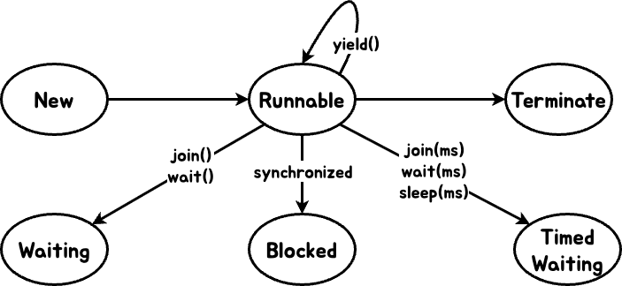

- [[#1. 멀티 프로세싱 vs 멀티 태스킹|1. 멀티 프로세싱 vs 멀티 태스킹]]
- [[#2. 사용자 스레드 vs 데몬 스레드|2. 사용자 스레드 vs 데몬 스레드]]
- [[#3. 스레드 생명주기|3. 스레드 생명주기]]
- [[#4.메모리 가시성|4.메모리 가시성]]
- [[#5. Syncronized|5. Syncronized]]
- [[#6. LockSupport|6. LockSupport]]
- [[#7. ReetrantLock|7. ReetrantLock]]
- [[#8. CAS|8. CAS]]
- [[#9. Spin Lock|9. Spin Lock]]
- [[#10. 세마포어|10. 세마포어]]

## 1. 멀티 프로세싱 vs 멀티 태스킹
- 멀티 프로세싱 : 단일 코어가 여러가지 작업을 동시에 수행
- 멀티 태스킹 : 단일코어가 여러가지 작업을 동시에 수행하는 것처럼 보임
```java
// 멀티 태스킹 예시 (스레드 두 개 실행)
public class MultiTaskingExample {
    public static void main(String[] args) {
        Runnable task1 = () -> System.out.println("Task1 실행");
        Runnable task2 = () -> System.out.println("Task2 실행");

        new Thread(task1).start();
        new Thread(task2).start();
    }
}
```
---

## 2. 사용자 스레드 vs 데몬 스레드
- 사용자 스레드 :  main 종료와 관계없이 작업이 끝날 때까지 실행됨
- 데몬 스레드 : 백그라운드가 실행되며 사용자 스레드가 모두 종료되면 자동 종료
```java
public class DaemonExample {

    public static void main(String[] args) {

        Thread daemon = new Thread(() -> {
            while (true) System.out.println("데몬 스레드 동작 중...");
        });

        daemon.setDaemon(true); // 데몬 스레드로 설정
        daemon.start();

        System.out.println("메인 종료"); // 메인 종료되면 daemon도 종료
    }
}
```

---

## 3. 스레드 생명주기


- yield() : 실행 중이던 스레드가 CPU를 양보하고 다시 Runnable 상태로 돌아감
```java
public class YieldExample {

    public static void main(String[] args) {
        Runnable task = () -> {
            for (int i = 0; i < 3; i++) {
                System.out.println(Thread.currentThread().getName());
                Thread.yield();
            }
        };

        new Thread(task, "Thread-A").start();
        new Thread(task, "Thread-B").start();

    }

}
```
---

## 4.메모리 가시성
- 메모리 가시성 : 멀티스레드 환경에서 스레드 변경값이 다른 스레드에서 언제 보이는가의 문제
- violatile : 스레드 내의 캐시메모리가 아닌 메인메모리의 값을 참조
- 임계영역 : 멀티 스레드 환경에서 동시에 접근하여 예상치 못한 동작이 발생 
```java
public class VolatileExample {
    private static volatile boolean running = true;

    public static void main(String[] args) throws InterruptedException {
        new Thread(() -> {
            while (running) {}
            System.out.println("스레드 종료");
        }).start();

  
        Thread.sleep(1000);
        running = false; // 메인 메모리 반영됨 → 스레드 종료
    }

}
```

---

## 5. Syncronized
- Blocked 상태로 대기
- 공정성 : Blocked 된 스레드 중에 어떤 스레드가 실행될지 알 수 없음
- 무한대기 : 기아 현상 발생, 인터럽트 X, 타임아웃 X
```java
public class SynchronizedExample {
    private int count = 0;

    public synchronized void increment() {
        count++;
    }
}
```

---

## 6. LockSupport
- Waiting 상태로 대기
- park()/unpark(), parkNanos()로 인터럽트 발생가능
- 임계영역에 대한 구성이 필요
```java
import java.util.concurrent.locks.LockSupport;

public class LockSupportExample {
    public static void main(String[] args) {
        Thread t = new Thread(() -> {
            System.out.println("스레드 대기");
            LockSupport.park();
            System.out.println("스레드 재개");
        });
        t.start();

        try { Thread.sleep(1000); } catch (InterruptedException e) {}
        LockSupport.unpark(t); // 스레드 깨움
    }
}
```

---

## 7. ReetrantLock
- Lock  인터페이스 사용
- Lock Condition을 활용하여 생산자/소비자 큐를 만들어 생산자 소비자 문제를 해결
- 공정모드 / 비공정모드 존재
```java
import java.util.concurrent.locks.*;

public class ReentrantLockExample {
    private final Lock lock = new ReentrantLock();
    private int count = 0;

    public void increment() {
        lock.lock();
        try {
            count++;
        } finally {
            lock.unlock();
        }
    }
}
```

---

## 8. CAS
- CPU에서 값 변경을 막아줌
- compareAndSet
- 낙관적 동기화
- Lock-free
```java
import java.util.concurrent.atomic.AtomicInteger;

public class CASExample {
    private AtomicInteger count = new AtomicInteger(0);

    public void increment() {
        count.compareAndSet(count.get(), count.get() + 1);
    }
}
```

---

## 9. Spin Lock
- 스레드가 락을 얻을 때까지 CAS연산을 수행
- 바쁜대기 -> CPU 사용량 커짐
- Runnable 상태에서 가볍고 빠르게 작동
```java
import java.util.concurrent.atomic.AtomicBoolean;

public class SpinLock {
    private final AtomicBoolean lock = new AtomicBoolean(false);

    public void lock() {
        while (!lock.compareAndSet(false, true)) {
            // busy-wait
        }
    }

    public void unlock() {
        lock.set(false);
    }
}
```

---

## 10. 세마포어
- 제한된 개수의 자원에 대해 동시 접근을 제어
- 공정, 비공정 모드
- Wating or Timed Waiting
```java
import java.util.concurrent.Semaphore;

public class SemaphoreExample {
    private static final Semaphore semaphore = new Semaphore(2);

    public static void main(String[] args) {
        Runnable task = () -> {
            try {
                semaphore.acquire();
                System.out.println(Thread.currentThread().getName() + " 실행 중");
                Thread.sleep(1000);
            } catch (InterruptedException e) {
                e.printStackTrace();
            } finally {
                semaphore.release();
            }
        };

        for (int i = 0; i < 5; i++) new Thread(task).start();
    }
}
```