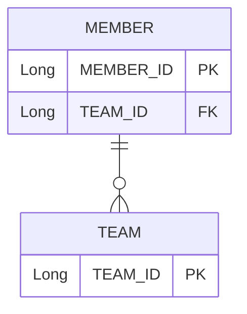
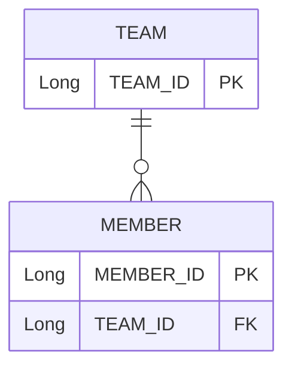
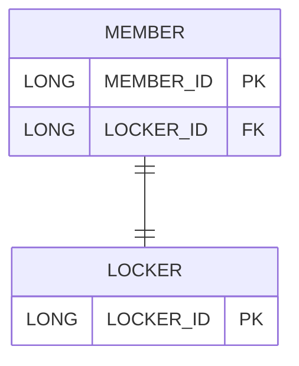
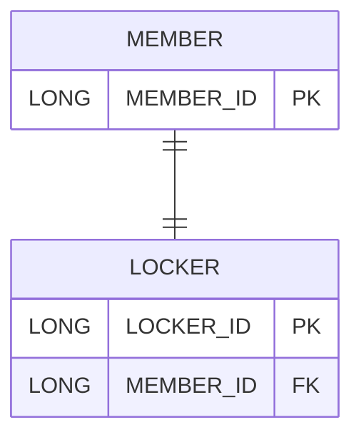
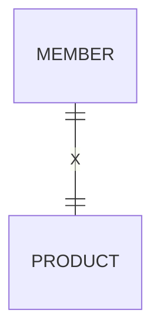
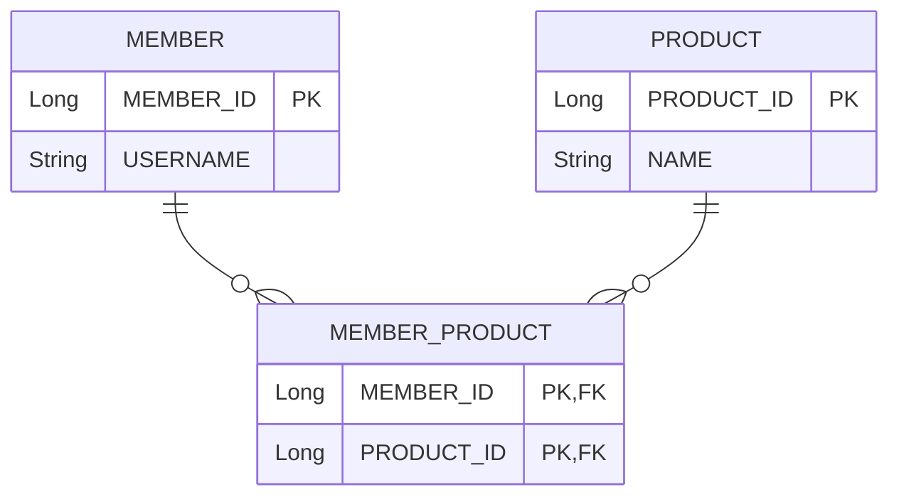

#  📘 03. 연관관계 매핑

## 🎯 학습 목표

- 객체의 연관관계와 테이블의 연관관계를 매칭시키는 방법 학습
- 각 테이블 관계에 따라 단방향 및 양방향 연관관계를 이해하고 구현

## 🧩 배경 및 도입

- 객체 모델을 테이블 중심으로 설계하면 협력 관계를 반영할 수 없음
- 테이블은 외래키(FK)를 통해 관계를 맺고, 객체는 참조(Reference)를 통해 관계를 표현
- 테이블은 하나의 외래키로 두 테이블 간 관계를 관리하지만, 객체는 방향성을 갖는 참조를 통해 관계를 맺음

## 🧠 핵심 개념 요약

| 항목 | 설명 |
|:--:|:--|
| 양방향 매핑의 연관관계 주인 | 외래키를 관리하는 엔티티만이 연관관계의 주인이며, 반대편은 읽기 전용 |
| 연관관계 주인 지정 기준 | 외래키가 있는 테이블을 주인으로 지정 |
| 다대일 단방향 | 가장 일반적인 연관관계 매핑 방식 |
| 다대일 양방향 | 외래키가 있는 쪽이 주인이며, 양쪽 참조를 통해 객체 그래프 탐색 가능 |
| 일대다 단방향 | 외래키가 반대편에 존재하므로 비효율적이며 비권장 |
| 일대다 양방향 | JPA에서는 공식적으로 비권장, 다대일 양방향으로 대체 |
| 일대일 단방향 | 주 테이블에 외래키가 있을 경우만 JPA에서 지원 |
| 일대일 양방향 | 외래키 위치에 따라 장단점 존재 |
| 다대다 | 관계형 DB에서는 다대다 관계를 직접 표현할 수 없으며 조인 테이블 필요 |


## ⚙️ 작동 방식 및 고려사항

### ✅ 연관관계 주인 지정
- 연관관계 주인은 외래키를 가진 엔티티
- 주인이 아닌 쪽은 `mappedBy` 속성을 사용해 주인을 명시
- 주인만이 insert/update SQL을 수행할 수 있음

### ✅ 연관관계 설계 시 고려사항
1. **다중성**
   - @ManyToOne, @OneToMany, @OneToOne, @ManyToMany
2. **방향성**
   - 단방향: A → B
   - 양방향: A ↔ B
3. **연관관계 주인 여부**
   - 주인이 외래키를 관리하며 DB 반영

### ❌ 권장하지 않는 연관관계
- **일대다 단방향**: update 쿼리 발생 및 비효율적
- **일대다 양방향**: 실질적 사용 어려움
- **다대다**: 실무에서는 연결 테이블로 풀어야 함
- **일대일 단방향(대상 테이블 FK)**: JPA에서 지원하지 않음


## 💻 실습 코드 예시

  
### 📌 1. 단방향/양방향 예시

```java
class A { B b; }
class B {}
```

```java
class A { B b; }
class B { A a; }
```

### 📌 3. 연관관계 편의 메서드

```java
class Member{
    public void setTeam(Team team){
        //만약 remove를 하지 않으면 영속성 컨텍스트가 존재하는 상태에서 조회할 경우 이전데이터 존재
        if(this.team != null){
            this.team.getMembers().remove(this);
        }
        this.team=team;
        team.getMembers().add(this);
    }
}
```

### 📌 4. Team 삭제 (2가지)

```java
member.setTeam(null);
em.remove(team);
```

### 📌 5. 다대일 



```java
class Member {
    @ManyToOne
    @JoinColumn(name="TEAM_ID")
    private Team team;
}

class Team {
    @OneToMany(mappedBy="team")
    private List<Member> members = new ArrayList<>();
}
```


### 📌 6. 일대다

#### ERD


#### 코드 (단방향: 비권장)

```java
class Team {
    @OneToMany
    @JoinColumn(name="TEAM_ID")
    private List<Member> members = new ArrayList<>();
}
```

#### 코드 (양방향)

```java
class Team {
    @OneToMany
    @JoinColumn(name="TEAM_ID")
    private List<Member> members = new ArrayList<>();
}

class Member {
    @ManyToOne
    @JoinColumn(name="TEAM_ID", insertable=false, updatable=false)
    private Team team;
}
```


### 📌 7. 일대일

#### 주 테이블에 FK


```java
class Member {
    @OneToOne
    @JoinColumn(name="LOCKER_ID", unique=true)
    private Locker locker;
}
```


#### 대상 테이블에 FK


```java
class Locker {
    @OneToOne
    @JoinColumn(name="MEMBER_ID", unique=true)
    private Member member;
}

class Member {
    @OneToOne(mappedBy="member")
    private Locker locker;
}
```


### 📌 8. 다대다


#### ERD (잘못된 다대다)


#### 다대다 -> 일대다 + 다대일 구조


#### 코드

```java
public class MemberProduct {
    @ManyToOne
    @JoinColumn(name = "MEMBER_ID")
    private Member member;

    @ManyToOne
    @JoinColumn(name = "PRODUCT_ID")
    private Product product;
}

public class Member {
    @OneToMany(mappedBy = "member")
    private List<MemberProduct> memberProducts = new ArrayList<>();
}

public class Product {
    @OneToMany(mappedBy = "product")
    private List<MemberProduct> memberProducts = new ArrayList<>();
}
```


## 🔁 회고

- 연관관계의 방향성과 주인의 설정이 영속성 컨텍스트에 미치는 영향이 큼
- 항상 외래키가 있는 테이블을 기준으로 매핑 설계
- 실무에서는 연관관계 편의 메서드 구현으로 사이드이펙트 예방이 중요함


## 📚 참고 자료
-  인프런 - 김영한 JPA강의
-  책 : 자바 ORM 표준 JPA 프로그래밍
  
---