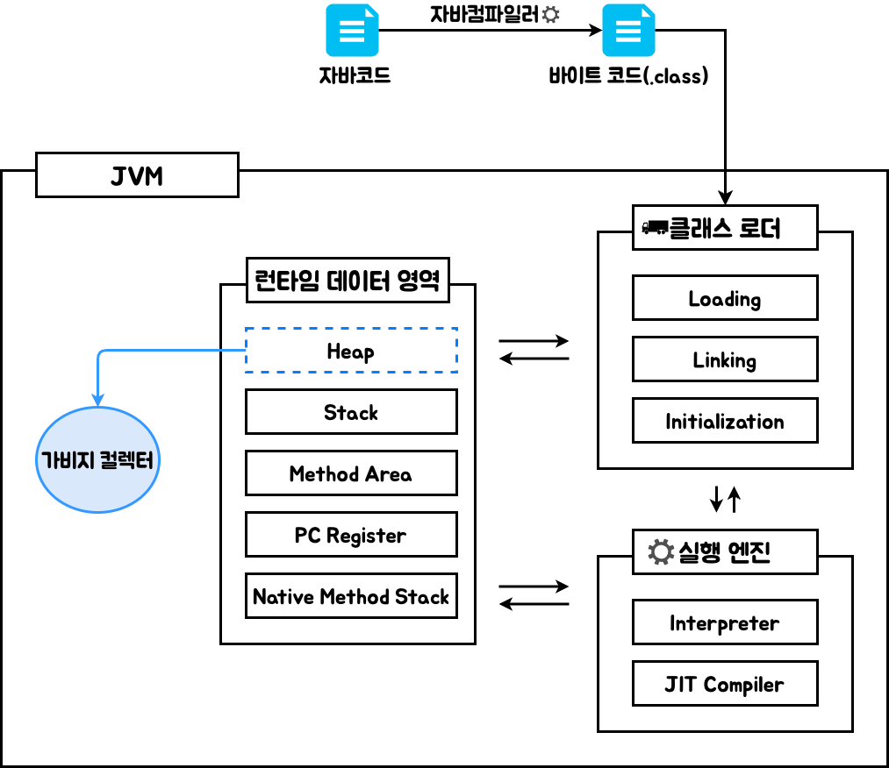
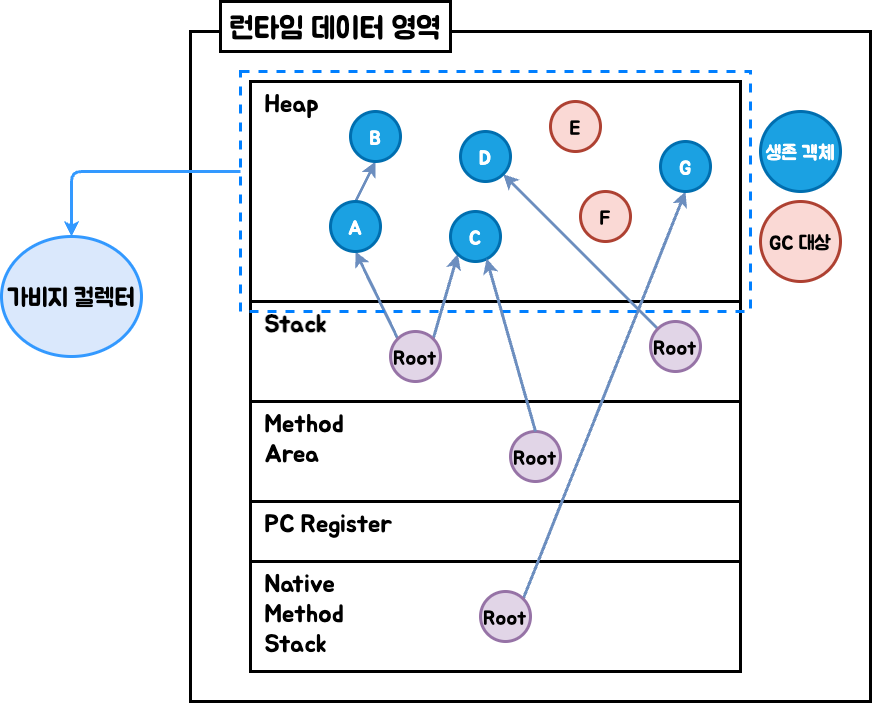
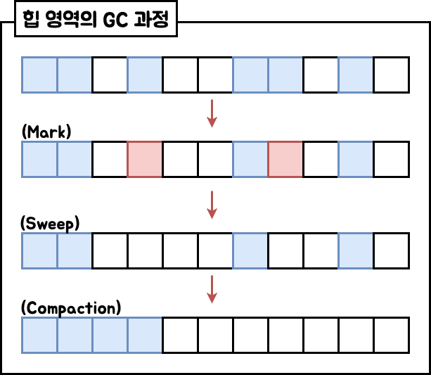
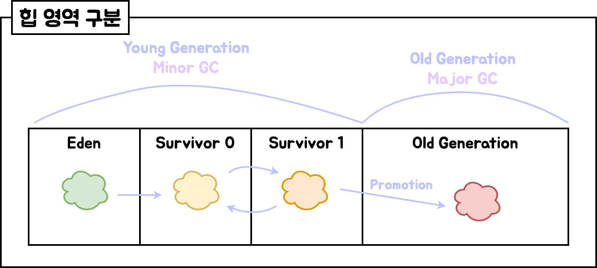

#  🧠 GC 이론

## ✅ 핵심 개념 요약

- GC(Garbage Collection)는 객체 생명주기를 관리하여 불필요한 객체를 회수하고 메모리를 정리하는 JVM 기능  
- GC 동작 시 **Stop-the-World(STW)** 발생 → 모든 스레드가 일시 정지  
- GC는 **Minor GC, Major GC, Full GC**로 구분  
- GC가 관리하는 메모리 영역은 **Young, Old, Metaspace**  
- Young 영역은 **Eden, Survivor 0 (S0), Survivor 1 (S1)** 로 구성  
- GC 동작 과정은 **Mark → Sweep → Compact**  
- Minor GC는 일반적으로 수십 ms, Full GC는 수 초 이상 걸릴 수 있어 성능에 큰 영향을 줄 수 있음

## 🔎 GC 개념 정리
| 구분                 | 설명                                                                      |
| ------------------ | ----------------------------------------------------------------------- |
| **Minor GC**       | Young(Eden)에서 객체를 Survivor로 복사, age 증가. Survivor 간 복사 반복 후 Promotion 발생 |
| **Major GC**       | Old Generation 대상. Mark → Sweep → Compact 수행                            |
| **Full GC**        | Heap 전체(Young+Old) + Metaspace 대상. 가장 비용 큼                              |
| **Stop-the-World** | GC 실행 동안 모든 스레드 정지                                                      |
| **System.gc()**    | 명시적 Full GC 요청 (JVM이 반드시 수행하는 것은 아님)                                    |
| **Metaspace**      | 클래스 메타 정보 저장. PermGen 대체. Native 메모리 사용                                 |

### 🔁 JVM 전체 구조

### 1. 클래스 로더 (Class Loader)
- **역할** : `.class` 바이트 코드를 JVM 메모리(Method Area/Metaspace)에 적재  
- **과정**
	- **Loading** : 클래스 바이트코드 로드  
	- **Linking** : 코드 검증 및 준비 (Verification → Preparation → Resolution)  
	- **Initialization** : static 변수 초기화, static 블록 실행  
- **종류**
	- Bootstrap Class Loader (JDK 기본 클래스 로드)  
	- Extension Class Loader (확장 클래스 로드)  
	- Application Class Loader (사용자 클래스 로드)  

### 2. 메모리 영역
- **Heap** : 객체 저장 (Young, Old, Metaspace)  
- **Stack** : 메서드 호출, 지역 변수 저장  
- **Method Area / Metaspace** : 클래스 정보, static 변수 저장  
- **PC Register** : 현재 실행 중인 명령어 주소 저장  
- **Native Method Stack** : 네이티브 코드 실행 시 사용  

### 3. 실행 엔진 (Execution Engine)
- **역할** : 바이트코드를 실제 기계어로 변환 후 CPU에서 실행  
- **구성**
	- **인터프리터** : 한 줄씩 실행 (빠른 시작, 반복 시 느림)  
	- **JIT(Just-In-Time) 컴파일러** : 반복 코드 기계어 변환 후 캐싱 (성능 최적화)  
	- **가비지 컬렉터** : 불필요한 객체 회수 및 메모리 관리  

### 4. JNI (Java Native Interface)
- 자바 코드에서 C/C++ 같은 네이티브 코드 실행 가능

### 🔁 GC ROOT 참조
- 판단 기준 :  루트 객체에서 시작하여 참조 가능한 객체를 따라가며 도달 불가능 객체만 가비지로 간주
- 루트 객체 예시
	- 스레드 스택에 있는 지역변수(메서드 내부 변수, 매개변수 등)
	- Method Area에 저장된 static 변수
	- Native Method Stack에서 참조 중인 자바 객체

### 🔁 GC 프로세스 단계 (Mark → Sweep → Compact)

#### 1. Mark
- GC Root에서 도달 가능한 객체를 탐색
- 참조 체인을 따라가며 유효한 객체에 표시

#### 2. Sweep
- Mark되지 않은 객체를 메모리에서 제거
- 이 단계는 실제로 객체를 회수하고 가용 공간을 확보

#### 3. Compact
- 남아 있는 객체를 한쪽으로 몰아 연속된 메모리 블록을 형성
- 단편화를 줄이고 새로운 객체의 할당 효율을 높임

### 🔁 GC 동작 흐름

1. Eden에 객체 생성  
2. Eden이 가득 차면 **Minor GC** 발생 → Survivor로 이동  
3. Survivor 간 복사(S0 ↔ S1), age 증가  
4. age가 임계값 이상이면 Old Generation으로 Promotion  
5. Old Generation이 가득 차면 **Major GC** 발생  
6. 전체 영역 포함 시 **Full GC** 발생

### 🔁 다양한 GC알고리즘

|       **GC종류**       |                 **특징**                  | STW 시간 | 사용 예시     |
| :------------------: | :-------------------------------------: | ------ | --------- |
|    **Serial GC**     |           단일스레드 GC 수행, 구조 간단            | 김      | 작은 애플리케이션 |
|   **Parallel GC**    |          멀티스레드로 GC 수행, 처리량 높음           | 중      | 서버, 배치 등  |
|       **CMS**        |     애플리케이션과 GC를 동시에 수행하여 멈춤 시간 최소화      | 낮음     | GUI 앱등    |
|      **G1 GC**       | 힙을 여러 영역(Region)으로 나누어 관리, 병렬 + 병행 수행가능 | 중 - 낮음 | 대부분의 앱    |
| **ZGC / Shenandoah** |                 초저지연 GC                 | 매우 짧음  | 대규모 시스템   |

### 🔁 회고

- GC의 동작 흐름(Mark → Sweep → Compact)을 이론적으로 학습하며, JVM 메모리 구조와 객체 생존 주기의 관계를 체계적으로 이해할 수 있었음  
- Stop-the-World로 인해 전체 애플리케이션 스레드가 일시 정지된다는 개념이 성능 병목의 핵심이라는 점을 이론을 통해 인식함  
- GC의 목적은 단순한 메모리 정리가 아니라, 성능 유지와 직접적으로 연결된 요소라는 사실을 배우며, GC 튜닝의 중요성을 개념적으로 파악하게 되었음  
- 추후 실습을 통해 G1GC, ZGC 등의 알고리즘을 비교하고, GC 로그 및 도구 분석을 통해 실전 대응력을 높일 계획

### 📎 관련 문서
- [JVM GC 실험 정리](../../experiment/gc/jvm-gc-experiment.md)